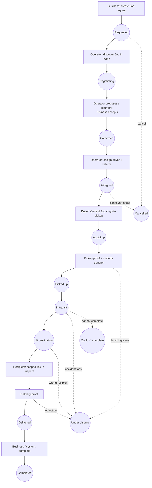

# FIKISHA — Design Phase 3 — Wireframes & Interaction Structure

**Status:** APPROVED — DOCUMENTATION BASELINE (Founder approval + amendment 2026-09-10)
**Design track:** Phase 3 (the formal wireframe & interaction deliverable)
**Amendment log:** 2026-09-10 — Founder approved Phase 3 subject to explicit
amendments: **O-P2** (business in-app pickup confirmation) confirmed
**in-scope** and specified (§6.6, §6.4 table, §9.3, §11 preamble); **O-P1**
(`RESUME_PRIOR` preconditions) **remains open**; **O-P3** (rating/reputation)
**remains deferred**; **O-P4** resolved as the **minimum-necessary-disclosure**
principle for the recipient page (§20.0); driver-critical journey review
recorded (§10.3); Business ↔ Driver pickup consistency review recorded (§9.3).
No product/architecture decision changed.
**Depends on / authoritative sources (in order):** `CLAUDE.md` ·
`docs/team-skills-policy.md` · `docs/design-brief.md` (Design Phase 0) ·
`docs/design-phase-1-ia.md` (Design Phase 1) · `docs/design-phase-2-user-flows.md`
(Design Phase 2) · approved `docs/phase-0/` + `docs/phase-1/` + `docs/phase-2/`
product & architecture docs.
**Client:** responsive PWA · **Languages:** English + Swahili (Swahili prominent on
operator/driver screens) · **Pilot:** Kitengela, Kajiado County + environs.

> This is a design / documentation phase. It contains **no application code** and
> changes **no** product, architecture, lifecycle, trust, verification, custody,
> payment, liability, or authorization decision. Where a design question would
> require such a change it is recorded in §26, not decided.

---

## 1. Phase purpose

Translate the approved Information Architecture (Design Phase 1) and User Flows
(Design Phase 2) into an **implementation-ready wireframe and interaction
specification**: what each screen contains, what the user sees, what they can do,
what the next action is, what happens after it, how it changes by **role** and by
**Job state**, what happens in **exceptions** and **offline**, what is
**server-confirmed**, and what is **progressively disclosed**.

**Success test:** a frontend developer can implement the approved interface from
this document without rediscovering product behaviour.

### 1.1 Lineage

```
docs/design-brief.md               → Design Phase 0  (foundation / constitution)
        ↓
docs/design-phase-1-ia.md          → Design Phase 1  (information architecture)
        ↓
docs/design-phase-2-user-flows.md  → Design Phase 2  (user flows)
        ↓
docs/design-phase-3-wireframes.md  → Design Phase 3  (this document)
        ↓
Design Phase 4 — Visual system & design tokens        (NOT started)
```

### 1.2 What this phase does NOT decide

Final brand colours, the definitive wordmark/lockup, the full design-token
system, motion specifications, production copy, and pixel layouts. Visual
direction here (§24) is **provisional** and explicitly marked as such.

---

## 2. Design principles

Carried from Design Phase 0–2 and applied to every screen below:

1. **Make the next right action obvious.** One primary action per screen,
   visually dominant, thumb-reachable on mobile. Everything else is secondary.
2. **Complexity in the system, clarity in the interface.** Fikisha is a
   coordination product, not a bureaucracy product. No database terminology on
   screen; no analytics-heavy dashboards.
3. **Active work before history.** A user with a live Job never has to search for
   it.
4. **Progressive disclosure.** Show the field/section when it becomes relevant,
   not before.
5. **Server-confirmed reality.** Never render an important state change as done
   before the server confirms it. Distinguish *saved on this phone* from
   *confirmed by Fikisha*.
6. **Role determines the workspace.** The same Job shows different information and
   different actions to Business / Operator / Driver / Group Manager / Operations
   Officer / Platform Admin / Recipient.
7. **Human timeline over raw state names.** `AT_PICKUP` → "At pickup".
8. **Verified ≠ trusted ≠ recommended.** Show concrete verified facts, never an
   absolute platform endorsement.
9. **Bilingual by construction.** Every string EN + SW; layouts tested against
   the ~15–30 % longer Swahili. Language switcher always in the app bar; one-tap
   EN | SW on the recipient page.
10. **Built for a cheap Android phone in sunlight on thin data.** ≥ 44 px tap
    targets, one-handed primary actions, high contrast, system fonts, minimal
    motion, skeletons not spinners where possible.
11. **Personality:** reliable · local · modern · practical · confident · human ·
    trustworthy. A calm, evidence-minded witness — never a "disruptor" that
    frames operators as the problem.

---

## 3. Wireframe notation

Textual wireframes. Not pixel-accurate; they fix **content, hierarchy, actions,
and states**.

```
┌───────────────────────────────┐   Frame = one screen / one viewport
│ ← Title                    ⋮  │   Top bar: back / title / overflow menu
│ ─────────────────────────────  │
│ Heading                        │   Section heading
│ Body text / value              │
│                                │
│ ┌───────────────────────────┐  │
│ │ ⌘ Primary action          │  │   ⌘  = the one primary action (filled)
│ └───────────────────────────┘  │
│ · Secondary action             │   ·  = secondary action (outline / text)
│ [chip] [chip]                  │   status chip / filter chip
│ ▸ Collapsed section            │   progressive-disclosure section (tap to open)
└───────────────────────────────┘
[ bottom nav: Home · Work · My Jobs · More ]     role-specific tab bar (mobile)
```

Annotation tokens used in the specs:

| Token | Meaning |
| --- | --- |
| `[server]` | Requires server confirmation; blocked or queued when offline with a specific message |
| `[local-ok]` | Safe to complete offline; queues and syncs (e.g. capture a photo, draft an incident) |
| `[optimistic]` | UI may update immediately then reconcile (only where the product allows — rare) |
| `[a11y: …]` | Accessibility requirement for this element |
| `[SW prominent]` | Swahili shown first / larger on this operator/driver screen |
| `as of HH:MM` | Stale-data badge shown when the view is served from cache |

Job-state label map (UI label ← authoritative state; the 14 states are **not**
renamed at the domain level):

| UI label | State | UI label | State |
| --- | --- | --- | --- |
| Draft | `DRAFT` | In transit | `IN_TRANSIT` |
| Requested | `REQUESTED` | At destination | `AT_DESTINATION` |
| Negotiating | `NEGOTIATING` | Delivered | `DELIVERED` |
| Confirmed | `CONFIRMED` | Completed | `COMPLETED` |
| Assigned | `ASSIGNED` | Cancelled | `CANCELLED` |
| At pickup | `AT_PICKUP` | Couldn't complete | `FAILED` |
| Picked up | `PICKED_UP` | Under dispute | `DISPUTED` |

---

## 4. Primary end-to-end journey (the design spine)

Design proceeds along this backbone first; isolated dashboards come after.



Screen sequence for the spine (each specified in §5–§13):

```
B-Home → B-CreateJob(1..n) → B-ReviewSubmit → B-JobDetail(Requested)
      → [operator side] O-Home → O-Work → O-JobOpportunity → Nego-Thread
      → B-JobDetail(Negotiating) ↔ Nego-Thread → B accepts
      → B-JobDetail(Confirmed) / O-JobDetail(Confirmed)
      → O-Assign(driver+vehicle) → O/GM-JobDetail(Assigned)
      → D-CurrentJob(Assigned) → D-GoToPickup → D-AtPickup
      → D-PickupProof(matrix) → D-CustodyConfirm → D-CurrentJob(Picked up)
      → D-Transit → D-AtDestination → D-RecipientHandover
      → R-ScopedLink → R-Inspect → R-ConfirmReceipt / R-ReportIssue
      → D-DeliveryProof(matrix) → D-CurrentJob(Delivered)
      → B-JobDetail(Delivered) → B-Complete → *-JobDetail(Completed)
```

---

## 5. Required design method (applied to every major screen)

For each screen the spec records: **Purpose · Primary user · Entry points ·
Information hierarchy · Primary action · Secondary actions · State(s) represented
· Success (what happens next) · Exception states · Offline behaviour ·
Responsive behaviour (small mobile / mobile / tablet / desktop) · Accessibility
annotations.** Spine screens get the full treatment; secondary/admin screens get
a compressed treatment (Purpose / hierarchy / primary action / state notes /
exceptions).

---

## 6. Business screens

Bottom nav (mobile): **Home · Jobs · Messages · More**. Desktop: left sidebar
with the same, plus Staff / Locations / Statements under a collapsible group.

### 6.1 Business Home — "What needs my attention?"

- **Purpose.** Surface everything that needs the business to act, and make
  "request transport" one tap away. Not an analytics dashboard.
- **Primary user.** Business owner / dispatcher.
- **Entry points.** App launch (default route); logo/Home tab; post-submit
  confirmation "Back to home"; notification deep-links land on the relevant Job,
  not here.
- **Information hierarchy.** (1) Needs your action (2) Active Jobs (3) Request
  transport CTA (4) Recent activity (5) empty state when nothing is live.
- **Primary action.** `⌘ Request transport`.
- **Secondary actions.** Open a Job card · View all Jobs · dismiss an activity
  item.
- **State(s).** Account: active / restricted / suspended (banner if not
  `GOOD`). Job cards show their state chip.
- **Success.** `⌘` → B-CreateJob step 1.
- **Exception states.** *Loading:* skeleton list of 3 cards. *Empty:* friendly
  illustration + "No deliveries in progress" + `⌘ Request transport`.
  *Restricted account:* amber banner "Some actions are limited — contact
  support", CTA still visible but submit is gated server-side. *Offline:* header
  shows `offline`; list shown `as of HH:MM`; `⌘` still opens the form (draft is
  `[local-ok]`), submit later is `[server]`.
- **Offline behaviour.** Whole screen renders from cache with `as of HH:MM`.
  No action here is destructive.
- **Responsive.** *Small mobile:* single column, CTA pinned above the fold,
  "Needs your action" collapses to a count + expand. *Mobile:* single column,
  CTA inline at top. *Tablet:* two columns (attention | active). *Desktop:*
  three-zone — attention rail, active Jobs grid, activity sidebar; CTA is a
  persistent button top-right.
- **Accessibility.** [a11y: single `<h1>` "Home"; "Needs your action" is an
  `<h2>` with `aria-live="polite"` count]. [a11y: each Job card is a link with an
  accessible name "Job FK-1042, At pickup, Kitengela to Athi River"]. [a11y: CTA
  ≥ 44 px, first in focus order after the skip link]. Status chips never
  colour-only — icon + text.

```
┌──────────────────────────────────────┐
│ Fikisha            EN|SW   ⌂  synced  │
│ ────────────────────────────────────  │
│ Needs your action (2)            ▸    │
│ • FK-1042  Counter-offer: KSh 7,800   │
│ • FK-1039  Confirm delivery           │
│                                       │
│ ┌─────────────────────────────────┐   │
│ │ ⌘  Request transport            │   │
│ └─────────────────────────────────┘   │
│                                       │
│ Active deliveries                     │
│ ┌───────────────┐ ┌───────────────┐   │
│ │ FK-1042       │ │ FK-1051       │   │
│ │ ● At pickup   │ │ ● Negotiating │   │
│ │ Kitengela →   │ │ Kitengela →   │   │
│ │ Athi River    │ │ Nairobi IA    │   │
│ └───────────────┘ └───────────────┘   │
│                                       │
│ Recent                                │
│ ✓ FK-1038 Completed · 2 days ago      │
└──────────────────────────────────────┘
[ Home · Jobs · Messages · More ]
```

### 6.2 Create Job (progressive, multi-step)

- **Purpose.** Capture a complete, valid transport request with the minimum
  perceived effort. One decision per step; the user always knows *why* a field
  is asked.
- **Primary user.** Business user with Job-creation permission.
- **Entry points.** Home `⌘ Request transport`; Jobs tab "＋ New"; empty state.
- **Steps (each its own screen / section; progress shown as "Step n of 8"):**
  1. **Pickup** — saved business locations as chips + "Other location" (label +
     area/landmark text; optional pin drop). [a11y: location list is a radio
     group.]
  2. **Destination** — same pattern; recipient name + phone (used for the
     scoped link and pickup/handover contact).
  3. **Cargo** — plain description + category chips (from reference data, human
     labels). Optional "fragile / keep upright / hazardous" toggles; hazardous
     shows the prohibited-goods note and can block submission.
  4. **Weight & size** — estimated weight (kg / tonnes toggle); dimensions only
     if "bulky" is toggled.
  5. **Declared value** — "What's the approximate value of the goods?" + helper
     "This sets the right transport and verification requirements." No internal
     threshold maths shown; no implication it is negotiable.
  6. **Vehicle needed** — vehicle-class cards with bespoke icons (Motorcycle /
     Pickup / Canter / Tipper / Lorry / Semi-truck / Trailer / Other) + a plain
     capacity hint. Not backed by model names on screen.
  7. **When** — "As soon as possible" or pick date + time window (EAT).
  8. **Delivery requirements** — notes; who receives; any access constraints.
  Then **Proposed price** (optional): "Suggest a price" free field with helper
  "Operators can accept or counter." No historical price guidance, no
  auto-pricing.
- **Primary action.** `⌘ Next` on each step; `⌘ Review request` on the last.
- **Secondary actions.** `· Back` · `· Save draft` (explicit) · `· Cancel`
  (confirm dialog if fields dirty).
- **State(s).** The Job is `DRAFT` throughout; it is not visible to operators.
- **Success.** Last step → B-ReviewSubmit.
- **Exception states.** *Validation:* inline, error text tied to the field,
  summary at top on submit attempt. *Hazardous/prohibited:* explanatory block,
  submit disabled with reason. *Session/permission lost:* "You no longer have
  permission to create Jobs — contact your business owner." *Leaving with unsaved
  changes:* confirm dialog offering `Save draft`.
- **Offline behaviour.** Entire flow is `[local-ok]`; the draft is queued
  locally and badged "Draft — not sent". Submitting is `[server]` and shows
  "You need a connection to send this request" while keeping the draft intact.
- **Responsive.** *Small mobile:* one field group per screen, sticky
  `⌘ Next`, progress as "3/8". *Mobile:* same, progress bar. *Tablet:* two-pane
  (step list left, fields right). *Desktop:* single scrollable form with a
  sticky step-nav rail and a live summary panel; still section-gated validation.
- **Accessibility.** [a11y: each step is a `<form>` with a fieldset legend =
  step title]. [a11y: `⌘ Next` is disabled only with an accessible reason; prefer
  enabled + inline errors on submit]. [a11y: currency input `inputmode="numeric"`,
  formats to `KSh 4,000` on blur, announces formatted value]. [a11y: vehicle
  cards are a radio group; icon has `aria-hidden`, label carries the name].
  [SW prominent for the business default is English, but SW copy shipped for
  every string.]

```
┌──────────────────────────────────────┐
│ ← Request transport         3 / 8     │
│ ▓▓▓░░░░░                              │
│ ────────────────────────────────────  │
│ What are you sending?                 │
│ ┌──────────────────────────────────┐  │
│ │ e.g. 8 cartons of electronics    │  │
│ └──────────────────────────────────┘  │
│ Category                              │
│ [Electronics] [Building] [Agri] [+]   │
│ ▸ Handling (fragile, upright, …)      │
│                                       │
│ ┌──────────────────────────────────┐  │
│ │ ⌘  Next                          │  │
│ └──────────────────────────────────┘  │
│ · Back        · Save draft            │
└──────────────────────────────────────┘
```

### 6.3 Review & submit

- **Purpose.** Let the user verify the whole request at a glance and understand
  the Draft → Requested transition.
- **Information hierarchy.** Cargo · pickup · destination · when · vehicle
  needed · declared value · delivery requirements · proposed price. Each row has
  an inline `· Edit` returning to that step.
- **Primary action.** `⌘ Send request`.
- **Secondary actions.** `· Edit` per row · `· Save as draft`.
- **State(s).** Shows a clear "Draft — not sent yet" banner; on success shows
  "Sent — operators can now see this".
- **Success.** `[server]` submit → Job becomes `REQUESTED` → route to
  B-JobDetail with a success toast; a "Request sent" state card at top.
- **Exception states.** *Submit fails (network):* stays on screen, banner "Not
  sent — check your connection", `⌘` becomes `Retry`. *Server rejects
  (validation/permission):* field-level or top-level problem message
  (`code` + human text, never a raw 4xx). *Duplicate tap:* idempotent — second
  tap shows "Already sent".
- **Offline behaviour.** `⌘ Send request` is `[server]`; offline shows the
  specific message and keeps the review intact.
- **Responsive.** Mobile: single column list. Desktop: two columns (summary |
  a persistent "what happens next" explainer).
- **Accessibility.** [a11y: summary is a description list; each `· Edit` names
  its section]. [a11y: the Draft/Sent banner uses `role="status"`].

### 6.4 Business Job Detail — the central Job workspace

- **Purpose.** Answer "what's happening with this delivery?" without opening
  another screen, and always present the one action the business can take now.
- **Primary user.** Business owner / dispatcher; read-only for VIEWER staff.
- **Entry points.** Home card; Jobs list; Messages thread; notification
  deep-link.
- **Information hierarchy (top → bottom; progressive disclosure below the
  fold):**
  1. **Status header** — state chip + plain-language line ("At pickup — the
     driver is collecting your goods") + `as of HH:MM` if cached.
  2. **Next action card** — role- and state-specific single `⌘` (see table
     below); absent when the business has nothing to do ("Nothing needed from
     you right now").
  3. **Route** — pickup → destination, with recipient name.
  4. **Cargo** — description, category, weight, handling flags.
  5. **Operator & vehicle** — name, vehicle class + plate, and *verified facts*
     (see §16), assigned driver name once `ASSIGNED`.
  6. **Price / negotiation** — current agreed price, or "Negotiating — 2
     operators responded" linking to Messages.
  7. **Timeline** — human-readable (§14).
  8. ▸ **Custody & delivery** — pickup proof + POD once they exist, with the
     "verified / operator-attested" marker.
  9. ▸ **Evidence** — photos / documents attached to this Job (authorised view
     only).
  10. ▸ **Incidents** — any raised, with status.
- **Primary action by state (Business):**

  | State | `⌘` primary | Notes |
  | --- | --- | --- |
  | Draft | Continue request | resumes B-CreateJob |
  | Requested | — (Cancel request under `·`) | waiting for operators |
  | Negotiating | Review offers | → Messages / offer cards |
  | Confirmed | — | monitoring; Cancel under `·` (late-cancel rules apply once Assigned) |
  | Assigned | — | monitoring; Report an issue under `·` |
  | **At pickup — *and* a business pickup confirmation is pending** | **Confirm pickup** | → B-PickupConfirm (§6.6). Shown **only** when the driver has requested business-side confirmation (or the OTP path is unavailable); otherwise no `⌘` here. Applies to **every** band — it is one of the two always-valid pickup proofs (§3, §11). |
  | At pickup (no confirmation pending) … At destination | — | monitoring; Report an issue under `·` |
  | Delivered | Confirm completion | → B-Complete |
  | Completed | Rate operator | minimal placeholder only — detailed rating is a later reputation design phase (§26 O-P3); shown if the approved Job flow's rating window applies |
  | Cancelled / Couldn't complete | View summary | read-only |
  | Under dispute | View dispute | status + what the business can do |

- **Secondary actions.** Message operator · Report an issue (§19) · Share
  tracking (sends/re-sends recipient link) · Cancel (with reason; consequence
  screen if a late-cancel — §23).
- **State(s).** All 14; sections appear/disappear by state (progressive
  disclosure).
- **Success.** Each `⌘` routes to its sub-flow and returns here with the state
  advanced.
- **Exception states.** *Loading:* status header skeleton + timeline skeleton.
  *Stale:* `as of HH:MM` chip + "Refresh". *Conflict* (business taps an action
  that is no longer valid because the operator moved first): action fails
  gracefully → toast "This Job has moved on — here's the latest" → view
  refreshes, `⌘` updates. *Unauthorised* (VIEWER tries a write): controls shown
  disabled with "View-only — ask an owner or dispatcher". *Cancelled/Failed:*
  read-only with reason and actor. *Disputed:* normal actions replaced by
  "Under dispute — normal steps are paused" + View dispute.
- **Offline behaviour.** Full detail from cache with `as of HH:MM`. Messaging a
  draft is `[local-ok]`; all state-advancing `⌘`s are `[server]` and show a
  specific "needs a connection" message. Capturing a photo for an incident is
  `[local-ok]` and queues.
- **Responsive.** *Small mobile:* status header + next-action card + collapsed
  sections; timeline is a vertical stepper. *Mobile:* same, more sections open by
  default. *Tablet:* two columns (left: status/next-action/route/cargo; right:
  operator/price/timeline). *Desktop:* three columns (summary | timeline &
  custody | messages/evidence/incidents as tabs); next-action card stays pinned
  top-left.
- **Accessibility.** [a11y: status header is `<h1>` + `role="status"` line].
  [a11y: the next-action `⌘` is the first interactive control; its label states
  the outcome ("Confirm completion")]. [a11y: timeline is an ordered list;
  current step has `aria-current="step"`]. [a11y: collapsible sections are
  `<button aria-expanded>` + region]. Status never colour-only.

```
┌──────────────────────────────────────┐
│ ←  FK-1042                        ⋮   │
│ ● At pickup   · as of 14:20           │
│ The driver is collecting your goods.  │
│ ────────────────────────────────────  │
│  Nothing needed from you right now.   │
│                                       │
│ Route                                 │
│ Pickup  Kitengela (Shop 4, Stage Rd)  │
│ Drop    Athi River — J. Mwangi        │
│                                       │
│ Cargo   8 cartons · Electronics       │
│         ~120 kg · Keep upright        │
│                                       │
│ Operator  Athi Movers                 │
│  ✓ Identity verified                  │
│  ✓ Licence verified (Pickup)          │
│  Vehicle  Pickup · KDG 123A           │
│  Driver   S. Kiptoo                   │
│                                       │
│ Price   KSh 7,800  (agreed)           │
│                                       │
│ Timeline                              │
│ ✓ Requested        13:02              │
│ ✓ Confirmed        13:40              │
│ ✓ Assigned         13:55              │
│ ● At pickup        14:19              │
│ ○ Picked up                           │
│ ○ In transit                          │
│ ○ Delivered                           │
│                                       │
│ ▸ Custody & delivery                  │
│ ▸ Evidence                            │
│ ▸ Incidents                           │
│ ─────────                             │
│ · Message operator   · Report an issue│
└──────────────────────────────────────┘
```

### 6.5 Business secondary screens (compressed)

- **Jobs list** — segmented: **Active · Requests · Completed · Cancelled**
  (never the 14 raw states as tabs). Row = ref, state chip, route, date, price.
  Filter by date / vehicle. Empty state per segment with the right CTA.
  Offline: list `as of HH:MM`; search is client-side over the cache.
- **Messages** — list of negotiation threads across Jobs (one per Job × operator
  where the business has replies pending on top). Opens Nego-Thread (§7).
- **Staff** — list (Owner / Dispatcher / Viewer), `⌘ Add staff` (phone + role +
  confirm). Guardrail: cannot remove the last active Owner — control disabled
  with reason. Non-authorised users see the list read-only with an explainer.
- **Locations** — list with the one active **Main** marked; `⌘ Add location`
  (label + type + area/landmark + optional pin). Setting a new Main explains the
  previous Main is demoted. UX line: "Where your business operates" vs. "where a
  specific Job is collected".
- **Statements** — weekly commission statements (read-only list → detail →
  printable/monospace layout with the wordmark). Shows *agreed price −
  commission = net to operator* framing where relevant; **no wallet balance, no
  pay button** (money moves party-to-party; Fikisha records + invoices
  commission only).
- **Account / Settings** — Profile · Language (EN | SW) · Notifications ·
  Security (MFA enrol/challenge) · Help. Business-specific settings live here;
  operator/admin settings do not leak in.

### 6.6 Business pickup confirmation — "Confirm the goods were collected"

**Founder-approved / in-scope** (amendment 2026-09-10, resolves §26 O-P2). This
is the **business-side** rendering of one of the two always-valid pickup proofs
in the approved matrix ("Business in-app confirmation"); it is not a new
lifecycle or a second transition mechanism — the same underlying pickup/custody
event and the same `JobLifecycleService.transition()` writer apply from either
side (§9.3 cross-check).

- **Purpose.** Let an authorised business user record the business-side
  acknowledgement that the goods have been handed to the operator/driver at
  pickup, so `AT_PICKUP → PICKED_UP` can proceed when the pickup-contact OTP path
  is not used or not available.
- **Primary user.** Business **owner or dispatcher** (never VIEWER — the control
  is not shown to VIEWER; server-side authorization is authoritative and the UI
  mirrors it, it does not substitute for it).
- **Entry points.** (1) Business Job Detail (§6.4) `⌘ Confirm pickup` when a
  confirmation is **pending** for a Job at `AT_PICKUP`; (2) a push / in-app
  notification "The driver is at pickup — confirm the goods were collected",
  deep-linking here; (3) Home "Needs your action". The `⌘` and the notification
  are the only ways in — **opening or viewing the Job never confirms anything**.
- **Information hierarchy.**
  1. **What you're confirming** — one plain sentence: "Confirm that **[cargo
     summary]** for Job **[FK-####]** has been handed to the driver at
     **[pickup location]**."
  2. **Who** — driver name + vehicle class + plate, so the user knows who is
     collecting.
  3. **When / where** — the driver marked "at pickup" at HH:MM (EAT) at the
     pickup address.
  4. **Consequence line** — "This records your side of the handover. The delivery
     then moves to *Picked up*." For a STANDARD Job where the driver reached
     here via the operator-attested route, add: "Your confirmation replaces the
     unverified pickup — the delivery is no longer capped at Standard for this
     reason."
  5. **Primary action** — a deliberate control (see below).
- **Primary action.** `⌘ Confirm pickup` `[server]` — a full-width button that
  requires a deliberate tap; on desktop it sits behind a lightweight
  confirm step ("Yes, confirm pickup for FK-1042") so a stray click cannot fire
  it. It is **disabled until the user has scrolled past / acknowledged the
  "what you're confirming" block** on small screens.
- **Secondary actions.** `· Not the right goods / not ready` → routes to Report
  an issue (§17.1), pre-tagged `WRONG_PICKUP` / `DELAY`; `· Message operator`;
  `· Call the driver`.
- **State(s) represented.** Job `AT_PICKUP` with a pending business
  confirmation. If the pickup-contact OTP is entered on the driver side first,
  this screen flips to a read-only "Pickup already confirmed by code — nothing
  needed" before the user acts.
- **Success.** `[server]` acknowledgement → Job `PICKED_UP`; the business sees
  the Job Detail advance, the timeline gains a **custody event** marked
  **"Verified pickup — confirmed by sender in app"** (not operator-attested), and
  a toast "Pickup confirmed". The driver's Current Job advances in parallel.
- **Exception states.**
  - *Confirmed by OTP first (race):* "The driver already confirmed pickup with
    the code — nothing needed from you." Read-only.
  - *Job moved on / no longer at pickup:* "This Job has moved on — here's the
    latest" → refresh; the `⌘` disappears.
  - *Network failure on submit:* the screen stays, banner "Not confirmed — check
    your connection", `⌘` becomes `Retry`; nothing is recorded until the server
    acknowledges.
  - *Unauthorised (VIEWER or a non-member opens the deep link):* "You don't have
    permission to confirm pickup — ask an owner or dispatcher." No control shown.
  - *Duplicate tap:* idempotent — "Already confirmed".
  - *Under dispute in the meantime:* the action is withdrawn and replaced by
    "This Job is under review".
- **Offline behaviour.** `⌘ Confirm pickup` is **`[server]`** — offline it shows
  a *specific* message: "You need a connection to confirm pickup. The driver can
  also confirm with the pickup code." The "what you're confirming" context is
  readable from cache with `as of HH:MM`. There is no local/queued confirm for
  this action — a custody/money/identity moment is always server-confirmed
  (§23.2 rule 6).
- **Responsive.** *Small mobile:* full-screen; context block above the fold;
  sticky `⌘` enabled only after the block is seen. *Mobile:* same. *Tablet /
  desktop:* a centred card / modal over the Job Detail, with the explicit
  "Yes, confirm" second step; never a bare one-click action in a dense list.
- **Accessibility.** [a11y: `<h1>` "Confirm pickup — FK-1042"]. [a11y: the "what
  you're confirming" text is in DOM order before the `⌘` and is `role="note"`].
  [a11y: `⌘` label is the full outcome "Confirm pickup for FK-1042", ≥ 44 px, and
  is `aria-disabled` with a stated reason until the context is acknowledged].
  [a11y: on success, focus moves to the `role="status"` confirmation]. [a11y: the
  desktop confirm step is a focus-trapped dialog restating action + Job]. Status
  and the verified-pickup marker are icon + text, never colour-only.

```
┌──────────────────────────────────────┐
│ ←  Confirm pickup · FK-1042           │
│ ────────────────────────────────────  │
│ Confirm that 8 cartons · Electronics  │
│ for FK-1042 has been handed to the    │
│ driver at Kitengela (Shop 4, Stage    │
│ Rd).                                   │
│                                       │
│ Driver   S. Kiptoo                    │
│ Vehicle  Pickup · KDG 123A            │
│ At pickup since 14:19                 │
│                                       │
│ This records your side of the         │
│ handover. The delivery then moves     │
│ to “Picked up”.                       │
│                                       │
│ ┌──────────────────────────────────┐  │
│ │ ⌘  Confirm pickup for FK-1042    │  │
│ └──────────────────────────────────┘  │
│ · Not the right goods / not ready     │
│ · Message operator   · Call driver    │
└──────────────────────────────────────┘
```

---

## 7. Operator screens

Bottom nav (mobile): **Home · Work · My Jobs · More**. [SW prominent] on all
operator screens; new operator accounts default to Swahili.

### 7.1 Operator Home — "What can I act on right now?"

- **Purpose.** Immediately answer: what work can I take, and what am I currently
  doing? Surface verification problems and operational alerts.
- **Primary user.** Individual operator; Group Manager sees a Team-scoped
  variant (§7.5).
- **Entry points.** App launch; Home tab; notification deep-links go to the Job.
- **Information hierarchy.** (1) Current Job (if any) — big card with next
  action (2) Needs response — Jobs where an offer/counter is waiting (3)
  Available work — count + top few, link to Work (4) Verification /
  operational alerts (5) Earnings snapshot (this week net) as a quiet line, not
  a chart.
- **Primary action.** Contextual: if there's a current Job → `⌘ Open current
  job`; else → `⌘ Find work`.
- **Secondary actions.** Open an alert · open a "needs response" item.
- **State(s).** Operator profile status (`PENDING` / `ACTIVE` / `RESTRICTED` /
  `SUSPENDED`) drives a top banner; `PENDING`/`RESTRICTED` limits what can be
  accepted (enforced server-side; UI explains).
- **Success.** `⌘` routes to the current Job or to Work.
- **Exception states.** *No profile yet:* onboarding checklist card (§21).
  *Suspended:* full-width explanation, work actions hidden. *Offline:* `as of
  HH:MM`; Available-work count may be stale — labelled.
- **Offline behaviour.** Renders from cache. Accepting/countering is `[server]`.
- **Responsive.** Mobile-first single column. Tablet/desktop (Group Manager
  mainly): two columns (current + team | available + alerts).
- **Accessibility.** [a11y: current-Job card is a labelled region with the
  next action as the first control]. [a11y: alert items are a list with
  severity conveyed by icon + text].

### 7.2 Work discovery (list + filters)

- **Purpose.** Let the operator quickly judge which Jobs are worth pursuing —
  without implying they see the whole marketplace (matching/authorisation
  restricts the list).
- **Primary user.** Operator; Group DRIVER only if the group is `DRIVER_ACCEPTS`
  (otherwise this tab is hidden and they see assignments only).
- **Entry points.** Work tab; Home "Find work"; notification "New job near you".
- **Information hierarchy.** Filter bar (vehicle class · area · date · value
  band · "I'm eligible") → list of opportunity cards: route, cargo summary,
  vehicle needed, window, proposed price (if any), distance-from-your-base hint,
  and an eligibility marker ("You can take this" / "Needs Level 2" / "Needs a
  verified heavy-class vehicle").
- **Primary action.** Open a card → O-JobOpportunity.
- **Secondary actions.** Adjust filters · save a filter · hide a Job.
- **State(s).** Each card: open for response / already responded / no longer
  available.
- **Success.** Card → opportunity detail.
- **Exception states.** *Empty:* "No matching work right now" + adjust-filters
  CTA + "We'll notify you". *Filtered to nothing:* "No results — clear filters".
  *A Job disappears while viewing the list:* it greys to "No longer available"
  rather than vanishing. *Not eligible:* card still shown with the reason, open
  is allowed (read-only detail), respond is disabled with the reason.
- **Offline behaviour.** List from cache with `as of HH:MM` and a clear "may be
  out of date" note; opening detail works from cache; responding is `[server]`.
- **Responsive.** Mobile: filter bar collapses to a "Filters (2)" button opening
  a sheet; single-column cards. Tablet: two-column cards, persistent filter
  rail. Desktop (Group Manager): table option with columns + the same rail.
- **Accessibility.** [a11y: filters are a labelled group; active filters
  announced]. [a11y: each card is a link with a descriptive name incl.
  eligibility]. [a11y: "no longer available" uses `aria-disabled` + text].

### 7.3 Operator Job Opportunity (evaluate & respond)

- **Purpose.** Give the operator everything needed to answer "can I safely and
  legitimately take this Job?" then respond.
- **Information hierarchy.** Route (with distance from base) · cargo (desc,
  category, weight, handling) · vehicle needed + capacity · window · declared
  value + **band** ("Elevated — needs Level 2") · delivery requirements ·
  relevant business info · **your eligibility** (concrete: "Your Level 2 covers
  this"; or "You're Level 1 — this needs Level 2", with what that requires) ·
  proposed price.
- **Primary action.** `⌘ Respond` → opens the response sheet: **Accept price** /
  **Counter** (amount + optional short note) / **Decline**.
- **Secondary actions.** Message the business (opens the thread) · Save for
  later.
- **State(s).** Opportunity open / you've responded (shows your standing offer) /
  withdrawn / no longer available / awarded to someone else (thread auto-closed).
- **Success.** Accept → Job moves toward `CONFIRMED` for this pairing (first
  mutual acceptance wins; other threads auto-close) → route to O-JobDetail.
  Counter → thread updated, back to a "waiting" state.
- **Exception states.** *Ineligible:* Respond disabled, reason shown, "How to
  reach Level 2" link (informational, no promises). *Job confirmed with another
  operator while you were deciding:* "No longer available — it's been confirmed
  with another operator." *Heavy-class needed, your vehicle not verified for it:*
  explicit "Needs a verified heavy-class vehicle" with a link to Vehicle
  verification.
- **Offline behaviour.** Detail from cache; `⌘ Respond` is `[server]` with the
  specific message; a drafted counter note is `[local-ok]` and kept.
- **Responsive.** Mobile: scroll + sticky `⌘ Respond`; response is a bottom
  sheet. Desktop: two columns (Job facts | eligibility + response panel).
- **Accessibility.** [a11y: eligibility block is a `role="note"` with a heading].
  [a11y: response sheet is a modal dialog with focus trap; amount input
  `inputmode="numeric"`, formats to `KSh`]. [a11y: "no longer available" is
  announced via `role="alert"` when it happens live].

### 7.4 Operator Job Detail

Same skeleton as Business Job Detail (§6.4) with operator-appropriate content and
actions:

| State | Operator `⌘` |
| --- | --- |
| Negotiating | Respond (accept / counter / decline) |
| Confirmed | Assign driver & vehicle (individual operator: "Confirm you'll drive" + pick vehicle) |
| Assigned | Start pickup *(if the operator is also the driver)* — else read-only, driver acts |
| At pickup → At destination | driver-driven; operator sees progress + "Report an issue" under `·` |
| Delivered | — (business/system completes) |
| Completed | View statement line for this Job |
| Under dispute | View dispute |

Extra operator sections: **Earnings for this Job** (agreed price − commission =
net; shown once `COMPLETED`, links to the statement).

### 7.5 Operator secondary screens (compressed)

- **My Jobs** — segmented **Active · Upcoming · Completed · Cancelled /
  disputed**. Row: ref, state chip, route, window, net.
- **More → Vehicles** — list with class icon, plate, status chip
  (**Active / Under repair / Suspended / Inactive**; Suspended is admin-only and
  read-only to the operator). `⌘ Add vehicle` → §21. Each vehicle → detail with
  Overview / Capacity / Control-operator / **Verification** (§15) / History.
- **More → Verification** — the operator's own verification home (§15), grouped
  Required / Submitted / Under review / Verified / Needs attention.
- **More → Operating locations** — Main stage/base, other stages/bases, yards,
  waiting areas. UX line: "a place you work from — not proof you own it or belong
  to it." `⌘ Add` (type + name + area + optional pin).
- **More → Group** — if the operator belongs to a group: group name, your role
  (Owner / Manager / Driver), assignment mode (Manager assigns / Drivers accept),
  read-only member list. No fleet-management surface.
- **More → Earnings / Statements** — weekly statement list → detail (net =
  agreed − commission), printable. No wallet.
- **More → Profile / Notifications / Settings / Help.**

---

## 8. Negotiation screens

### 8.1 Negotiation thread (Business ↔ one Operator) — "conversation + structured offers"

- **Purpose.** Reach an agreed price with a preserved, immutable record. It is
  the authoritative negotiation record — **not** a social chat, and **not** the
  system of record's replacement by WhatsApp.
- **Primary user.** Business dispatcher and the responding operator (each sees
  only their own thread; operators never see each other's offers — sealed
  threads).
- **Entry points.** Business: Job Detail "Review offers" / Messages tab.
  Operator: opportunity "Respond" / Messages.
- **Information hierarchy.** Job context strip (ref, route, cargo, vehicle
  needed) pinned at top → chronological entries: **offer / counter-offer** cards
  and optional short text notes → composer with the allowed response for the
  current turn.
- **Offer card contents (every proposal):** proposer (You / operator name /
  business name) · amount in `KSh` · timestamp (EAT) · this proposal's status
  (Current / Countered / Accepted / Declined / Expired) · the response available
  to *you* now.
- **Primary action.** State-dependent single `⌘`: `Accept KSh X` /
  `Send counter` / (after agreement) `Open Job`.
- **Secondary actions.** Add a short note · Decline · (business) switch to
  another operator's thread.
- **State(s).** Thread: active / agreed (frozen) / closed (declined, expired, or
  auto-closed because another thread was accepted first).
- **Success.** Accept → the agreed amount becomes **visually authoritative**
  (pinned "Agreed: KSh 7,800", composer replaced by "Agreed — open the Job");
  Job → `CONFIRMED`; other operator threads for this Job auto-close with
  "No longer available".
- **Exception states.** *Concurrent accept:* business taps "Accept" on a stale
  offer → "The operator changed their offer — here's the latest" → thread
  refreshes, `⌘` updates (never accepts the stale amount). *Offer expired:*
  card shows "Expired", composer offers "Ask again" (new offer) not "Accept".
  *Operator withdrew:* "This operator is no longer available." *Thread
  auto-closed:* read-only with the reason. *Offline:* thread from cache; a typed
  note/counter is `[local-ok]` (queued, marked "Not sent"); Accept is `[server]`.
- **Offline behaviour.** Read from cache with `as of HH:MM`. Composing is
  `[local-ok]`; sending offers/counters and Accept are `[server]` with specific
  messages. A queued counter that is invalidated on sync (price moved) surfaces
  in the sync-issues tray, never auto-sent silently.
- **Responsive.** Mobile: full-screen thread, pinned context strip, sticky
  composer. Tablet: thread + a side rail with Job facts. Desktop (business with
  several offers): left = list of operator threads for this Job with their
  current amounts; right = the open thread; the Job facts strip spans the top.
- **Accessibility.** [a11y: entries are an ordered list; each offer card names
  proposer + amount + status]. [a11y: `aria-live="polite"` region announces new
  incoming offers]. [a11y: the "Agreed" banner is `role="status"`, and the
  composer's replacement is announced]. [a11y: amount field `inputmode="numeric"`,
  min tap target 44 px, currency formatting announced]. No auto-pricing controls;
  no "market rate" hint anywhere.

```
┌──────────────────────────────────────┐
│ ←  FK-1051 · Kitengela → Nairobi IA   │
│ 10 bags cement · Pickup needed        │
│ ────────────────────────────────────  │
│                        You  13:10     │
│              ┌──────────────────────┐  │
│              │ Offer  KSh 7,500     │  │
│              │ Countered            │  │
│              └──────────────────────┘  │
│  Athi Movers  13:14                    │
│  ┌──────────────────────┐              │
│  │ Counter  KSh 7,800   │              │
│  │ Current               │              │
│  └──────────────────────┘              │
│  "Fuel is high today."                 │
│ ────────────────────────────────────  │
│ ┌──────────────────────────────────┐  │
│ │ ⌘  Accept KSh 7,800              │  │
│ └──────────────────────────────────┘  │
│ · Send counter     · Decline          │
└──────────────────────────────────────┘
```

---

## 9. Confirmation & assignment

### 9.1 Confirmed Job (both sides)

- **Purpose.** Mark the pivot from "negotiating" to "this is happening"; show
  agreed price, counterpart, expected timing, next milestone.
- **Primary action.** Business: none (monitor). Operator/Group: `⌘ Assign driver
  & vehicle` (individual operator: `⌘ Confirm you'll drive` → pick vehicle).
- **State.** `CONFIRMED`. Cancel is available to either side under `·` with a
  reason; if it is now past `ASSIGNED` the late-cancel consequence screen applies
  (§23).
- **Exceptions.** *Counterpart cancels:* both see "Cancelled by [role] —
  [reason]" and the Job goes read-only.

### 9.2 Assign driver & vehicle (Operator / Group Manager)

- **Purpose.** Bind a specific eligible **driver** and **vehicle** to the Job.
  The UI must not permit an assignment that violates verification / value-band /
  heavy-class eligibility; **server-side authorization is authoritative** and the
  UI mirrors it.
- **Primary user.** Individual operator (self + own vehicle) or Group
  Owner/Manager (group drivers + group-controlled vehicles).
- **Entry points.** Confirmed Job `⌘ Assign`.
- **Information hierarchy.**
  1. **Job requirements recap** — vehicle class, capacity, declared value +
     **band**, heavy-class flag if applicable.
  2. **Choose driver** — list of eligible drivers (individual: just "You").
     Each row: name, trust level, and a green "Eligible for this band" or a
     blocked row with the specific reason ("Level 1 — needs Level 2 for
     Elevated"). Ineligible drivers are shown but not selectable, with reason.
  3. **Choose vehicle** — eligible vehicles (operator-controlled or, for a
     group Job, group-controlled). Row: class icon, plate, capacity, status,
     and verification marker ("Vehicle verified"; heavy Jobs also need
     "Heavy-class compliance verified"). Ineligible vehicles shown with reason.
  4. **Review** — driver + vehicle + "what the recipient/business will see".
- **Primary action.** `⌘ Confirm assignment`.
- **Secondary actions.** `· Back`, `· Why is someone not eligible?` (opens an
  explainer that lists the concrete missing facts — no scores).
- **State(s).** `CONFIRMED` → `ASSIGNED` on success.
- **Success.** `[server]` → Job `ASSIGNED`; business gets an assignment summary
  (operator, driver, vehicle, route); driver gets "You've been assigned a
  delivery"; route back to Job Detail.
- **Exception states.** *Selected driver/vehicle became ineligible or
  unavailable between selection and confirm:* confirm fails → "That driver can't
  be assigned to this Job — [reason]" → selection refreshes. *No eligible driver
  or vehicle exists:* the step explains what's missing and links to Verification;
  `⌘` disabled with reason. *Group assignment where the group is `DRIVER_ACCEPTS`:*
  the flow instead **offers the Job to eligible drivers**; Manager sees "Offered
  to N drivers — waiting for one to accept", and can switch to `MANAGER_ASSIGNS`
  behaviour only if group config allows (no new rule invented here).
- **Offline behaviour.** Eligibility lists render from cache with `as of HH:MM`
  and a warning that eligibility is confirmed on submit; `⌘ Confirm assignment`
  is `[server]` and blocked offline with a specific message.
- **Responsive.** Mobile: stepper (requirements → driver → vehicle → review),
  sticky `⌘`. Tablet/desktop (Group Manager): single screen, three panels
  (requirements | drivers | vehicles) + a review bar; a table view for larger
  groups.
- **Accessibility.** [a11y: driver and vehicle lists are radio groups;
  ineligible options use `aria-disabled="true"` and include the reason in the
  accessible name]. [a11y: the "why not eligible" explainer is a dialog listing
  missing facts as a list]. [a11y: eligibility is never colour-only — icon +
  "Eligible" / "Not eligible: …" text].

```
┌──────────────────────────────────────┐
│ ←  Assign · FK-1042                   │
│ Needs: Pickup class · ~120 kg ·       │
│ Standard band                        │
│ ────────────────────────────────────  │
│ Driver                                │
│ ( ) S. Kiptoo   L2 · Eligible         │
│ ( ) A. Otieno   L1 · Not eligible:    │
│      needs L2 for this band (n/a here)│
│                                       │
│ Vehicle                               │
│ ( ) 🛻 KDG 123A  Pickup · Verified     │
│ ( ) 🛻 KDJ 900B  Pickup · Verification │
│      needed — can't assign            │
│                                       │
│ ┌──────────────────────────────────┐  │
│ │ ⌘  Confirm assignment            │  │
│ └──────────────────────────────────┘  │
│ · Why is someone not eligible?        │
└──────────────────────────────────────┘
```

### 9.3 Business ↔ Driver pickup — consistency cross-check (amendment 2026-09-10)

Result of the focused review required by the Founder amendment §9. **Finding:
consistent — one product model, two role renderings.**

| Concern | Driver side | Business side | Same underlying behaviour? |
| --- | --- | --- | --- |
| Where pickup proof lives | §10.1 `⌘ Confirm pickup` → §11 proof screen | §6.4 `⌘ Confirm pickup` (at `AT_PICKUP`, when pending) → §6.6 | — |
| Accepted proofs | pickup-contact OTP · in-app business confirmation · (STANDARD only) operator-attested fallback | in-app business confirmation (this screen **is** that path) | **Yes** — same approved matrix (§3, §11.2, §11.3); no side adds or removes a path |
| Band rules | STANDARD has the operator-attested fallback; ELEVATED+ does not | not applicable to the business action (it is itself a full-band proof); the STANDARD "upgrade from unverified" note appears where relevant | **Yes** — bands unchanged |
| State transition | `AT_PICKUP → PICKED_UP` via `JobLifecycleService.transition()` | `AT_PICKUP → PICKED_UP` via the **same** writer | **Yes** — one lifecycle, one writer; no second transition mechanism |
| Custody event | one custody event, marked verified / operator-attested | the **same** event; marked "Verified pickup — confirmed by sender in app" | **Yes** — a single event, whichever side triggers it |
| Server confirmation | `[server]`; offline shows a specific message | `[server]`; offline shows a specific message; no local/queued confirm | **Yes** — custody moment is always server-confirmed (§23.2 rule 6) |
| Race handling | if the business confirms first, the driver screen flips to "Confirmed by sender" | if the OTP is entered first, this screen flips to "already confirmed by code" | **Yes** — first valid proof wins; the other side goes read-only, never double-records |
| Authorization | server-side; the driver's controls mirror it | server-side; VIEWER never sees the control; the UI mirrors, it does not enforce | **Yes** — hiding a control is never the authorization |

No second pickup lifecycle, no duplicate status-transition mechanism, no new
fallback. The screens differ substantially by role; the product behaviour does
not.

---

## 10. Driver screens

Bottom nav (mobile): **Current Job · Jobs · More**. There is **no standalone
Driver sign-up** — a driver reaches this workspace by role (`GroupMembership
role=DRIVER`, or an individual operator acting as their own driver). [SW
prominent]. Minimal interaction while moving (§13, §18).

### 10.1 Current Job (the driver's home)

- **Purpose.** One screen that says what to do next. The current Job dominates.
- **Primary user.** Assigned driver.
- **Entry points.** App launch (default for a driver with an active
  assignment); "View Job" from the assignment notification; Current Job tab.
- **Information hierarchy.** (1) Job ref + state line (2) the **one** next
  action, large (3) pickup → destination with the relevant contact for this
  step (4) cargo summary (5) vehicle (6) a compact 3-step progress
  "Pickup → Transit → Delivery" (7) `· Report an issue` always reachable.
- **Primary action by state (Driver):**

  | State | `⌘` | After |
  | --- | --- | --- |
  | Assigned | Go to pickup | opens map hand-off (external), state unchanged |
  | Assigned (at the location) | I'm at pickup `[server]` | → At pickup; pickup OTP issued to the pickup contact |
  | At pickup | Confirm pickup `[server]` | → Pickup proof (§11) |
  | Picked up | Start transit `[server]` | → In transit |
  | In transit | I've arrived `[server]` | → At destination |
  | At destination | Confirm delivery `[server]` | → Delivery proof (§15) |
  | Delivered | — ("Delivery recorded") | business/system completes |

- **Secondary actions.** Call pickup/recipient contact · Report an issue (§19) ·
  view full Job detail (progressive disclosure).
- **State(s).** `ASSIGNED`…`DELIVERED`; if `DISPUTED`, the action area is
  replaced by "This Job is on hold — Fikisha is reviewing an issue" + Report /
  view.
- **Success.** Each `⌘` advances the state after **server confirmation** and the
  progress indicator + timeline update.
- **Exception states.** *No active assignment:* "No active job" + (only if the
  group is `DRIVER_ACCEPTS` or the person is an individual operator) a compact
  "available work" entry; otherwise just "No active job — you'll be notified
  when you're assigned." *GPS/location permission denied:* "Go to pickup" still
  works (opens the address in the map app); no in-app tracking is attempted.
  *Wrong//stale state (server moved):* the action fails softly → "This Job has
  updated" → screen refreshes with the correct `⌘`.
- **Offline behaviour.** Screen renders from cache with `as of HH:MM`. **Every
  state-advancing `⌘` is `[server]`** and, offline, shows a *specific* message
  ("You need a connection to confirm pickup") — not a generic error — while
  still allowing the safe preparatory part (e.g. take the goods photo into the
  queue, §11). "Call contact" works offline (dials).
- **Responsive.** *Small mobile:* the `⌘` fills the width, ~30 % of viewport
  height, high contrast; everything else scrolls under it. *Mobile:* same with a
  bit more context visible. *Tablet:* two columns (action + route | cargo +
  progress). *Desktop* (rare for a driver; e.g. a yard office): centred
  single-column, max ~640 px — **not** a stretched layout.
- **Accessibility.** [a11y: the `⌘` label is a full instruction ("Confirm
  pickup"), ≥ 56 px tall on mobile, first in focus order]. [a11y: state line is
  `role="status"`]. [a11y: contacts are `tel:` links]. [a11y: progress is an
  ordered list with `aria-current`]. [a11y: nothing critical conveyed by colour
  alone; icons + text; large text supports OS text-scaling].

```
┌──────────────────────────────────────┐
│  FK-1042            ⌂  syncing…       │
│  Uko kwenye kuchukua (At pickup)      │
│                                       │
│ ┌──────────────────────────────────┐  │
│ │                                  │  │
│ │      ⌘  THIBITISHA KUCHUKUA      │  │
│ │         Confirm pickup           │  │
│ │                                  │  │
│ └──────────────────────────────────┘  │
│                                       │
│ Chukua / Pickup                       │
│  Kitengela — Shop 4, Stage Rd         │
│  ☎ Mary (mtoaji / sender)             │
│                                       │
│ Peleka / Deliver                      │
│  Athi River — J. Mwangi               │
│                                       │
│ Mzigo  8 cartons · Electronics        │
│                                       │
│  Pickup ●——— Transit ○——— Delivery ○  │
│                                       │
│ · Ripoti tatizo / Report an issue     │
└──────────────────────────────────────┘
[ Current Job · Jobs · More ]
```

### 10.2 Go to pickup / arrival

- **Purpose.** Get the driver moving and record arrival.
- **Primary action.** `⌘ I'm at pickup` `[server]` (enabled always; no geofence
  gate in MVP — arrival is a declared event, consistent with "event-based
  location, not continuous GPS").
- **Secondary.** Open address in map app (external) · call the pickup contact.
- **Success.** `[server]` → `AT_PICKUP`; the pickup-contact OTP is issued
  (SMS-primary; WhatsApp may also carry it); screen advances to §11.
- **Exceptions.** *Offline:* "You need a connection to record arrival" — but the
  driver can still navigate and call. *Already at pickup (double tap):*
  idempotent.
- **A11y.** [a11y: map link opens in a new context and is labelled "Open pickup
  address in maps"].

### 10.3 Driver-critical journey — usability consistency review (amendment 2026-09-10)

Result of the focused review required by the Founder amendment §8, over
`ASSIGNED → Current Job → Go to pickup → AT_PICKUP → Pickup proof → Custody
confirmation → PICKED_UP → IN_TRANSIT → AT_DESTINATION → Delivery proof →
DELIVERED → COMPLETED`. **Not** a redesign — a consistency check. **Finding:
the journey holds; no change required beyond the O-P2 addition, which is
consistent with it.**

| Criterion | Check | Where enforced in this doc |
| --- | --- | --- |
| **Mobile-first** | Every driver screen is specified mobile-first; desktop is a narrow centred column, never a stretched layout. | §10.1 responsive, §24.1 |
| **Action-dominant** | Exactly one `⌘` per step, ~30 % of viewport height, high contrast, thumb-reachable; everything else scrolls under it. | §10.1, §10.2, §11, §12, §13 |
| **Low typing** | The only text entry on the whole spine is the 6-digit OTP (and, STANDARD-fallback only, a contact name). Everything else is tap / camera / signature. | §11.1–11.3, §15 delivery proof |
| **Low cognitive load** | One decision per screen; band context stated in one line; no dashboards; progressive disclosure for detail. | §2 principles, §10.1, §11.1 |
| **Small-screen usable** | 320 px baseline; single column; sticky primary; progress as a 3-dot strip, not a 14-state list. | §10.1 wireframe, §24.1 |
| **Outdoor usable** | High contrast; status = icon + shape + text (never colour-only); ≥ 56 px driver-critical targets; system fonts; minimal motion. | §25.1, §25.2, §28 |
| **Next action always clear** | Each state maps to one labelled `⌘` in the §10.1 table; when there is nothing to do the screen says so. | §10.1 state table |
| **Explicit server confirmation** | Every state-advancing `⌘` on the spine is `[server]`; interim shows "recorded on this phone — syncing", visually distinct from a confirmed ✓; specific offline messages, not generic errors. | §10.1 offline, §12.1, §23.1–23.3 |
| **Safe against accidental transitions** | No optimistic state changes on the spine; OTP `⌘ Confirm handover` enabled only when a valid proof path is complete; ELEVATED+ has no bypass; "I'm at pickup"/"I've arrived" are declared events but idempotent and reversible only by a real subsequent step; the new business `⌘ Confirm pickup` (§6.6) needs a deliberate tap + desktop confirm step + acknowledged context. | §11.1, §11.3, §6.6, §10.2 |
| **Report-an-issue always reachable** | `· Report an issue` is present on Current Job and every transit/destination screen without leaving the Job. | §10.1, §13.1, §13.2, §17.1 |
| **Bilingual, SW prominent** | Driver screens marked `[SW prominent]`; the §10.1 wireframe shows SW first on the primary action; custody/OTP wording flagged for professional review. | §2.9, §10, §25.1 |

Residual watch-items (design-track, non-blocking): final SW verb choices for the
custody steps (§26 #1); the exact 3-dot progress affordance vs. the full timeline
on the smallest screens (§26 #2); whether "I'm at pickup" needs a light
"are you there?" confirm on very cheap devices where mis-taps are common
(§26 #8-adjacent — evidence/interaction placement).

---

## 11. Pickup proof matrix (critical interaction)

The screen implements the **approved band-dependent rules exactly** (Design
Phase 2 §39; `docs/phase-1/chain-of-custody.md`). No new fallback is invented.

> **Two-sided proof, one model.** "In-app business confirmation" below is the
> **same** proof as the business-side screen in §6.6 — the business taps
> `⌘ Confirm pickup`, the server validates it as a permitted proof, and the
> driver's screen reflects it. Whichever side acts, it is the **same**
> pickup/custody event and the **same** `AT_PICKUP → PICKED_UP` transition
> through the single lifecycle writer. There is no second pickup lifecycle and no
> second transition mechanism (§9.3 cross-check). The screens differ by role; the
> product behaviour does not.

### 11.1 Shared structure

- **Purpose.** Prove the goods changed hands, gated by the Job's value band.
- **Entry.** Driver `⌘ Confirm pickup` from §10.1.
- **Top of screen:** band context line — "Standard delivery" / "Elevated
  delivery — verified pickup required" — so the driver knows which rules apply,
  without exposing internal thresholds.
- **Primary action.** `⌘ Confirm handover` (enabled only when a valid proof
  path is complete).
- **Success.** `[server]` → `PICKED_UP`; routes to custody confirmation (§12).
- **A11y (all variants).** [a11y: OTP entry is 6 single-character inputs with
  one `aria-label="Pickup code"` on the group, `inputmode="numeric"`,
  `autocomplete="one-time-code"`, paste-to-fill, visible + SR error text tied to
  the group]. [a11y: camera button ≥ 44 px, labelled "Take photo of the goods";
  after capture, a thumbnail with "Retake" and an accessible "Photo added"
  status]. [a11y: the band context line is `role="note"`]. [a11y: the whole
  transition explains, in plain EN/SW, what is required and what to do if it
  can't be met].

### 11.2 STANDARD band

```
Accepted proof (either):
  • Pickup-contact OTP        → driver enters the 6-digit code the sender reads out
  • In-app business confirmation → the business confirms in their app (§6.6); driver's screen flips to "Confirmed by sender"

If the OTP can't be delivered/used:
  Operator-attested fallback (STANDARD only):
     • Take a photo of the goods            [local-ok]
     • Enter the pickup-contact's name
     → recorded as operator-attested; timeline shows "Pickup — operator-attested (unverified)"
     → Job stays capped at STANDARD (a later in-app business confirmation can upgrade it to verified)
```

- **Screen.** Segmented control "Enter code" | "Sender confirms in app" |
  "Code not working?"; the third reveals the fallback (photo + name). A persistent
  line: "Photo + name is an unverified pickup — the delivery stays Standard."
- **Exceptions.** *Wrong OTP:* inline error, attempts remaining, retry within
  limits; after repeated failure the "Code not working?" fallback is
  highlighted. *Offline:* OTP validation and business-confirm are `[server]`
  (specific message); the fallback **photo capture is `[local-ok]`** and queues,
  but "Confirm handover" itself still needs a connection — the screen says so and
  keeps the captured photo.

### 11.3 ELEVATED / HIGH / VERY_HIGH bands

```
Accepted proof (either):
  • Pickup-contact OTP
  • In-app business confirmation (§6.6)
No operator-attested fallback.
If neither can be obtained → the handover cannot be confirmed. The transition does not proceed.
```

- **Screen.** Only two options: "Enter code" | "Sender confirms in app". If the
  OTP fails and the business isn't confirming, the screen shows a **blocking
  explainer**: "This delivery needs a verified pickup. Ask the sender for the
  code, or ask them to confirm in the Fikisha app. Contact Fikisha support if it
  still can't be done." `⌘ Confirm handover` stays disabled with that reason.
- **Exceptions.** No fallback path is offered anywhere. *Offline:* both paths
  are `[server]`; the screen states a connection is required and offers "Call
  the sender".

```
┌──────────────────────────────────────┐
│ ←  Confirm pickup · FK-1042           │
│ Elevated delivery — verified pickup   │
│ required                              │
│ ────────────────────────────────────  │
│ [ Enter code ]  [ Sender confirms ]   │
│                                       │
│ Pickup code                           │
│  [_] [_] [_] [_] [_] [_]              │
│  Ask the sender to read the 6-digit   │
│  code from their SMS.                 │
│  ⚠ Wrong code. 2 tries left.          │
│                                       │
│ ┌──────────────────────────────────┐  │
│ │ ⌘  Confirm handover  (disabled)  │  │
│ └──────────────────────────────────┘  │
│ · Call the sender                     │
└──────────────────────────────────────┘
```

---

## 12. Custody

### 12.1 Custody confirmation (goods received)

- **Purpose.** Make it unmistakable that the operator/driver has **formally
  taken custody** of the goods — one of Fikisha's key accountability events.
- **Entry.** Immediately after a successful pickup proof (§11).
- **Information hierarchy.** Big confirmation state ("Goods received / Mzigo
  umepokelewa") · timestamp (EAT) · who confirmed (driver name) · which proof
  path was used, with the **verified / operator-attested (unverified)** marker ·
  optional "add a note or extra photo" `[local-ok]`.
- **Primary action.** `⌘ Start transit` (→ §13) — or "Done for now" if the
  driver isn't leaving yet (state stays `PICKED_UP`).
- **State(s).** `PICKED_UP`.
- **Success.** Timeline gains a **custody event** with proof + marker; business
  and recipient views update.
- **Exception states.** *Sync pending:* the custody card shows "Recorded on this
  phone — syncing" until the server acknowledges; it must not claim "confirmed
  by Fikisha" until then. *Sync conflict* (e.g. the Job was disputed server-side
  in the meantime): surfaced in the sync-issues tray, not auto-merged.
- **Offline behaviour.** Reaching this screen means §11's `[server]` step
  already succeeded, so custody is server-backed. Extra notes/photos here are
  `[local-ok]`.
- **Responsive.** Mobile: full-screen confirmation. Desktop: centred card.
- **Accessibility.** [a11y: confirmation is `role="status"` and focus moves to
  it]. [a11y: the proof marker is icon + text ("Verified pickup" /
  "Operator-attested — unverified"), never colour alone].

---

## 13. Transit & destination

### 13.1 In transit (deliberately minimal)

- **Purpose.** Keep the driver focused on the road; record the leg, not the
  route. **No continuous GPS, no route optimisation, no AI dispatch, no
  fleet-management surface.** Event-based location evidence only.
- **Information hierarchy.** Job ref + "In transit" · destination + recipient
  contact · the single next action · `· Report an issue`.
- **Primary action.** `⌘ I've arrived` `[server]` → `AT_DESTINATION`.
- **Secondary.** Call recipient · open destination in maps (external).
- **Exception states.** *Breakdown / accident / delay:* `· Report an issue`
  opens the incident form (§19) pre-tagged to the transit stage, without
  abandoning the Job. *Offline:* "I've arrived" is `[server]` with a specific
  message; navigation/calling still work; a drafted incident is `[local-ok]`.
- **Offline behaviour.** Screen from cache; arrival is `[server]`.
- **Responsive.** As §10.1 — action-dominant on mobile; centred narrow column
  on desktop.
- **Accessibility.** [a11y: minimal controls; `⌘` ≥ 56 px; contacts are `tel:`].

### 13.2 At destination

- **Purpose.** Bridge to recipient handover and delivery proof.
- **Primary action.** `⌘ Hand over to recipient` → §16 flow context / §15 proof.
- **Secondary.** Call recipient · "Recipient not reachable?" → guidance +
  incident entry (`WRONG_RECIPIENT` / `DELAY`).
- **State.** `AT_DESTINATION`.
- **Exceptions.** *Recipient absent / refuses / wrong person:* routes to
  incident (§19) or dispute entry (§20) as appropriate; the Job does not
  silently fail.

---

## 14. Job timeline

### 14.1 The human-readable timeline (primary progress UX)

- **Purpose.** The main way any role understands progress. Human labels, not raw
  states. Answers: what happened, when, who acted, what proof exists, whether
  proof is verified, what's next.
- **Placement.** A section in every Job Detail (Business / Operator / Group
  Manager / Ops / Admin) and a compact 3-step version on the Driver Current Job.
- **Entry rows** (each): icon · human label · timestamp (EAT) · actor
  ("You" / role / name) · optional proof chip ("Photo", "OTP", "Signature") ·
  optional **verification marker** ("Verified" / "Operator-attested —
  unverified") · optional short note.
- **Progression display.** Completed steps ✓, current step ●, upcoming steps ○.
  Only the legal next steps are ever implied.

### 14.2 Off-happy-path rendering (explicitly designed)

| Situation | Timeline treatment |
| --- | --- |
| **Draft** | Not shown as a timeline; the Job Detail shows "This request hasn't been sent yet" + Continue. |
| **Normal progression** | ✓ / ● / ○ as above, ending at Completed. |
| **Cancelled** | The timeline freezes at the last real step; a distinct **Cancelled** end-cap row (neutral, *not* success styling) with reason + who cancelled + time. No ✓ "Completed". |
| **Couldn't complete (Failed)** | Freezes at the last real step; a distinct **Couldn't complete** end-cap (clearly not success, clearly not the same as Cancelled) with reason; contextual next actions where permitted (e.g. "Report an issue", "Request again"). |
| **Under dispute** | The timeline keeps all prior steps; a **Under dispute** banner overlays the current point ("Normal steps are paused while Fikisha reviews an issue"). Progress actions are hidden/greyed until resolution or an authorised resume. |
| **Operator-attested pickup** | The "Picked up" row carries an "Operator-attested — unverified" marker (icon + text) and a one-line explanation; the Job shows a "Standard (capped)" note. |
| **Completed** | Final ✓ **Completed** row + a completion summary (see §13/§6.4). |

- **Exception states.** *Loading:* 3–5 skeleton rows. *Stale:* `as of HH:MM` on
  the section. *A queued driver action not yet synced:* that row shows "on this
  phone — syncing", visually distinct from a server-confirmed ✓.
- **Offline behaviour.** Renders from cache; queued local events are shown as
  pending, never as confirmed.
- **Responsive.** Mobile: vertical stepper, one row per line, note wraps under.
  Tablet/desktop: vertical stepper with a wider row (actor + proof + note in
  columns); admin gets an expandable raw-event drawer per row.
- **Accessibility.** [a11y: `<ol>`; current step `aria-current="step"`; each row's
  accessible name = "label, time, actor, proof/marker"]. [a11y: end-caps
  (Cancelled / Couldn't complete / Under dispute) use icon + text + shape, never
  colour alone; announced via `role="status"` when they occur live].

```
┌──────────────────────────────────────┐
│ Timeline                              │
│ ✓ Requested    13:02  You             │
│ ✓ Negotiating  13:10  You ↔ Athi Mvrs │
│ ✓ Confirmed    13:40  KSh 7,800       │
│ ✓ Assigned     13:55  S. Kiptoo · 🛻   │
│ ✓ At pickup    14:19  S. Kiptoo       │
│ ● Picked up    14:24  S. Kiptoo       │
│     OTP · Verified pickup             │
│ ○ In transit                          │
│ ○ At destination                      │
│ ○ Delivered                           │
│ ○ Completed                           │
└──────────────────────────────────────┘
```

---

## 15. Verification UX

### 15.1 Verification home (per subject: operator / vehicle / base)

- **Purpose.** Show, in plain terms, what the subject still needs, what's in
  progress, and what needs the user's attention — without exposing
  `VerificationRecord` / `VerificationDecision`.
- **Primary user.** The subject owner (operator for their identity/licence/good
  conduct; operator or group for a vehicle; operator for a base) and — in a
  read context — reviewers/admins.
- **Entry points.** Operator More → Verification; Vehicle detail →
  Verification; Operating location detail → Verification; onboarding checklist;
  notification "Your vehicle verification needs attention".
- **Information hierarchy.** Five user-facing groups, in this order:
  **Required · Submitted · Under review · Verified · Needs attention.** Each item
  = domain name in human terms (Identity, Driving licence, Good conduct, Vehicle,
  Heavy-class compliance, Group association, Operating base, Document) + a short
  status line + the next step.
- **Grouping map (presentation only — the 7 authoritative states are unchanged):**

  | Group | Underlying / effective state |
  | --- | --- |
  | Required | `NOT_SUBMITTED` for a domain that is required for this subject |
  | Submitted | `SUBMITTED` |
  | Under review | `IN_REVIEW` |
  | Verified | `VERIFIED` (and not effectively expired) |
  | **Needs attention** | `INFO_REQUESTED` · `REJECTED` · `EXPIRED` (where effective expiry applies) |

- **Primary action.** On a Required item: `⌘ Start` → §15.2. On a Needs-attention
  item: `⌘ Fix` → the specific remediation (provide info / correct & resubmit /
  renew).
- **Secondary actions.** View a submitted item's status/history (read-only) ·
  learn what a domain requires.
- **State(s).** All 7 verification states, surfaced through the 5 groups;
  `EXPIRED` is shown when effective (folded on read), even if the last stored
  label was `VERIFIED`.
- **Success.** Submitting moves an item Required → Submitted; a reviewer decision
  later moves it to Verified / Under review / Needs attention.
- **Exception states.** *Nothing required:* "You're all set — nothing needs
  verification right now." *All required done, some optional missing:* optional
  items are not nagged. *Offline:* list from cache with `as of HH:MM`; starting a
  submission is `[local-ok]` up to the point of upload; the submit itself is
  `[server]`.
- **Offline behaviour.** Viewing works from cache. Evidence capture is
  `[local-ok]` and queues; submission is `[server]`.
- **Responsive.** Mobile: accordion groups, Needs-attention expanded by default.
  Desktop: two columns (groups list | selected item detail).
- **Accessibility.** [a11y: groups are headed regions; "Needs attention" count in
  an `aria-live` region]. [a11y: each item states its status in text, not colour;
  the CTA names the outcome ("Provide the requested information")].

```
┌──────────────────────────────────────┐
│ ←  Verification                       │
│ ────────────────────────────────────  │
│ Needs attention (1)                   │
│  ! Driving licence — more info asked   │
│    “Photo was blurry.”   ⌘ Fix        │
│                                       │
│ Required (1)                          │
│  • Good conduct certificate  ⌘ Start  │
│                                       │
│ Under review (1)                      │
│  … Identity — submitted 2 days ago    │
│                                       │
│ Verified (2)                          │
│  ✓ Vehicle · KDG 123A                 │
│  ✓ Operating base · Kitengela stage   │
└──────────────────────────────────────┘
```

### 15.2 Submit / resubmit evidence

- **Purpose.** Capture the evidence a domain needs, with the requirement stated
  plainly before capture.
- **Flow.** Pick domain → read "what's needed" (e.g. "A clear photo of the
  front and back of the driving licence") → add evidence (camera / file), one or
  more items, client-compressed to WebP → optional issue/expiry dates where the
  domain uses them → review → `⌘ Submit`.
- **Primary action.** `⌘ Submit` `[server]`.
- **State(s).** `NOT_SUBMITTED` → `SUBMITTED`. Resubmit from `INFO_REQUESTED` /
  `REJECTED` / `EXPIRED` supersedes the prior evidence (kept, not deleted) and
  returns to `SUBMITTED`.
- **Success.** "Submitted — we'll review it" + the item moves to the Submitted
  group; no SLA promised unless one exists.
- **Exception states.** *File too large / wrong type:* inline, before submit
  ("Use a photo or PDF under 10 MB"). *Upload fails:* the captured items stay;
  `⌘` becomes "Retry". *Offline:* capture and fill are `[local-ok]`; `⌘ Submit`
  is `[server]` with a specific message; items stay queued as a draft
  submission.
- **Offline behaviour.** Everything up to submit is `[local-ok]`.
- **Responsive.** Mobile: step form, camera-first. Desktop: drag-drop + preview
  grid.
- **Accessibility.** [a11y: "what's needed" is read before the capture control
  in DOM order]. [a11y: each added item has a name, size, and a "Remove"
  button]. [a11y: date fields are labelled with format hints; errors tied to the
  field]. [a11y: HIGH-PII items show a short "why we need this and who sees it"
  note].

### 15.3 Verification review (Operations Officer)

- **Purpose.** Work the queue: review a subject × domain, its evidence, and
  decide.
- **Entry.** Operations → Verification.
- **Information hierarchy.** Queue (filter by subject type / domain / age) →
  record detail: subject, domain, current state, **evidence** (metadata +
  viewer), decision history (append-only), and the decision panel.
- **Primary action.** `⌘ Start review` → then `Approve` / `Request information`
  / `Reject` (each requires a reason; Reject/Request-info require a note).
- **State transitions shown:** `SUBMITTED → IN_REVIEW → { VERIFIED |
  INFO_REQUESTED | REJECTED }`; expiry may later make a `VERIFIED` record
  effectively `EXPIRED`.
- **Guardrails (mirrored from server).** The reviewer **cannot act on a record
  they submitted evidence for** — the decision panel is replaced by "You
  submitted evidence for this — another reviewer must decide." Evidence access is
  **authorised per fetch**; opening a HIGH-PII item shows a "this access is
  logged" note and writes an access-log entry server-side.
- **Exception states.** *Record changed since opening* (superseding evidence
  arrived, or it expired): banner "This record has new activity" → refresh.
  *Evidence fails to load:* retry; never falls back to a bucket URL.
- **Offline behaviour.** Admin/Operations console is **desktop, online-first**;
  offline shows a clear "reconnect to review" state — decisions are `[server]`
  only.
- **Responsive.** Desktop-first: three-pane (queue | record + evidence viewer |
  decision + history). Tablet: two-pane with the queue as a drawer. Small
  screens: functional but single-column, one record at a time.
- **Accessibility.** [a11y: evidence viewer has zoom, keyboard pan, alt text
  fields for reviewer notes; PDF pages are navigable]. [a11y: decision buttons
  are not colour-only; Reject requires the reason field to be non-empty and says
  so]. [a11y: the "you submitted this" lockout is `role="note"` and removes the
  controls from the tab order].

---

## 16. Trust UX

- **Principle.** **Verified ≠ trusted ≠ recommended.** Show concrete,
  evidence-backed facts. Never an absolute endorsement ("Trusted Driver ✓" as a
  standalone claim is prohibited).
- **Disclosure principle (founder-adopted 2026-09-10 — resolves §26 O-P4):**
  **minimum necessary disclosure.** Each audience sees only the identity /
  verification facts it needs for its task. Personal details (full names, phone
  numbers), internal organisational information, verification documents, and
  trust/reputation internals are **not** exposed beyond the audience that needs
  them. This does not change the identity model — it constrains what each screen
  renders.
- **Where trust/verified facts appear:**
  - **Business evaluating an operator's response / assignment:** a short
    fact list — "Identity verified · Driving licence verified (Pickup) ·
    Vehicle verified" — plus, where relevant, the operator's **level** phrased as
    earned standing ("Level 2 — established") with a one-line "what this means"
    (the value band they're cleared for). No stars on the person. No verification
    documents; no other operators' data.
  - **Operator evaluating a Job:** "This is an Elevated delivery — it needs
    Level 2." Their own standing shown as fact, with the path to the next level
    described without promises. Business-staff personal details are not shown.
  - **Recipient:** the **minimum** to trust the person at the door —
    "Driver: S. Kiptoo · Vehicle: Pickup · KDG 123A · Operator identity
    verified." **No phone numbers, no operator/business staff details, no
    verification documents, no trust internals, no location history.** (See §20.)
  - **Operations / Admin:** full verification + trust context, including
    domain-by-domain state and history — the only audience with this depth,
    every access authorised and (for HIGH-PII) logged.
- **Visual device.** Level shown as a small **tiered badge / pips** that reads as
  "earned standing that grows", never as a 1–5 rating. Provisional; final metaphor
  is an open question for design + founder (§26 / design-brief §12.4).
- **Exception states.** *An operator with few verified facts:* show what's
  present, don't imply risk with red; absence is neutral. *A lapsed
  (effectively expired) verification:* the fact flips to "Verification expired"
  (attention styling), and any place that relied on it (e.g. assignment
  eligibility) updates.
- **Accessibility.** [a11y: fact list is a `<ul>`; each item is icon + text].
  [a11y: level badge has an accessible name "Level 2, established — cleared for
  deliveries up to KSh 250,000", not just "L2"]. Never colour-only.

---

## 17. Incidents & disputes

### 17.1 Incident entry (any permitted actor)

- **Purpose.** Let a business / operator / driver / recipient record that
  something went wrong, with evidence, without implying automatic liability or a
  refund.
- **Entry points.** Job Detail `· Report an issue`; Driver Current Job; Recipient
  page; Transit/Destination screens (pre-tagged to the stage).
- **Flow.**
  ```
  Report  →  pick a category  →  describe what happened  →  add evidence (photos / statement) [local-ok]
        →  review  →  ⌘ Submit  →  "Recorded — Fikisha will look into it"
  ```
- **Categories (human labels; map 1:1 to the approved `incident_type` enum):**
  Damage · Loss · Missing goods · Wrong recipient · Pickup issue · Misconduct ·
  Breakdown · Accident · Delay · Cancellation · Other.
- **Primary action.** `⌘ Submit`.
- **Important copy.** "Reporting an issue doesn't automatically mean a refund or
  payment. Fikisha reviews each case; resolution is handled separately."
- **State(s).** Creates an incident linked to the Job; the Job may or may not
  move to `DISPUTED` depending on whether the incident is progression-blocking
  (server decides; the UI reflects it).
- **Exception states.** *Offline:* the whole draft incl. photos is `[local-ok]`
  and queued; on reconnect it submits with a confirmation prompt; the user sees
  "Not sent yet — will send when you're online". *Duplicate:* idempotent submit.
- **Offline behaviour.** Fully draftable offline; submission is `[server]` but
  the queue is explicit and safe.
- **Responsive.** Mobile: step form, camera-first, big category targets.
  Desktop: single form + evidence grid.
- **Accessibility.** [a11y: categories are a radio group with icon + text; the
  disclaimer is in DOM order before `⌘ Submit` and is `role="note"`]. [a11y:
  each evidence item removable and named]. [a11y: after submit, focus moves to
  the "Recorded" status].

### 17.2 Incident / dispute review (Operations Officer)

- **Purpose.** Understand the Job context and drive an **amicable-first**
  resolution; propose outcomes within permission.
- **Information hierarchy.** Incident + Job context (route, actors, vehicle,
  custody history, evidence, chronology) → communication log → resolution panel.
- **Operations Officer can:** facilitate an amicable resolution · request
  information from parties · review evidence (HIGH-PII access logged) ·
  communicate · **propose** a resolution / trust change where permitted.
- **Operations Officer cannot** (controls absent, not just disabled, and labelled
  as Platform-Admin-only): issue a **binding** resolution **above the Standard
  band** · move `DISPUTED → RESUME` · change configuration · suspend / offboard
  an account. These route to a Platform Admin.
- **Exception states.** *Above-Standard binding decision needed:* the panel shows
  "This needs a Platform Administrator" + `· Escalate to Platform Admin`.
- **Accessibility.** [a11y: the Platform-Admin-only section is a titled region
  with an explanatory line; its actions are not in the Officer's tab order].

### 17.3 Dispute — Platform Admin

- **Purpose.** Record binding resolutions and, where the situation allows,
  resume a frozen Job.
- **Platform-Admin-only actions (explicitly marked as such in the UI):**
  - **Binding dispute resolution** (all bands), routing the Job to
    `COMPLETED` / `FAILED` / `CANCELLED` with the recorded outcome and
    commission treatment (Apply / Reduce / Waive).
  - **`DISPUTED → RESUME`** — restore the Job to its pre-dispute state so it can
    continue. The UI shows: "Resume this Job to [pre-dispute state]" with a
    mandatory reason; it **does not** define *when* a resume is allowed —
    **`RESUME_PRIOR` preconditions remain an open product/architecture question
    (§26)**; the screen states "Resume when the authoritative system permits it"
    and the action is audited.
  - Configuration changes · account suspension / offboarding.
- **Every action:** requires a **reason for action** (captured), is
  **audit-logged**, and needs a **fresh MFA** check for the most sensitive ones
  (resume, suspend, config).
- **Exception states.** *Resume attempted when not permitted:* the server
  refuses; the UI shows the refusal reason verbatim-ish (human) and does not
  offer a workaround.
- **Accessibility.** [a11y: "reason for action" is a required textarea with a
  clear label; the confirm dialog restates the action and the target].

### 17.4 Job timeline for disputes

Per §14.2: prior steps preserved; an **Under dispute** overlay at the current
point; progress actions suspended; a resolution row is appended when it happens
("Resolved by Platform Admin — Job completed / failed / cancelled / resumed",
with reason visible to permitted roles).

---

## 18. Operations Officer screens

Desktop-first dense workspace; functional (single-column, one item at a time) on
smaller screens. Nav: **Operations · Jobs · Verification** primary; Incidents ·
Disputes · Businesses · Operators · Vehicles · Search secondary.

### 18.1 Operations overview — "What needs attention?"

- **Purpose.** Triage, not vanity metrics. Prioritised queues, not a chart wall.
- **Information hierarchy.** (1) Jobs needing intervention (exceptions, stuck,
  disputed, failed) (2) Verification queue age/size (3) Open incidents (4)
  Disputes awaiting action (with a marker for "needs Platform Admin") (5) Search.
- **Primary action.** Open the top-priority item.
- **Exception states.** *Empty queues:* "Nothing needs attention" is a valid,
  good state. *Offline:* "Reconnect to work the console."
- **Responsive.** Desktop: multi-column queue board. Tablet: stacked queues.
  Mobile: a single prioritised list.
- **Accessibility.** [a11y: queues are headed lists with counts in `aria-live`;
  each row's name summarises the item and its age].

### 18.2 Job monitoring

- List/table of active Jobs with filters (state, exception, band, age); row →
  the admin view of Job Detail with the raw-event drawer (§14). Intervention
  actions per permission ("nudge", "flag", "open incident"); binding lifecycle
  moves above Standard route to Platform Admin.

### 18.3 High-value review

- **Purpose.** Surface Jobs at/over the configured threshold that need
  **admin pre-assignment review** and show the review requirement to the right
  role. `high_value_threshold_kes = 250,000`.
- **Bands shown for context:** Standard ≤ 50,000 · Elevated 50,001–250,000 ·
  High 250,001–1,000,000 (admin pre-assignment review) · Very high > 1,000,000
  (per-Job Platform-Admin approval).
- **Flow.** Job enters the review path → Operations/Admin sees the requirement →
  reviews trust + verification eligibility of the intended driver/vehicle →
  approves or intervenes **per authorization** (Very-high approval is
  Platform-Admin-only). The UI must not let an ordinary user bypass this; the
  gate is server-side and the screen mirrors it.
- **No new eligibility rules are introduced here.**

### 18.4 Search

- Scope: Job ref · phone (where authorised) · vehicle registration · business ·
  operator · group · incident · verification record. Results **respect
  authorization** (a result the officer may not open is not shown, or is shown
  locked with a reason). Row → the appropriate detail screen.

### 18.5 Audit / activity (read)

- Who acted · what happened · when · to which resource · resulting action.
  Read-only; filter by actor / resource / time. Not an end-user feature.

---

## 19. Platform Admin screens

Desktop administrative console; same design language, higher density. Nav:
**Control · Jobs · Verification** primary; Trust & Reputation · Incidents &
Disputes · Users & Organizations · Configuration · Commission · Audit ·
System secondary.

### 19.1 Control overview

- Platform health + the queues that are **Platform-Admin-only**: above-Standard
  binding disputes, resume requests, suspension/offboarding requests,
  configuration change requests.

### 19.2 Platform-Admin-only actions (consistent pattern)

Every one of these uses the **same interaction shell**:

```
Open target → review context → choose action
   → enter REASON FOR ACTION (required, captured, audited)
   → [fresh MFA challenge for: resume, suspend/offboard, configuration]
   → confirm dialog restating action + target
   → ⌘ Apply  [server]   → audit row written in the same transaction
```

Covered: `DISPUTED → RESUME` (reason mandatory; preconditions **not** invented —
§26); binding dispute resolution (all bands) with commission treatment
(Apply / Reduce / Waive); account **suspend / offboard**; **configuration**
changes (versioned; shows the new version + diff); trust-level confirmation
(admin-confirmed progression — the confirmation queue is the real gate).

### 19.3 Configuration (read-mostly here; changes are gated)

- Displays the live config (commission rate/min/cap, value bands, trust criteria,
  vehicle classes, verification requirements) **read-only** with a "propose
  change" flow that produces a new version for approval. **This screen does not
  let the design or the model change a value** — it visualises what exists.

### 19.4 Commission & statements (admin view)

- Per-Job `commission_record` (immutable, config-version pinned), adjustments
  (Waive / Reduce / Manual credit — each reasoned + audited), weekly statements,
  settlement status. **No wallet, no balance, no pay action** — Fikisha records
  and invoices commission; money moves party-to-party.

### 19.5 Users & organizations

- Businesses, operators, groups, memberships; view + the gated suspend/offboard
  action. Cross-org data is never shown without authorization.

---

## 20. Recipient screens (no account, scoped link)

Extremely lightweight. One-tap **EN | SW** toggle. No login, no signup, no
dashboard, no marketplace, no unrelated Jobs, no platform settings, no
unrestricted evidence browsing. The link **is** the navigation. The recipient
model is unchanged: **no account + scoped + time-limited Job access.**

### 20.0 Recipient disclosure principle — *minimum necessary*

**Founder-adopted 2026-09-10 (resolves §26 O-P4).** The scoped-link experience
exposes **only** what the recipient needs to (a) identify the delivery, (b)
understand the relevant delivery context, (c) confirm receipt, and (d) report a
problem. Specifically:

| Shown | Not shown |
| --- | --- |
| Delivery reference (FK-####) | Business staff names / roles / contacts |
| Recipient's **first name + last initial** (the name the sender entered), for "is this for me?" | Recipient's full name, address history, or other Jobs |
| Cargo **summary** (e.g. "8 cartons · Electronics") | Declared value, price, commission, negotiation |
| Current delivery **status** + the driver's **first name** and **vehicle class + plate** | Driver/operator phone numbers, personal details, home base, trust internals, verification documents |
| "Operator identity verified" as a plain fact | Any other verification/trust detail, level, or score |
| The confirm / report actions and short terms | Internal organisational information, location history, evidence browsing |

No new recipient identity model is introduced. Where a value above needs
founder/legal confirmation (exact name form), it is noted in §26 as a
design-track detail, not a blocker.

### 20.1 Scoped-link shell

- **Purpose.** Open directly into a single Job's delivery view for the person
  receiving the goods; feel safe and obvious to someone who has never seen
  Fikisha.
- **Entry point.** SMS / WhatsApp link (token-scoped, time-limited).
- **Information hierarchy.** Small Fikisha mark + "Delivery for [first name +
  last initial]" → status line ("On the way" / "Driver has arrived") → what's
  coming (cargo **summary**) → who's bringing it (driver **first name**, vehicle
  class + plate, "operator identity verified") → the action area → short terms
  link. Nothing beyond the §20.0 "shown" column.
- **Primary action.** State-dependent: while en route → none (just status);
  on arrival → `⌘ Confirm receipt` **or** `· Report a problem`.
- **State(s).** Mirrors the Job: en route / arrived / delivered / (link
  expired) / (already confirmed).
- **Exception states.** *Link expired:* "This link has expired. Ask the sender or
  driver for a new one." — nothing else. *Already confirmed:* a calm "Delivery
  confirmed on [date] — thank you" read-only. *Wrong person:* `· Report a
  problem` → `Wrong recipient`. *Offline:* the page is tiny and mostly static;
  status is `as of HH:MM`; confirming is `[server]` with "You need a connection
  to confirm — the driver can also record it."
- **Offline behaviour.** Renders whatever was last loaded; the confirm action is
  `[server]`.
- **Responsive.** Mobile-first, single column, very large targets; on desktop it
  stays a narrow centred card — never expands into a workspace.
- **Accessibility.** [a11y: `<h1>` "Delivery for [name]"; EN|SW toggle is a real
  control with `aria-pressed`]. [a11y: status is `role="status"`]. [a11y: the
  driver/vehicle facts are a short list]. [a11y: everything reachable and
  operable with assistive tech in a handful of tab stops].

```
┌──────────────────────────────────────┐
│ fikisha            EN | ᴥ SW          │
│ ────────────────────────────────────  │
│ Delivery for John M.                  │
│ ● The driver has arrived              │
│                                       │
│ Coming: 8 cartons · Electronics       │
│ Driver: Samuel                        │
│ Vehicle: Pickup · KDG 123A            │
│ Operator identity verified            │
│ ────────────────────────────────────  │
│ ┌──────────────────────────────────┐  │
│ │ ⌘  Confirm I received the goods  │  │
│ └──────────────────────────────────┘  │
│ · Report a problem                    │
│ Terms                                 │
└──────────────────────────────────────┘
```

### 20.2 Confirm receipt

- **Flow.** `⌘ Confirm receipt` → the **proof required for this Job's band**
  (§15): STANDARD → name + one of OTP / signature / photo; ELEVATED+ → name +
  OTP **and** photo. The screen states the requirement **before** the final
  action. Not a generic upload.
- **Success.** `[server]` → contributes to `DELIVERED`; page shows "Delivery
  confirmed — thank you", read-only thereafter.
- **Exceptions.** *Can't complete the required proof:* "Ask the driver to record
  the delivery" (driver-side path in §15) — no recipient-side fallback is
  invented. *Offline:* `[server]`; the page says so and points to the driver
  path.
- **A11y.** [a11y: OTP input as in §11.1; signature pad has a clear "Clear" and
  an accessible label; photo capture labelled]. [a11y: the required-proof list
  is read before the submit control].

### 20.3 Report a problem

- **Flow.** Pick a problem (Damaged · Missing / short · Wrong item · Wrong
  recipient · Other) → short description → add photos `[local-ok]` → `⌘ Send`.
- **Success.** "Reported — Fikisha has your report" (read-only confirmation). May
  put the Job into `DISPUTED` server-side; the recipient page then shows a calm
  "This delivery is being reviewed."
- **Copy.** Same non-liability line as §17.1, shortened.
- **A11y.** [a11y: problem list is a radio group; confirmation focus-moved and
  `role="status"`].

---

## 21. Onboarding sub-flows (referenced by Home screens)

Compressed — these assemble screens already specified.

- **Business onboarding.** Choose Business → phone + OTP auth → create business
  (name + contact) → add first location → land on Business Home. No verification
  demanded up front unless a rule requires it.
- **Operator onboarding.** Phone + OTP auth → create operator profile → add an
  operating location → add a vehicle (§7.5 / §15.2) → **verification checklist**
  (Identity, Driving licence, Good conduct as required; Vehicle; Heavy-class if
  the vehicle class is heavy) shown as the §15.1 grouped list. Requirements are
  **contextual** — the checklist only shows what this operator/vehicle actually
  needs. No standalone **driver** onboarding exists.
- **Driver entry.** A group Owner/Manager assigns (or, in `DRIVER_ACCEPTS` mode,
  offers) a Job → the person opens it from the notification using their existing
  identity → they are in the Driver workspace (§10). If they are also an
  individual operator, the org-context switch (§22 pattern from IA §18) governs
  which workspace they see.

---

## 22. Exception states (catalogue)

Every major screen must implement the relevant subset. Shared visual vocabulary:

| State | Pattern | Copy stance |
| --- | --- | --- |
| **Loading** | Skeletons matching the final layout (not a bare spinner) for lists, cards, timelines; a labelled inline spinner only for a single pending control ("Confirming pickup…"). | Say what's loading. |
| **Empty** | Light spot illustration + one plain sentence + the one relevant CTA (role/segment-specific). | Not "No data." |
| **Offline** | App-bar indicator = `offline`; content shown `as of HH:MM`; `[server]` actions show a **specific** localized message ("You need a connection to confirm pickup"), never a generic error; `[local-ok]` parts still work and queue. | Tell them what still works. |
| **Error (recoverable)** | Inline banner: what happened · why it matters · what to do; the primary control becomes `Retry`. | Human, not a code. |
| **Error (problem+json from server)** | Map `code` → a human message; show `request_id` in a "details" disclosure for support. Never surface a raw 4xx/5xx. | Specific where possible. |
| **Unauthorized** | "You don't have permission to do this" + who to ask (business owner / group manager / Fikisha support). Controls shown disabled with the reason, not hidden (except Platform-Admin-only blocks, which are hidden from other roles). | No blame. |
| **Expired** | Recipient link / OTP / verification: "This has expired" + the single next step (new link / new code / resubmit). | One step. |
| **Already completed / already done** | Calm read-only confirmation with date; the action that would repeat it is replaced by a status line. | Reassure. |
| **Conflicting action (stale)** | "This [Job/offer] has moved on — here's the latest" → refresh → the primary action updates. Never apply the stale action. | Show the truth. |
| **Missing proof** | The proof screen states exactly what's required for the band and what to do if it can't be met (band-appropriate — fallback for STANDARD only, blocking explainer for ELEVATED+). | Precise. |
| **Verification problem** | Item in "Needs attention" with the reviewer's reason and a `⌘ Fix` that opens the specific remediation. | Actionable. |
| **Cancelled** | End-cap row + read-only Job with reason + actor; visually distinct from success. | Neutral. |
| **Couldn't complete (Failed)** | End-cap row, clearly not success and clearly not the same as Cancelled; contextual next actions where permitted. | Clear. |
| **Incident raised** | A banner on the Job + an Incidents section entry with status; normal actions continue unless the Job is `DISPUTED`. | Non-liability. |
| **Under dispute** | Progress actions suspended; "Under dispute — Fikisha is reviewing" overlay; per-role "what you can do" (report/add info/view). | Not guilt. |
| **Sync issue (conflict)** | A "Sync issues" tray in the app bar; the conflicted item is listed with both versions; the user resolves — **never auto-merged**. | Surface it. |

---

## 23. Offline / server-confirmed behaviour

### 23.1 The core distinction

Every action is one of:

- **`[local-ok]`** — safe to do offline: drafting a Job, composing a
  negotiation note, capturing goods/evidence photos, drafting an incident,
  filling a verification submission. These queue and show "on this phone — not
  sent".
- **`[server]`** — must be confirmed by Fikisha before the UI shows it as done:
  every Job state transition (request, accept, assign, arrive, confirm pickup,
  start transit, arrive, confirm delivery, complete), pickup/delivery proof
  validation, in-app business confirmation, verification submit and every
  verification decision, incident submit, recipient confirm, all admin actions.
  Offline, these show a **specific** message naming the action and what still
  works.

### 23.2 Rules

1. **Never** render a `[server]` transition as complete before the server
   acknowledges. Interim = "Recorded on this phone — syncing", visually distinct
   from a confirmed ✓.
2. The **offline / syncing / synced** indicator is always visible in the app bar.
3. Cached views carry `as of HH:MM`.
4. Conflicts are **surfaced in a sync-issues tray, never auto-merged** (e.g. a
   queued counter-offer invalidated because the price moved; a queued arrival on
   a Job that got disputed).
5. Safe sub-parts of a blocked action still proceed: offline at pickup, the
   driver can **capture the goods photo** into the queue even though
   `Confirm handover` needs a connection.
6. Money / custody / identity moments are **always** `[server]`.

### 23.3 Per-flow offline table (spine)

| Flow step | Local-ok | Server-only |
| --- | --- | --- |
| Create Job | whole draft, edits, save draft | Send request |
| Negotiation | typed notes / counters (queued) | send offer/counter, **Accept** |
| Assign driver+vehicle | viewing eligibility (stale-badged) | Confirm assignment |
| Go to pickup | navigate, call | I'm at pickup |
| Pickup proof | take goods photo, type contact name | OTP validation, business confirm, **Confirm handover** |
| Custody | extra notes/photos | (already server-backed by handover) |
| Transit | draft incident, call, navigate | I've arrived / Start transit |
| Delivery proof | take photo, capture signature | OTP validation, **Confirm delivery** |
| Recipient confirm | (view) | Confirm receipt / Report a problem |
| Complete / rate | draft rating text | Confirm completion, submit rating |

---

## 24. Responsive behaviour

### 24.1 Per-role strategy

| Role | Strategy | Primary breakpoints |
| --- | --- | --- |
| **Operator / Driver** | **Mobile-first**, one-handed, action-dominant. Desktop = a narrow centred column (max ~640 px), never a stretched layout. | 320 / 360–412 / (tablet rare) |
| **Business** | **Responsive** mobile + desktop. Mobile = bottom nav + single column. Desktop = left sidebar + 2–3 content columns, persistent "Request transport". | 360 / 768 / 1024 / 1280 |
| **Recipient** | **Mobile-first, ultra-light.** Stays a narrow card on any screen. | 320 / 360 |
| **Operations Officer** | **Desktop-first dense** workspace (multi-pane, tables). Degrades to single-column, one-item-at-a-time on tablet/mobile — functional, not pretty. | 1280 / 1024 / 768 / 360 |
| **Platform Admin** | **Desktop administrative console.** Same as Operations for degradation. | 1440 / 1280 / 1024 |

### 24.2 What changes across breakpoints

| Dimension | Mobile | Tablet | Desktop |
| --- | --- | --- | --- |
| **Navigation** | bottom tab bar (role-specific), "More" for the rest | bottom bar or left rail | persistent left sidebar; admin gets a secondary nav row |
| **Density** | one primary thing per view; progressive disclosure aggressive | two columns; more sections open | multi-column; admin tables dense |
| **Cards vs tables** | cards / stacked rows everywhere | cards, optional table for Work/queues | tables for lists & queues; cards for a single Job |
| **Drawers / modals** | full-screen sheets (bottom sheet for quick actions) | side drawers | side panels / split view; modals only for confirm-and-reason |
| **Action placement** | sticky bottom primary; thumb zone | sticky bottom or inline | top-right or inline; pinned next-action card on Job Detail |
| **Timeline** | vertical stepper, one row/line | wider rows (columns for actor/proof) | stepper + expandable raw-event drawer (admin) |

### 24.3 Constant regardless of size

Language switcher in the app bar; offline/sync indicator in the app bar; ≥ 44 px
targets; `KSh` whole-number money; EAT times; metric units; no horizontal body
scroll (wide tables/diagrams scroll inside their own container).

---

## 25. Accessibility

Applied during design (skill: `accessibility-compliance`), targeting **WCAG 2.2
AA** as the floor, higher on operator critical flows.

### 25.1 Cross-cutting annotations

- **Touch targets** ≥ 44 px (≥ 56 px for driver critical `⌘`s); spacing prevents
  mis-taps in the thumb zone.
- **Keyboard / focus:** every interactive element reachable and operable;
  visible focus ring on all; logical order = reading order; skip-to-content
  link; focus moves to the new heading on route change and to status text after
  an action; modals trap focus and restore it on close.
- **Semantics:** one `<h1>` per screen; sectioned `<h2>`/`<h3>`; landmarks
  (`header`/`nav`/`main`); lists are lists; the timeline is an `<ol>` with
  `aria-current="step"`.
- **Forms:** every field has a visible, programmatic label; errors are text,
  tied to the field (`aria-describedby`), summarised at the top on submit;
  required state is stated, not colour-only; currency/number fields use
  `inputmode`, format on blur, and announce the formatted value.
- **Status / feedback:** `role="status"` (polite) for progress and confirmations;
  `role="alert"` for errors and "no longer available"; **never colour-only** —
  status = icon + shape + text everywhere (job state, verification state, trust
  facts, sync state).
- **Motion:** respects `prefers-reduced-motion`; no essential information in
  animation.
- **Text scaling:** layouts survive 200 % text zoom and OS font scaling; no
  clipped text; tested against the longer Swahili strings.
- **Contrast:** AA for body and UI; aim higher on operator flows and on the
  recipient page (outdoor, unknown device).
- **Language:** `lang` attribute switches with the EN/SW toggle; SW is
  professionally translated (custody/OTP/incident wording reviewed for
  unambiguity).

### 25.2 Component-specific

- **OTP entry:** grouped inputs with one group label ("Pickup code" / "Delivery
  code"), `inputmode="numeric"`, `autocomplete="one-time-code"`, paste fills all,
  error text tied to the group, SR announces "3 of 6 entered" sparingly.
- **Photo capture:** button labelled with intent ("Take photo of the goods");
  post-capture thumbnail with "Retake"; "Photo added" status; a text field for a
  short caption where evidence benefits from it.
- **Signature capture:** labelled canvas, "Clear" button, an accessible
  alternative note ("If you can't sign, use the code or photo option").
- **Evidence viewer (reviewer):** zoomable, keyboard-pannable; PDF page nav;
  reviewer can add alt/notes; a visible "this access is logged" note on HIGH-PII.
- **Timeline:** `<ol>`; each row's accessible name = "label, time, actor,
  proof/marker"; end-caps announced when they occur.
- **Maps hand-off:** the "open in maps" link is clearly an external action.
- **Confirm-and-reason dialogs (admin):** the reason textarea is required and
  labelled; the dialog restates action + target; MFA challenge is a labelled,
  focus-trapped step.

---

## 26. Open design / product questions

Recorded, not decided. Anything here that touches product/architecture is for the
**founder** to decide. Founder dispositions from the 2026-09-10 amendment are
recorded inline below.

### Product / architecture items — founder disposition (amendment 2026-09-10)

- **O-P1 · `RESUME_PRIOR` preconditions — REMAINS OPEN.** Founder re-affirmed:
  do **not** invent or finalise the conditions under which `DISPUTED → RESUME`
  is allowed (Design Phase 2 §59; `docs/phase-1/job-state-machine.md §5.4`). The
  Phase 3 UX provides **only** the approved Platform-Admin action shell —
  Platform-Admin-only · reason required · appropriate MFA · audit trail ·
  explicit indication that the system permits the action · target = the
  pre-dispute state. **No** precondition logic, **no** undocumented automatic
  resume behaviour. *Affected screens:* §17.3, §19.2. This stays an explicit open
  product/architecture decision for the founder + architecture before the Jobs
  build phase.
- **O-P2 · Business in-app pickup confirmation — RESOLVED: FOUNDER-APPROVED /
  IN-SCOPE.** The business-side "Confirm pickup" interaction is part of the MVP
  UX. It is the business-side rendering of the already-approved proof
  "in-app business confirmation" — valid on **every** band alongside the
  pickup-contact OTP; the operator-attested fallback remains **STANDARD only**.
  Specified in **§6.6**, wired into the §6.4 Business action table at
  `AT_PICKUP` (shown only when a confirmation is pending), cross-referenced from
  §11, and consistency-checked against the driver side in **§9.3** and the §11
  preamble.
  It creates **no** new lifecycle and **no** second transition mechanism — the
  same pickup/custody event and the same single lifecycle writer apply from
  either side.
- **O-P3 · Rating / reputation — REMAINS DEFERRED.** Founder re-affirmed: do not
  design a detailed rating/reputation system — no rating algorithms, score
  calculations, public star ratings, ranking, recommendation logic, or reputation
  thresholds. Phase 3 keeps only the **minimal placeholder** action the approved
  Job flow already references ("Rate operator" after `COMPLETED`); there is **no**
  rating-display surface. Detailed behaviour is a later reputation design phase.
- **O-P4 · Recipient PII — RESOLVED: principle adopted =
  *minimum necessary disclosure*.** The scoped-link page exposes only what the
  recipient needs to identify the delivery, understand the context, confirm
  receipt, and report a problem. Specified in **§20.0** (shown / not-shown
  table) and applied in §20.1 and §16. Default name form on the page = **first
  name + last initial**; the exact name form is a design-track detail for
  founder/legal confirmation (below), **not** a blocker, and does **not** change
  the recipient identity model (no-account + scoped + time-limited).

### Design questions (for the design track — do not trigger product/architecture change)

1. **Job-state vocabulary (final EN + SW labels).** The map in §3 is a working
   set. Which exact human labels for all 14 states, especially `FAILED`
   ("Couldn't complete"?) and the `DISPUTED` phrasing, in both languages?
2. **Timeline visual treatment.** Best treatment for current / done / upcoming /
   cancelled / failed / disputed / operator-attested in one legible,
   colour-blind-safe component on a cheap screen in sunlight.
3. **Negotiation presentation.** Chat-with-offer-cards (as drawn) vs. an
   offer-timeline vs. a hybrid — validate with operators.
4. **Trust-level metaphor.** Tiered badge vs. pips vs. a track — must read as
   *earned standing that grows*, never a 1–5 rating of the person
   (design-brief §12.4).
5. **Recipient page branding balance.** How much Fikisha identity vs. deliberate
   plainness for a first-time viewer at a doorstep (design-brief §12.5).
6. **Recipient name form.** First name + last initial (adopted default) vs. first
   name only vs. initials — founder/legal to confirm; page copy adapts, model
   unchanged.
7. **Location entry for the pilot.** Easiest Kitengela-friendly way to set
   pickup/destination (saved places + landmark text + optional pin?) — needs
   field validation.
8. **Evidence capture placement.** Inline vs. dedicated screen, per flow
   (pickup proof, incident, verification).
9. **Admin console skin.** Same visual language at higher density vs. a distinct
   back-office skin (recommendation: same language, tuned density —
   design-brief §12.6).
10. **Vehicle-class icons.** Bespoke set must be distinguishable at ~24 px in
    sunlight (8 classes).
11. **"As of HH:MM" and sync-tray vocabulary.** The exact words for cached /
    queued / not sent / sync issue, in EN + SW, unambiguous to a low-literacy
    user.

---

## 27. Phase 3 exit criteria

Design Phase 3 is complete when:

- the **primary end-to-end journey** (§4) is specified screen-by-screen, both
  sides;
- **every role workspace** (Business, Operator, Driver, Group Manager, Operations
  Officer, Platform Admin) and the **recipient** experience have their key
  screens specified with the §5 method;
- the **14 Job states** each have a defined user-facing treatment (labels +
  timeline rendering incl. Draft / Cancelled / Failed / Disputed / operator-
  attested);
- the **7 verification states** and the 5 user-facing groups have defined
  screens, with "Needs attention" = `INFO_REQUESTED` + `REJECTED` + effective
  `EXPIRED`;
- the **pickup proof matrix** (STANDARD with operator-attested fallback;
  ELEVATED+ with none) is specified exactly, with no invented fallback, and the
  **business-side in-app pickup confirmation** (O-P2, founder-approved) is
  specified (§6.6) and consistency-checked against the driver side (§9.3);
- the **delivery proof matrix** (STANDARD: OTP/SIGNATURE/PHOTO; ELEVATED+:
  OTP+PHOTO) is specified, shown before the final action;
- **custody transfer** has an unambiguous confirmation screen with the
  verified/operator-attested marker;
- **Platform-Admin-only** actions (`DISPUTED → RESUME`, binding above-Standard
  dispute resolution, configuration, suspend/offboard) are explicitly marked and
  separated from Operations Officer screens; `RESUME_PRIOR` preconditions are
  **not** invented;
- **incident** entry (11 categories) and **dispute** review (amicable-first,
  role-bounded) are specified;
- **exception states** (§22) are catalogued and mapped to screens;
- **offline vs server-confirmed** behaviour (§23) is defined per flow step, with
  the sync-issues/never-auto-merge rule;
- **responsive behaviour** (§24) is defined per role and per dimension;
- **accessibility annotations** (§25) cover targets, keyboard/focus, semantics,
  forms, status (non-colour-only), OTP/photo/signature, text scaling, and
  bilingual `lang`;
- a **provisional visual direction** (§28 below) and a **component / interaction
  inventory** (§29 below) exist, with provisional items marked;
- the **minimum-necessary-disclosure** principle for the recipient page (O-P4,
  founder-adopted) is recorded (§20.0) and applied (§20.1, §16);
- **O-P1** (`RESUME_PRIOR` preconditions) is preserved as **open**, and **O-P3**
  (rating/reputation) as **deferred** (§26);
- the **driver-critical journey review** (§10.3) and the **Business ↔ Driver
  pickup consistency review** (§9.3) are recorded;
- **no approved product or architecture decision has been changed**, and every
  remaining tension is logged in §26;
- **no application code, API, model, migration, auth, authz, commission,
  lifecycle, trust, verification, or custody rule** has been touched.

Upon approval, the next deliverable is **Design Phase 4 — Visual system & design
tokens** (palette, typography scale, spacing, radius, iconography, the domain
state colour treatments, and the Figma component library that plugs into the
Phase 2A component seams). Frontend implementation does **not** begin at Phase 4
either — it begins only when the founder approves a build phase.

---

## 28. Provisional visual direction

**Provisional — not locked. Final palette, wordmark, and token system are Design
Phase 4 + founder decisions (design-brief §6, §10, §12).**

- **Personality expressed:** reliable · local · modern · practical · confident ·
  human · trustworthy. A calm, evidence-minded witness. No "disruption" energy;
  operators are the heroes.
- **Typography:** **system-font stack only** (no web fonts — bundle budget).
  Working stack `system-ui, -apple-system, "Segoe UI", Roboto, Helvetica, Arial,
  sans-serif` (to be refined + checked for Swahili diacritics and the `KSh`
  glyph on Android). **Type scale:** few steps, generous line-height for
  bilingual density, legible minimum body (~16 px), tabular figures for money /
  weights / OTP. Hierarchy: screen title → section heading → body → caption /
  meta.
- **Spacing philosophy:** an 8-px-based rhythm; generous vertical spacing around
  primary actions; thumb-zone padding at the bottom of mobile screens; content
  max-width for readability on desktop (operator/driver stay narrow).
- **Button hierarchy:** one **filled primary** (`⌘`) per screen; **outline
  secondary**; **text/ghost** tertiary; destructive actions are text + a
  confirm-and-reason dialog, never a bare filled red button. Primary ≥ 44 px
  (≥ 56 px on driver critical flows), full-width on mobile.
- **Form structure:** one question per step on mobile critical flows; label
  above field; helper text explains *why*; errors inline + summarised; explicit
  "Save draft".
- **Card behaviour:** a card = one Job / one entity / one decision. Tap target =
  whole card. Status chip top-right. No nested cards.
- **Status presentation (domain state machines):** every status = **icon +
  shape + text**, with colour as reinforcement only. Distinct, colour-blind-safe,
  sunlight-legible steps for: job lifecycle, trust level, verification state,
  and connectivity (online / offline / syncing / synced + sync-issue). These
  palettes are specified in Phase 4; Phase 3 fixes only that they must be
  **legible without colour**.
- **Navigation:** role-specific bottom tab bar on mobile; persistent sidebar on
  desktop; language switcher and sync indicator always in the app bar.
- **Feedback:** skeletons over spinners for structure; a single labelled inline
  spinner for a pending control; a non-intrusive "new version — reload" toast;
  micro-feedback on tap only; all motion respects `prefers-reduced-motion`.
- **Trust / verification presentation:** concrete fact lists; level as a small
  tiered badge/pips that reads as earned standing (final metaphor open, §26 #4);
  never an absolute "Trusted" endorsement.
- **Provisional colour:** the code currently ships teal `#0f766e` as a
  **placeholder** primary with a `brand` 50–800 scale (also the PWA
  `theme_color`). **Treat as replaceable.** The brief's steer: a saturated,
  grounded, non-corporate hue that survives sunlight; light theme flawless; token
  structure must not preclude a later dark theme.
- **Not locked here:** final brand colours, the definitive wordmark/lockup, the
  app-icon system, the full design-token values, illustration style,
  photography direction, motion specs.

---

## 29. Component / interaction inventory

For Phase 4 / future implementation. **Do not implement now.** Each plugs into or
extends the existing Phase 2A component seams (Button, Input, Field, Card, Alert,
Spinner, StatusBadge, PageLoader, EmptyState, ErrorState).

| Component | Purpose | Key states / props | Notes |
| --- | --- | --- | --- |
| **AppBar** | title, back, language switcher, connectivity indicator, overflow | online/offline/syncing/synced; stale badge | always present |
| **RoleTabBar** | mobile bottom nav, role-specific | per-role item sets (§6/§7/§10) | ≥ 44 px items |
| **JobStatusHeader** | state chip + plain-language line + `as of HH:MM` | all 14 states; cached/live | icon+shape+text |
| **NextActionCard** | the one `⌘` for role×state, or "nothing needed" | enabled/disabled+reason; server/local | first in focus order |
| **JobCard** | list/grid item for a Job | state, route, cargo, price, band | whole-card tap target |
| **JobTimeline** | human-readable progress `<ol>` | done/current/upcoming; end-caps (cancelled/failed/disputed); proof + verified/attested markers; pending-sync row | admin raw-event drawer variant |
| **NegotiationThread** | conversation + offer cards | active/agreed(frozen)/closed; per-turn allowed action | sealed per Job×operator |
| **OfferCard** | one proposal | proposer, amount (`KSh`), time, status, available response | no market-rate hint |
| **EligibilityRow** | driver/vehicle selection row | eligible / not-eligible+reason; selectable/disabled | radio group member |
| **VerificationGroupList** | the 5 groups + items | Required/Submitted/Under review/Verified/Needs attention | grouping only |
| **VerificationItem** | one subject×domain | 7 states via effective_state; CTA = next step | plain-language domain name |
| **TrustFactList** | concrete verified facts | present/absent/expired | never "Trusted" alone |
| **TrustLevelBadge** | earned-standing tier | L1/L2/L3; accessible name incl. band | metaphor provisional |
| **OtpInput** | pickup/delivery/recipient code | 6 cells; attempts left; error; disabled | `one-time-code`, paste-fill |
| **PhotoCapture** | goods / evidence / POD photo | empty/captured/retake; caption; queued(offline) | client-compress to WebP |
| **SignaturePad** | POD signature (STANDARD option) | empty/drawn/clear; a11y alternative note | labelled canvas |
| **EvidenceViewer** | reviewer views evidence | image zoom/pan; PDF pages; HIGH-PII "access logged" note | never a bucket URL |
| **CustodyConfirmation** | "goods received" event | recorded-local/syncing/confirmed; verified vs operator-attested | focus-moved status |
| **ProofRequirementPanel** | states what proof the band needs | STANDARD vs ELEVATED+; fallback vs blocking explainer | shown before final `⌘` |
| **IncidentForm** | report an issue | 11 categories; evidence; non-liability note; queued(offline) | camera-first on mobile |
| **RecipientShell** | scoped-link page frame | en route/arrived/delivered/expired/already-confirmed | EN|SW toggle, tiny |
| **RecipientConfirm** | confirm receipt | band-appropriate proof; success read-only | no invented fallback |
| **ReasonForActionDialog** | admin confirm + reason (+ MFA) | reason required; restate action+target; MFA step | audited action |
| **ConfirmDialog** | generic destructive/confirm | title, body, confirm/cancel; focus trap | reason variant above |
| **SyncIssuesTray** | surfaced conflicts | list; both versions; user resolves | never auto-merge |
| **StaleBadge** | "as of HH:MM" on cached views | timestamp | pairs with AppBar indicator |
| **Skeleton** set | loading placeholders | list/card/timeline/detail shapes | over spinners |
| **EmptyState** / **ErrorState** (extend 2A) | per-screen empty/error | role/segment CTA; retry; problem+json `code`→human | no "No data." |
| **LanguageSwitcher** (extend 2A) | EN | SW | `aria-pressed`; sets `lang` | always in AppBar |
| **VehicleClassIcon** set | 8 bespoke class icons | ~24 px legible | Phase 4 art |
| **BandContextLine** | "Standard / Elevated delivery" note | per Job band | no thresholds shown |

---

## 30. Scope boundary honoured

This document did not: modify application code · modify APIs · modify database
models · create migrations · change authentication or authorization · change
commission · change the Job lifecycle · change trust, verification, or custody
rules · add continuous GPS, AI dispatch, route optimization, wallet/escrow,
native apps, or fleet management · reopen approved discovery. Where a design need
brushed against a product/architecture rule it is logged in §26.

---

## 31. Approval gate

**DESIGN PHASE 3 — APPROVED, DOCUMENTATION BASELINE** (Founder approval +
amendment, 2026-09-10). The amendment is folded in:

- **O-P2 — resolved, in-scope:** business in-app pickup confirmation specified
  (§6.6), wired into the Business action table at `AT_PICKUP` (§6.4),
  consistency-checked against the driver side (§9.3), cross-referenced from §11.
  No new lifecycle, no second transition mechanism, no new fallback.
- **O-P1 — remains open:** `RESUME_PRIOR` preconditions are not invented; only
  the approved Platform-Admin action shell is provided (§17.3, §19.2).
- **O-P3 — remains deferred:** minimal "Rate operator" placeholder only; no
  rating/reputation system designed.
- **O-P4 — resolved:** minimum-necessary-disclosure principle for the recipient
  page (§20.0), applied in §20.1 and §16; recipient model unchanged.
- Driver-critical journey review (§10.3) and Business ↔ Driver pickup
  consistency review (§9.3) recorded.

Status carried forward:

```
Design Phase 3          APPROVED  (documentation baseline)
Application implementation   NOT STARTED
Design Phase 4               NOT STARTED
Architecture changes        NONE
Product changes             O-P2 explicitly confirmed in-scope
Open product decisions      O-P1 RESUME_PRIOR
                            O-P3 rating / deferred reputation behaviour
```

On explicit founder approval to proceed, the next deliverable is **Design
Phase 4 — Visual system & design tokens**. **Frontend implementation has not
started and does not start at Phase 4.** Remaining items in §26 are design-track
details that do not trigger product or architecture change.
