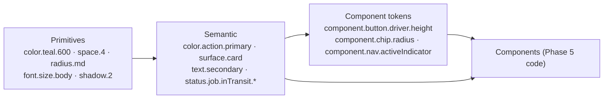

# FIKISHA — Design Phase 4 — Visual System & Design Tokens

**Status:** DRAFT — AWAITING FOUNDER REVIEW
**Design track:** Phase 4 (visual language & design-token specification)
**Depends on / authoritative (in order):** `CLAUDE.md` · `docs/team-skills-policy.md` ·
`docs/design-brief.md` (Design Phase 0) · `docs/design-phase-1-ia.md` (Phase 1) ·
`docs/design-phase-2-user-flows.md` (Phase 2) · `docs/design-phase-3-wireframes.md`
(Phase 3, approved baseline, commit `537e36b`) · approved `docs/phase-0/` +
`docs/phase-1/` + `docs/phase-2/`.

> **This is a design-system and visual-language phase only.** It contains **no**
> application code, no CSS, no Tailwind config, no tokens-in-source, no Storybook.
> It changes **no** product behaviour — not the Job lifecycle, verification
> lifecycle, trust rules, value bands, pickup/delivery proof, custody, recipient
> model, authorization, commission, payment architecture, dispute behaviour,
> legal position, or MVP scope. Every colour, the wordmark, the final token
> values, and all Swahili terminology below are **PROVISIONAL** and marked as
> such. Where a visual need brushed a product/architecture rule it is recorded in
> §32, not resolved.

---

# 1. Phase purpose

Design Phase 3 fixed *what the interface does* — screens, hierarchy, workflows,
interactions, states, exceptions, responsive behaviour, accessibility
requirements. **Phase 4 fixes what Fikisha consistently looks and feels like**
expressing those decisions: typography, spacing, colour, shape, elevation,
iconography, status presentation, interaction states, density, the visual
language of Jobs / timelines / negotiation / trust / verification / evidence /
incidents, the per-role visual systems, motion, EN–SW handling, and a **design-
token architecture**.

**Success test:** Phase 5 can translate this into implementation (a real Tailwind
config, component code, tokens file) **without inventing the visual language**.
The token *values* here are provisional starting points; the token *structure*,
the semantic mapping, and the component behaviour are the deliverable.

---

# 2. Visual design principles

1. **The next right action is the most prominent thing on the screen.** One
   filled primary per screen; everything else recedes.
2. **Status is never colour alone.** Every status = colour **+** text **+**
   icon/shape (**+** position where it helps). Works on a cheap LCD in sunlight
   and for colour-blind users.
3. **Borders before shadows.** Content surfaces are defined by a hairline border
   on a warm off-white ground. Shadow is reserved for things that genuinely
   float (dialogs, sheets, dropdowns, the sticky action bar).
4. **Restraint reads as competence.** No gradients, glassmorphism, hero imagery,
   decorative motion, or dashboard ornament. Every visual element earns its
   place or is removed.
5. **Legibility first.** 16 px minimum body on mobile; tabular figures for money,
   weights, OTP, timestamps; generous line-height for bilingual text; survives
   200 % zoom.
6. **Coherent across roles, tuned by density.** Business, Operator, Driver,
   Operations, Admin, and Recipient share one design language and one token set;
   they differ in density, layout, and which actions appear — never in visual
   vocabulary.
7. **Server-confirmed vs local is visible.** A pending local action never looks
   like a confirmed one.
8. **Human, local, grounded.** Warm neutrals, an earth-tone accent, locally
   grounded spot illustration — not a cool corporate SaaS palette, not fintech
   neon.
9. **Provisional is labelled.** Anything awaiting the brand/KIPI process or SW
   language review is marked `[PROVISIONAL]`.

---

# 3. Brand personality → visual characteristics

The seven attributes from `docs/design-brief.md §4`, translated to observable
visual decisions.

| Trait | What it means visually | What it should look like | Avoid |
| --- | --- | --- | --- |
| **Reliable** | Predictability and stability | Clear heading hierarchy; controls in the same place every screen; one stable status vocabulary; hairline-bordered cards on a calm ground; nothing shifts under the user | Layout that reflows on load; ambiguous icon-only controls; status that changes style by context; decorative "loading" effects |
| **Local** | Belongs at the stage and the yard, Kajiado not Nairobi-gloss | Warm off-white ground (`stone-50`), an **earth/clay accent**, spot illustration of stages/yards/boda-to-trailer, Swahili prominent on operator screens | Cool blue-grey "freight forwarder" palette; imported stock logistics imagery; English-only layouts |
| **Modern** | Current, clean, unfussy | Generous whitespace; a tight type scale with few steps; a single outline icon style; flat surfaces with clear edges | Skeuomorphism; heavy 2010s shadows; gradient buttons; bevels |
| **Practical** | Nothing costs a tap or a second | Big targets (≥ 44 / ≥ 56 px driver); primary action full-width on mobile; progressive disclosure; plain labels; no steps that aren't needed | Multi-level menus; carousels; modals that interrupt a flow; decorative empty states with no CTA |
| **Confident** | Calm authority, not loud | Solid primary in one grounded brand colour; firm 700-weight titles; short declarative copy; ample contrast | Exclamation-heavy UI; oversized "TRUSTED!" badges; alarm-red used for non-alarms; shouty gradients |
| **Human** | A person made this, for people | Warm neutrals over pure grey; friendly-but-plain empty-state illustration; sentence-case copy; forgiving errors ("check the code and try again") | Cold system-error tone; raw codes on screen; clinical all-caps; sterile pure-white everywhere |
| **Trustworthy / accountable** | A reliable witness; evidence-minded | Consistent, understated verification pills (fact, not praise); a timeline that shows *who / when / what proof*; "verified" vs "operator-attested" always distinguished; audit-visible admin actions | An endorsement ribbon; a 5-star rating of a person; anything that implies a guarantee; hiding the unverified state |

---

# 4. Visual direction (provisional)

**Overall character.** A calm, high-contrast, **field-tool** aesthetic. Warm
off-white ground, near-black text, one grounded brand colour for action, one
earth accent for standing/identity, and a strict semantic set for status.
Surfaces are flat with hairline borders. Type does the hierarchy work; colour
does the *meaning* work; shadow barely appears. It should be instantly readable
one-handed in sunlight and feel like it was built by people who move goods for a
living.

| Dimension | Direction |
| --- | --- |
| **Density** | Operator/Driver: **low** (one thing per card, big targets). Business: **medium**. Operations/Admin: **high but structured** (dense tables, strong hierarchy, progressive disclosure). Recipient: **minimal**. |
| **Contrast** | High. Body text `stone-900` on `stone-50`/white (~13:1). Operator-critical flows and the recipient page aim ≥ 7:1 on body. Focus ring and UI borders ≥ 3:1. |
| **Shape language** | Moderate radius — `md` 8 px on cards/buttons/inputs, `lg` 12 px on sheets/dialogs, `sm` 4 px on chips. **Not** pill buttons (reads playful), **not** square corners (reads cold). Practical, not soft. |
| **Typography character** | System sans, functional, tight scale, 700 for titles, tabular figures for data. No display face, no web font. |
| **Icon character** | One outline set, 1.75 px stroke, 24 px grid, rounded joins. Always with a label except for back/close/overflow/call. Bespoke icons for vehicle classes, custody steps, verification, trust, connectivity. |
| **Imagery** | Lightweight local **SVG spot illustration** for empty/onboarding/recipient/error only. No photography in-product for MVP (photography direction is a marketing deliverable). |
| **Surface treatment** | Flat. `stone-50` page, white cards with a 1 px `stone-200` border. Elevation only for floating/transient surfaces. |
| **Action emphasis** | Exactly one filled `brand-600` primary per screen; secondary = outline; tertiary = text. Driver-critical primary is 56 px and visually dominant. |
| **Status emphasis** | A consistent chip/badge system: colour + icon + text. Job state, verification group, and connectivity each have a fixed treatment reused everywhere. |

**This should read as Fikisha, not a template:** the warm `stone` neutral + a
clay accent + a grounded teal, the fact-pill trust language, the who/when/proof
timeline, and the field-tool driver screen are the recognisable signature.

---

# 5. Design-system foundations

## 5.1 Typography

**Family (provisional, refine in Phase 5).** System stack, no web-font download
(`NFR-PERF-4`, design-brief §6.3 / §8):

```
font.family.sans =
  -apple-system, BlinkMacSystemFont, "Segoe UI", Roboto, "Helvetica Neue",
  Arial, "Noto Sans", sans-serif
font.family.numeric = same stack + font-feature-settings: "tnum" 1, "lnum" 1
```

`Noto Sans` is added as a late fallback for broad Android coverage. Swahili uses
plain Latin letters (no diacritics), so the constraint is **string length**
(SW ≈ +15–30 %), not glyph coverage. `KSh` is ASCII — renders everywhere.

**Type scale** (rem, 16 px base; few steps, clear jumps):

| Token | size / line-height | weight | Use |
| --- | --- | --- | --- |
| `font.size.display` | 1.75 / 2.0 rem | 700 | onboarding / marketing screen title only |
| `font.size.h1` | 1.375 / 1.75 rem | 700 | screen title |
| `font.size.h2` | 1.125 / 1.5 rem | 700 | section heading |
| `font.size.h3` | 1.0 / 1.375 rem | 600 | subsection / card title |
| `font.size.body` | 1.0 / 1.5 rem | 400 | default body |
| `font.size.body-sm` | 0.875 / 1.25 rem | 400 | secondary text, notes |
| `font.size.label` | 0.875 / 1.25 rem | 600 | form labels, chips, nav labels |
| `font.size.caption` | 0.75 / 1.0 rem | 400 | timestamps, meta, `as of HH:MM` |
| `font.size.button` | 1.0 / 1.0 rem | 600 | button text (driver-critical: 1.0625 rem / 700) |
| `font.size.numeric-lg` | 1.5 / 1.75 rem | 700 (tnum) | agreed price, earnings total, OTP |

**Rules.** Body never below 16 px on mobile. Respect OS text scaling to 200 %
(no clipped text; containers grow). Titles sentence case. Numeric contexts
(money, weight, distance, OTP, counts, timestamps) use `font.family.numeric`
(tabular lining figures) so digits align in lists and don't jitter while
counting. Line length capped ~70 ch on reading views.

## 5.2 Spacing

Base unit **4 px**. Systematic scale (no arbitrary values):

| Token | px | Token | px |
| --- | --- | --- | --- |
| `space.0` | 0 | `space.5` | 20 |
| `space.1` | 4 | `space.6` | 24 |
| `space.2` | 8 | `space.8` | 32 |
| `space.3` | 12 | `space.10` | 40 |
| `space.4` | 16 | `space.12` | 48 |
| — | — | `space.16` | 64 |

| Context | Value |
| --- | --- |
| Page padding — mobile / tablet / desktop | `space.4` / `space.6` / `space.8` |
| Card padding — mobile / desktop | `space.4` / `space.5` |
| Form: label → input | `space.2`; input → hint/error | `space.1` |
| Form: field → field | `space.4` |
| Section → section | `space.6` (mobile) / `space.8` (desktop) |
| Button internal x-padding | `space.4`; icon → label | `space.2` |
| Timeline row → row | `space.3`; node → text | `space.3` |
| Bottom sticky action bar | `space.4` + `env(safe-area-inset-bottom)` |
| List row vertical padding (compact/admin) | `space.2`–`space.3` |

## 5.3 Layout / grid

| Role | App frame | Content max-width | Grid |
| --- | --- | --- | --- |
| **Operator / Driver** | centred single column at every size; bottom nav always | **480 px** | 1-col; cards stack |
| **Business** | ≤ `lg`: bottom nav + single column; ≥ `lg`: 240 px sidebar + content | reading views **720 px**; list/grid views to ~1120 px | 12-col at ≥ `lg`; card grid 1 / 2 / 3 by breakpoint |
| **Operations / Admin** | left nav 220 px + optional per-section top tab row; content fluid | fluid to **1600 px** | 12-col; three-pane where useful |
| **Recipient** | centred card, **max 400 px**, on any screen | 400 px | single card |

Mobile gutter 16, desktop gutter 24, admin table gutter 16. **Form inputs stay
single-column, max 480 px wide even on desktop.** **Desktop ≠ stretched mobile:**
operator/driver keep the 480 column; business *adds* a sidebar and columns; admin
*adds* density and panes.

## 5.4 Border radius

| Token | px | Use |
| --- | --- | --- |
| `radius.none` | 0 | flush dividers, full-bleed media |
| `radius.sm` | 4 | chips, badges, small inputs, thumbnails |
| `radius.md` | 8 | inputs, buttons, cards, nav items |
| `radius.lg` | 12 | bottom sheets, dialogs, the recipient card |
| `radius.full` | 9999 | avatar, connectivity dot, trust pips, count pill |

Practical reliability, not decorative softness: `md` is the workhorse; no
pill-shaped buttons.

## 5.5 Elevation

| Token | Value (provisional) | Use |
| --- | --- | --- |
| `shadow.0` (`elevation.0`) | none | page, in-flow content |
| `shadow.1` | `0 1px 2px rgba(26,24,21,.08)` | sticky bottom action bar top edge, sticky table header |
| `shadow.2` | `0 1px 2px rgba(26,24,21,.08), 0 4px 12px rgba(26,24,21,.08)` | dropdowns, popovers, toasts |
| `shadow.3` | `0 8px 24px rgba(26,24,21,.16)` | dialogs, bottom sheets |

**Rule:** a surface in normal flow (card, list row, panel) uses a **border**,
never a shadow. A surface that floats over content or is transient uses a
**shadow** and no border. Never both.

## 5.6 Borders / dividers

| Token | Value | Use |
| --- | --- | --- |
| `border.width.hairline` | 1 px | default surfaces, dividers |
| `border.width.control` | 1 px | inputs (colour `border.color.strong`) |
| `border.width.emphasis` | 2 px | focus ring, current-proposal accent, active nav indicator (3 px) |
| `border.color.subtle` | `stone-100` | dividers inside dense lists |
| `border.color.default` | `stone-200` | cards, panels |
| `border.color.strong` | `stone-300` | inputs, selectable rows |
| `border.color.focus` | `brand-600` | focus ring |

## 5.7 Iconography

- **One style:** outline, 1.75 px stroke, 24 px grid, rounded caps/joins.
  Rendered ≥ 20 px in body, ≥ 24 px in nav/actions; tap area always ≥ 44 px.
- **Icon + label** in navigation and in every status indicator. Icon-only
  permitted for `back (←)`, `overflow (⋮)`, `close (×)`, `call (☎)` — and each
  still carries an `aria-label`.
- **Meaningful shape, not just colour** for status: `✓` verified/complete ·
  `●` current/active · `○` upcoming · `!`-in-circle attention · `▲` warning ·
  `✕` rejected/failed · `⏸` (pause bars) disputed/frozen · `↻` syncing ·
  `⚑` admin-review flag · `◐`/dashed pending-sync.
- **Bespoke sets** (commission as SVG in Phase 5, `[PROVISIONAL]` art):
  - **Vehicle classes** (distinguishable at ~24 px): Motorcycle · Pickup ·
    Canter · Tipper · Lorry · Semi-truck · Trailer · Other.
  - **Custody / job steps:** request · negotiate · confirm · assign · at-pickup ·
    custody-confirmed · in-transit · at-destination · proof-of-delivery ·
    completed · cancelled · couldn't-complete · disputed.
  - **Verification:** required · submitted · in-review · verified · rejected ·
    expired.
  - **Trust:** the 3-pip ladder device (not stars).
  - **Connectivity:** online · offline · syncing · synced · sync-issue.
  - **General:** camera · signature · OTP keypad · pin/location · phone · filter ·
    statement · search.
- A licensed open outline library (e.g. a Lucide-style set) is an acceptable
  **base**; the domain icons above are **bespoke**. No icon library ships as a
  runtime dependency — icons are inlined SVG (bundle budget).

---

# 6. Colour system

**All hex values are `[PROVISIONAL]`** — starting points consistent with
design-brief §6.2 ("saturated, grounded, non-corporate hue that survives
sunlight"; teal `#0f766e` is a *placeholder to replace*). Final palette follows
the brand/KIPI process and founder sign-off. What is **not** provisional: the
**semantic structure**, the **two-tier token model**, and the **never
colour-alone** rule.

Colour is **meaning, not decoration.** Brand colour = *action/identity*. Semantic
colours = *state*. Neutrals = *structure*.

## 6.1 Brand colours

**Brand — "Fikisha teal"** (grounded blue-green; primary action & identity):

| Step | Hex `[PROV]` | Role |
| --- | --- | --- |
| `brand.50` | `#ECFDF9` | tint backgrounds (selected nav, info-on-brand) |
| `brand.100` | `#CFF6EC` | hover tint, chips |
| `brand.200` | `#9EE9D6` | borders on tint |
| `brand.300` | `#63D3BB` | disabled-on-brand, decorative |
| `brand.400` | `#2FB79C` | — |
| `brand.500` | `#149782` | secondary brand fills |
| `brand.600` | `#0B7A69` | **primary action** (white text; target ≥ 4.5:1 — verify final hex) |
| `brand.700` | `#0B6357` | primary hover/pressed, links, secondary-button text |
| `brand.800` | `#0C5049` | pressed, high-emphasis text on tint |
| `brand.900` | `#0B3F3A` | rare, max-emphasis |

**Accent — "Kajiado clay"** (warm earth; standing/identity, the trust pips, map
& vehicle accents — *not* an action colour):

| Step | Hex `[PROV]` | Role |
| --- | --- | --- |
| `accent.50` | `#FBF3EC` | tint |
| `accent.100` | `#F5E2D0` | chip bg |
| `accent.300` | `#E0A876` | trust pip (filled), decorative |
| `accent.500` | `#C0703A` | accent emphasis |
| `accent.600` | `#A2591F` | accent text / trust-level label (on white ≥ 4.5:1 — verify) |
| `accent.700` | `#824718` | pressed |

> **Documented risk (§32-Q1):** brand is blue-green and `status.success` is
> green. They must stay visibly distinct. Mitigations baked in: success is a
> **warmer, leafier** green than the brand teal; **every** success state also
> carries the `✓` shape; verification/trust never use the success token for the
> level device (they use `accent`). Phase 5 must contrast-and-hue-check the final
> brand vs. success hexes side by side on a cheap panel.

## 6.2 Semantic colours

Each has `.fg` (text/icon on light), `.bg` (tint fill), `.border`, and `.solid`
(strong fill, white text). Colour-blind-safe pairing = hue **+** the mandated
icon/shape.

| Token | Hex `.solid` `[PROV]` | Meaning | Mandatory icon |
| --- | --- | --- | --- |
| `status.success` | `#1E8E3E` | verified · delivered · completed · agreed | `✓` |
| `status.warning` | `#C77700` (amber) | attention · expiring · operator-attested · disputed-hold | `▲` / `!` / `⏸` |
| `status.danger` | `#C5221F` | rejected · failed · destructive · blocking error | `✕` |
| `status.info` | `#2A5B8C` (slate-blue) | in progress · requested · in transit · under review | `●` / `…` |
| `status.neutral` | `#5C574E` (`stone-600`) | draft · cancelled · not-submitted · muted | `•` / `⊘` |

`status.danger` is reserved for genuine failure/blocking/destructive — **never**
for a non-alarm (e.g. an absent optional verification is `neutral`, not `danger`).

## 6.3 Surface colours

Warm-tinted neutral scale — **"stone"** (warmer than pure grey; "local,
grounded"):

`stone.0 #FFFFFF` · `stone.50 #F7F6F3` · `stone.100 #EFEDE8` · `stone.200 #E1DED7`
· `stone.300 #CBC7BD` · `stone.400 #A8A399` · `stone.500 #7C776C` · `stone.600
#5C574E` · `stone.700 #403C35` · `stone.800 #2A2721` · `stone.900 #1A1815`

| Token | Value | Use |
| --- | --- | --- |
| `surface.page` | `stone.50` | app background (warm off-white — sunlight glare, "human") |
| `surface.card` | `stone.0` | cards, list rows, panels |
| `surface.raised` | `stone.0` | dialogs, bottom sheets, popovers (+ `shadow.2/3`) |
| `surface.input` | `stone.0` | inputs (+ `border.color.strong`) |
| `surface.nav` | `stone.0` | bottom bar, business sidebar |
| `surface.nav.console` | `stone.50` | Operations/Admin nav (cooler signal that this is a console) |
| `surface.sunken` | `stone.100` | the negotiation context strip, code blocks, table zebra |
| `surface.overlay` | `rgba(26,24,21,.55)` | modal/sheet scrim |
| `surface.brandTint` | `brand.50` | selected nav item, "confirmed" header wash |

Light theme is authoritative and must be flawless. Dark theme is **not** in MVP
scope; the semantic-token structure does not preclude a later `dark` set
(design-brief §6.2). No dark values are authored here.

## 6.4 Text colours

| Token | Value | Contrast on `surface.page` | Use |
| --- | --- | --- | --- |
| `text.primary` | `stone.900` | ~13:1 | body, titles |
| `text.secondary` | `stone.600` | ~5.6:1 | supporting text, meta |
| `text.muted` | `stone.500` | ~4.6:1 (AA body) | captions, timestamps, hints |
| `text.disabled` | `stone.400` | < AA (intentional) | disabled control text — **always** with an explicit reason nearby (Phase 3) |
| `text.inverse` | `stone.0` | on `brand.600` / `status.*.solid` | text on solid fills |
| `text.link` | `brand.700` | ~5.9:1 | inline links (underline on hover/focus, not by default in dense UI) |

## 6.5 Status colours — domain state treatment

Reusable everywhere the state appears (chip, header, timeline, list, badge). Full
Job-state map in §13; verification in §16; connectivity below.

| Connectivity | Token | Treatment |
| --- | --- | --- |
| Online / synced | `status.connectivity.synced` | `status.success.fg` dot + "Synced" (or hidden after 2 s) |
| Syncing | `status.connectivity.syncing` | `status.info.fg` `↻` (rotates; static under reduced-motion) + "Syncing…" |
| Offline | `status.connectivity.offline` | `status.warning.fg` dot + "Offline" |
| Sync issue | `status.connectivity.issue` | `status.warning.fg` `⚑` + count → opens the sync-issues tray |

Always in the app bar; never colour-only (dot **+** word / icon **+** word).

## 6.6 Accessibility contrast (targets)

WCAG **2.2 AA** floor, per Phase 3.

| Element | Minimum | Fikisha target |
| --- | --- | --- |
| Body text | 4.5:1 | ≥ 7:1 on operator-critical flows & recipient page |
| Large text (≥ 18.66 px bold / 24 px) | 3:1 | 4.5:1 |
| UI components, borders, focus ring | 3:1 | ≥ 3:1, focus ring aims ≥ 3:1 against **both** adjacent colours |
| Status chip (text + icon vs. its bg) | 4.5:1 | 4.5:1; the chip bg vs. the page ≥ 3:1 |
| Disabled controls | exempt | still carry a **text** reason |

Every provisional hex pair in §6.1–6.4 must be re-verified with the **final**
hexes in Phase 5, on a low-cost LCD, in the `accessibility-compliance` check.
Tokens: `a11y.contrast.bodyMin = 4.5`, `a11y.contrast.bodyTarget = 7`,
`a11y.contrast.largeMin = 3`, `a11y.contrast.uiMin = 3`.

---

# 7. Interaction states

Applies to every interactive element.

| State | Treatment | Notes |
| --- | --- | --- |
| **Default** | token-defined rest style | — |
| **Hover** | desktop/pointer only: bg darken ~8 % or tint | never a hover-only affordance (touch-first) |
| **Focus-visible** | 2 px `border.color.focus` ring, 2 px offset | on **every** interactive element incl. cards-as-links; `:focus-visible` (not on mouse click) |
| **Active / pressed** | bg −12 %, no scale bounce, no translate | immediate; `motion.fast` |
| **Selected** | `surface.brandTint` bg + `brand.700` text + 2–3 px `brand.600` marker | nav items, radio/segmented, filter chips |
| **Disabled** | `stone.100` bg, `text.disabled`, `cursor: not-allowed`, no focus | **always** with a visible reason (Phase 3); `aria-disabled` where the element must stay discoverable |
| **Loading** | label → inline spinner (+ "Confirming…"); width **locked**; `aria-busy` | control does not resize; see §8, §20 |
| **Error** (inputs) | `status.danger.border` + `✕`-in-circle + message tied via `aria-describedby` | see §9 |

---

# 8. Buttons

| Variant | Rest | Use |
| --- | --- | --- |
| **Primary** | `brand.600` bg, `text.inverse`, `radius.md` | the one `⌘` per screen |
| **Secondary** | `surface.card` bg, `brand.700` text, 1.5 px `brand.600` border | supporting action |
| **Tertiary / text** | `brand.700` text, no bg/border | low-emphasis (e.g. "Save draft", "Why not eligible?") |
| **Destructive** | `surface.card` bg, `status.danger.fg` text, 1.5 px `status.danger.border` | the *entry* to a destructive flow; the final confirm inside the dialog is `status.danger.solid` bg + `text.inverse` |
| **Success confirm** | `brand.600` primary in nearly all cases; a `status.success.solid` fill **only** for the single terminal positive confirmation (e.g. recipient "Confirm I received the goods") | used sparingly so it stays meaningful |
| **Icon button** | 44 px square, tertiary styling | back / overflow / close / call only |

**States:** default · hover · focus-visible · pressed · disabled (+ reason) ·
loading (label → "Confirming…", width locked).

| Size token | Height | Font | Use |
| --- | --- | --- | --- |
| `component.button.compact` | 36 px | `label` | desktop dense tables **only**; never a primary |
| `component.button.default` | 44 px | `button` (16/600) | standard |
| `component.button.driver` | **56 px** | 17/700 | driver-critical `⌘` (Phase 3): full-width, in a block ~30 % of viewport height with its padding |

Primary is **full-width on mobile**, auto/inline on desktop. One primary per
screen (Phase 3). Icon + text for anything the user must read; icon-only only for
the four universal controls.

---

# 9. Forms & inputs

**General.** Label **always visible above** the field (never placeholder-as-
label). Required shown as the word "Required" (or "(required)"), not a colour-
only asterisk. Input height 44 px (48 px on driver flows), `surface.input`,
1 px `border.color.strong`, `radius.md`, 12 px x-padding, **16 px text** (prevents
iOS auto-zoom). Hint below in `text.muted` `caption`; error below in
`status.danger.fg` + `✕`-in-circle, tied via `aria-describedby`, error border
`status.danger.border`; success (where meaningful) a `✓` + `status.success.fg`.

| Control | Spec |
| --- | --- |
| **Text input** | as general |
| **Select** | native `<select>` on mobile; custom listbox on desktop only if it adds value; same height/border |
| **Search** | leading search icon, clear (`×`) button when non-empty, `type=search` |
| **Textarea** | min 3 rows, auto-grow to ~8, resize handle on desktop |
| **Currency** | leading `KSh` adornment (`text.muted`), `inputmode=numeric`, tabular figures, formats to `KSh 4,000` on blur, announces the formatted value; no decimals |
| **Phone** | Kenya context fixed (`+254`) for MVP, `inputmode=tel`, format as typed |
| **OTP** | 6 separate cells 44 × 48 px, `numeric-lg` tabular, one group `aria-label` ("Pickup code" / "Delivery code"), `autocomplete=one-time-code`, paste fills all, **group-level** error, "N of 6 entered" announced sparingly |
| **Date / time** | native pickers on mobile; EAT shown; "As soon as possible" is the first radio option (Phase 3) |
| **Photo / evidence** | ≥ 44 px "Take photo" / "Add photo" with camera icon; captured → `radius.sm` thumbnail + 1 px border + "Retake" + "Photo added" `role=status`; multiple items wrap in a grid; drag-drop zone on desktop |
| **Checkbox / radio** | 24 px control, **whole row** ≥ 44 px is the target, label to the right |
| **Switch** | only for an **immediate** on/off with instant effect (language, a notification toggle) — never for a form choice that needs submit |

---

# 10. Navigation (visual translation of the approved IA — IA unchanged)

## 10.1 Mobile bottom bar

56 px + safe-area, `surface.nav`, top hairline `border.color.default`. 3–4 items;
each = icon (24) above `label` (11–12 px / 600). **Active:** `brand.600` icon +
label **and** a 3 px `brand.600` top indicator. **Inactive:** `stone.500`.
**Badge:** an 8 px `status.danger` dot for "needs action" (no number); a small
count pill (`radius.full`, `caption` tnum) only on Messages / Notifications.
"More" opens a **full-screen sheet list**, not a dropdown. Labels are **always**
shown — if space is tight, drop to 3 items + More, never drop labels.

| Role | Bottom bar |
| --- | --- |
| Business | Home · Jobs · Messages · More |
| Operator | Home · Work · My Jobs · More |
| Driver | Current Job · Jobs · More |
| Group Manager | Home · Jobs · Team · More |

## 10.2 Desktop sidebar (Business) & console nav (Operations / Admin)

- **Business sidebar:** 240 px, `surface.nav`. Item = icon + label, 40–44 px row.
  **Active:** `surface.brandTint` bg + `brand.700` text + 3 px left `brand.600`
  border. Secondary items in a collapsible group.
- **Operations:** left nav 220 px, `surface.nav.console`. Primary:
  Overview · Jobs · Verification · Incidents · Disputes · Businesses · Operators ·
  Vehicles · Search · Audit. Optional per-section top tab row.
- **Platform Admin:** left nav 220 px. Primary:
  Overview · Users & Organizations · Operators · Businesses · Vehicles ·
  Verification · Trust & Reputation · Jobs · Incidents & Disputes · Commission ·
  Configuration · Audit · System. Denser row height (36–40).

## 10.3 App bar (all roles)

Sticky top, `surface.card`, bottom hairline. Left: `←` back (context) / screen
title (`h1`). Right: **language switcher** (`EN | SW`, current bold, 44 px tap) +
**connectivity indicator** (§6.5). Overflow `⋮` where a screen has secondary
destructive/rare actions.

## 10.4 Notification / needs-action indicators

A dot (not a number) on the nav item; a count pill only where a count is
actionable (unread messages, pending confirmations). Never a red dot for purely
informational updates.

---

# 11. Cards & surfaces

- **Card:** `surface.card`, 1 px `border.color.default`, `radius.md`, padding
  `space.4` (mobile) / `space.5` (desktop), **no shadow in flow**. When a card
  represents one navigable entity the **whole card** is the tap target (Phase 3);
  status chip top-right. **No nested cards** — use dividers/subsections inside.
- **List row:** full-bleed with a bottom hairline on mobile; a bordered card on
  tablet+. Compact/admin rows 40–44 px, zebra via `surface.sunken` at 50 %.
- **Section:** `h2` heading + optional trailing text link ("See all") + content;
  `space.6`/`space.8` between sections.
- **Panel (desktop/admin):** like a card but may be full-height in a pane; header
  row with title + panel actions.
- **Sheet / dialog:** `surface.raised`, `radius.lg`, `shadow.3`, scrim
  `surface.overlay`; bottom sheet on mobile, centred modal ≥ `md`.

---

# 12. Job visual language

The Job is the core object; its **chrome is identical across roles**, its content
and actions differ.

| Element | Treatment |
| --- | --- |
| **Job reference** | `FK-1042`, `font.family.numeric`, `text.secondary`; SR name always prefixes "Job " |
| **State** | the §13 chip, top-right of the card / left of the header line |
| **Route** | two lines, `pickup → destination` with a `→` glyph; pickup label `text.muted`, place `text.primary`; recipient shown as first name + last initial where relevant (Phase 3 §20.0) |
| **Cargo** | one line: description · category; weight + handling flags on a second `body-sm` line |
| **Value / band** | shown to Business/Operator/Admin as `KSh` (tnum) + a band word ("Standard" / "Elevated" …); **never** shown to the recipient |
| **Operator / driver / vehicle** | name + `text.secondary` role; vehicle = class icon + plate (tnum); verified facts as §16 pills (not a blanket badge) |
| **Next action** | the §39 *next-action card* — one `⌘` or "Nothing needed from you right now" |
| **Negotiation** | "Negotiating — N responded" link, or the agreed `KSh` in `numeric-lg` with a lock glyph |
| **Custody / delivery** | proof chips ("OTP" / "Photo" / "Signature") + the **verified / operator-attested** marker (§16) |
| **Incidents** | a `status.info` "Reported" / `status.warning` "Under review" chip in the Incidents section |

**Job card anatomy (all roles):**

```
┌───────────────────────────────┐
│ Kitengela → Athi River  [chip]│   route (h3) + state chip
│ 8 cartons · Electronics       │   cargo (body)
│ ~120 kg · Keep upright        │   meta (body-sm, text.secondary)
│ 🛻 Pickup · Today 14:00        │   vehicle icon + when
│ KSh 7,800                     │   price (numeric-lg or body, tnum)
│ Counter-offer: KSh 7,800  ›   │   optional next-action hint (brand.700)
│ FK-1042                       │   reference (caption, numeric, text.muted)
└───────────────────────────────┘
```

---

# 13. Job status system — the 14 authoritative states

**Underlying states are unchanged.** UI labels are `[PROVISIONAL]` (EN working
set from Phase 3 §3; SW `[PROVISIONAL]` — professional review pending,
design-brief §5). Categories: **pre-active · progress · terminal-positive ·
terminal-neutral · terminal-negative · exception-hold.**

| State | Label EN `[PROV]` | Label SW `[PROV]` | Category | Icon | Colour role | Chip | Header line | Timeline node |
| --- | --- | --- | --- | --- | --- | --- | --- | --- |
| `DRAFT` | Draft | Rasimu | pre-active | pencil | `neutral` | outline `stone` | "Not sent yet" | *not shown* (pre-timeline) |
| `REQUESTED` | Requested | Imeombwa | progress | paper-plane | `info` | soft `info` | "Waiting for operators" | first `●` |
| `NEGOTIATING` | Negotiating | Mnajadiliana | progress | chat | `info` | soft `info` | "N operators responded" | `●` |
| `CONFIRMED` | Confirmed | Imethibitishwa | progress | handshake | `brand` | soft `brand` | "Price agreed: KSh X" | `✓` |
| `ASSIGNED` | Assigned | Imepangwa | progress | id-badge | `brand` | soft `brand` | "Driver & vehicle assigned" | `✓` then `●` |
| `AT_PICKUP` | At pickup | Kwenye kuchukua | progress | pin-down | `info` | soft `info` | "Driver is collecting your goods" | `●` |
| `PICKED_UP` | Picked up | Imechukuliwa | progress | box-check | `brand` | soft `brand` | "Goods collected · [verified / operator-attested]" | `✓` + proof marker |
| `IN_TRANSIT` | In transit | Njiani | progress | truck | `info` | soft `info` | "On the way" | `●` |
| `AT_DESTINATION` | At destination | Amefika | progress | pin-check | `info` | soft `info` | "Driver has arrived" | `●` |
| `DELIVERED` | Delivered | Imefikishwa | progress (near-terminal) | package-down | `success` | soft `success` | "Delivered — confirm to close" | `✓` + POD marker |
| `COMPLETED` | Completed | Imekamilika | **terminal-positive** | flag-check | `success` | **solid** `success` | "Completed" | final `✓` |
| `CANCELLED` | Cancelled | Imefutwa | **terminal-neutral** | circle-slash | `neutral` (strong) | outline `stone-600` — **not** success styling | "Cancelled — [reason] · [who]" | neutral end-cap; connector stops |
| `FAILED` | Couldn't complete | Haikukamilika | **terminal-negative** | triangle-x | `danger` (muted) | `danger` outline | "Couldn't complete — [reason]" + permitted next actions | distinct negative end-cap (**different** from Cancelled) |
| `DISPUTED` | Under dispute | Inashughulikiwa | **exception-hold** | pause-bars | `warning` | **solid** `warning` | "Under dispute — normal steps are paused" | amber overlay at the current point; prior `✓` kept; upcoming `○` greyed further |

Compact badge = icon + short label. Header = chip + plain line + `as of HH:MM`
if cached. `CANCELLED` and `COMPLETED` must be **unmistakably different** (neutral
vs. success). `FAILED` must be distinct from both. `DISPUTED` never looks like
progress.

---

# 14. Timeline visual language

Vertical stepper. Left rail = node + connector; right = content.

| Part | Treatment |
| --- | --- |
| **Node — done** | `✓` in a `status.success` fill circle |
| **Node — current** | `●` in a `brand.600` fill; a slow pulse allowed, **static** under reduced-motion |
| **Node — upcoming** | `○` ring in `stone.300` |
| **Connector** | 2 px `stone.200`; the segment *above* a done node is `brand.300` |
| **Row content** | label (`body`; **600** for the current step) · timestamp (`caption`, tnum) · actor (`caption`) · optional proof chip (`OTP` / `Photo` / `Signature`, `radius.sm`) · optional **verified / operator-attested** marker · optional note (`body-sm`, wraps) |
| **Operator-attested pickup** | the "Picked up" row carries an amber `!` "Operator-attested · unverified" marker + a one-line note; the Job header shows a "Standard (capped)" note |
| **Pending sync** | **dashed** connector + node outline + "recorded on this phone · syncing" in `text.secondary` — visibly not a solid `✓` |
| **End-cap — Cancelled** | `stone-600` circle-slash node + "Cancelled" + reason; no further `○` |
| **End-cap — Couldn't complete** | `status.danger` triangle-x node + "Couldn't complete" + reason + inline permitted next-action links |
| **Overlay — Under dispute** | a full-width amber banner (`⏸` + "Under dispute — normal steps paused") across the timeline at the current point; prior steps unchanged; progress actions hidden/greyed |

Admin gets an expandable **raw-event drawer** per row. Never colour-only — every
node has a distinct shape.

```
Timeline
 │
 ✓ Requested     13:02  You
 │
 ✓ Confirmed     13:40  KSh 7,800
 │
 ✓ Assigned      13:55  S. Kiptoo · 🛻
 │
 ● Picked up     14:24  S. Kiptoo
 │   [OTP]  ✓ Verified pickup
 ┊
 ○ In transit
 ○ At destination
 ○ Delivered
```

---

# 15. Negotiation visual language

**Conversation + structured offers — not social messaging.** No avatars-as-
identity, no reactions, no read-receipt theatre, no typing indicators.

| Part | Treatment |
| --- | --- |
| **Job context strip** | pinned top, `surface.sunken`, `body-sm`: ref · route · cargo · vehicle needed |
| **Offer card** | a **bordered card** (not a chat bubble), aligned left (other party) / right (you); `radius.md`, 1 px border |
| **Offer card content** | proposer label (`label`) · amount `KSh X` in `numeric-lg` tnum · timestamp (`caption`) · status chip · the response available to you |
| **Current proposal** | 2 px `brand.600` left-border accent + a `brand` "Current" chip |
| **Accepted / agreed** | card gets a `status.success` `✓`; the composer is **replaced** by a pinned, prominent `brand` bar: **"Agreed: KSh 7,800 · Open Job"** with a lock glyph — the agreed price is visually authoritative (larger, brand, locked) |
| **Countered** | `status.neutral` chip "Countered"; amount stays legible, not struck |
| **Declined** | muted; amount struck through; `status.neutral` "Declined" chip |
| **Expired / stale** | muted; `status.warning` "Expired" chip; action becomes "Ask again", never "Accept" |
| **Text notes** | plain `body-sm` `text.secondary`, clearly subordinate to offer cards |

No automated pricing control, no "market rate" hint, no historical price
guidance — anywhere.

---

# 16. Trust & verification visual language

**Enforced visually: VERIFIED ≠ TRUSTED ≠ RECOMMENDED.** No endorsement ribbon,
no "TOP RATED", no oversized "Trusted Driver". No 5-star rating of a person.

## 16.1 Verification

- **Fact pill:** `[domain] · Verified ✓` in `status.success` (fg + tint bg +
  border); `[domain] · Needs attention !` in `status.warning`; `[domain] · Not
  submitted` in `status.neutral`. Small, `radius.sm`, `label` text + icon.
- **The 5 user-facing groups** (presentation only; 7 states unchanged):

| Group | Colour / icon | Underlying / effective states |
| --- | --- | --- |
| Required | `neutral` `•` | `NOT_SUBMITTED` (required for this subject) |
| Submitted | `info` `…` | `SUBMITTED` |
| Under review | `info` eye | `IN_REVIEW` |
| Verified | `success` `✓` | `VERIFIED` (not effectively expired) |
| **Needs attention** | `warning` `!` | `INFO_REQUESTED` · `REJECTED` · effective `EXPIRED` |

  Each item inside "Needs attention" shows its own specific reason line
  (question-mark / `✕` / clock-slash icon + the reviewer's words).
- A lapsed verification **flips** its fact pill to `status.warning` "Verification
  expired"; any dependent eligibility line updates.
- Verification is **never** rendered as a score, stars, or a blanket "Verified
  operator" badge.

## 16.2 Trust

- **Trust facts** = a stacked list of verification pills (§16.1) — evidence, not
  praise. Absence is `neutral`, **not** `danger`.
- **Trust level device:** three small pips (`▮▮▯`) in `accent` (Kajiado clay) +
  a text label "Level 2 · Established" in `accent.600`. Accessible name: *"Level 2
  of 3, established — cleared for deliveries up to KSh 250,000."* Reads as a
  progress ladder, **not** a rating. Pips are **clay**, never gold/stars.
- **Detail:** tapping the device opens a sheet — what Level 2 means · the value
  band · how Level 3 is reached (informational, no promises).
- **Compact / mobile:** pips + "L2"; full meaning via `aria-label`.
- **Per audience** (Phase 3 §16, minimum-necessary-disclosure): Business sees the
  fact list + level; Operator sees their own standing + the Job's required level;
  **Recipient** sees only "Operator identity verified" as one plain line;
  Operations/Admin sees full domain-by-domain state + history.

---

# 17. Evidence & media

Operational language only: **Add photo · Take photo · Upload document · View
proof · Pickup photo · Delivery photo · Signature.** Never `EvidenceObject`,
`SHA-256`, "bucket", or internal IDs on a user screen.

| Treatment | Visual |
| --- | --- |
| **Upload / capture** | ≥ 44 px button, camera / document icon; drag-drop zone on desktop |
| **Preview** | `radius.sm` thumbnail grid, 1 px border; tap → full viewer (pinch / keyboard zoom); each item removable pre-submit via a named "Remove" |
| **Verified evidence** | small `status.success` "Verified" tag (reviewer / authorised contexts) |
| **Operator-attested evidence** | `status.warning` "Unverified" tag + the one-line explanation |
| **Restricted evidence** | a lock icon + "You don't have access to this" — no thumbnail (HIGH-PII, non-owner / non-reviewer); reviewer view shows a "this access is logged" note |
| **Failed / unavailable upload** | the item stays, "Upload failed — Retry"; captured bytes are **not** lost |

---

# 18. Incidents & disputes

Four visual levels, escalating:

| Level | Visual |
| --- | --- |
| **1 · Operational note / nudge** | inline, `neutral`, no chip |
| **2 · Incident** | an incident card: category icon + a `status.info` **"Reported"** chip; appears on the Job and in the Incidents section |
| **3 · Dispute** | the Job **header flips** to the `DISPUTED` treatment (§13); a dispute panel appears; progress actions greyed |
| **4 · Resolution** | a `status.success` (or `neutral`, per outcome) **"Resolved"** chip + the recorded outcome + reason (to permitted roles) |

Status progression chips: **Reported** (`neutral`) → **Under review** (`info`) →
**Resolved** (`success` / `neutral`). **Never** "Fault: operator" styling; no
automatic-liability colour; no automatic-refund implication. The non-liability
line sits near every report action as a `role="note"`, not an alarm.

**Platform-Admin-only region** (Phase 3 §17.3, §19.2): a distinct titled block
("Platform Administrator") with a subtle `accent` left border; the *reason for
action* field is visually required; MFA is a labelled dialog. `DISPUTED → RESUME`
shows only the approved shell — **no** `RESUME_PRIOR` preconditions are drawn
(§32-Q7).

---

# 19. Notifications & feedback

| Component | Treatment | Rule |
| --- | --- | --- |
| **Toast / snackbar** | bottom, above the nav, `surface.raised` + `shadow.2`, 1 line + optional 1 action, auto-dismiss ~5 s, `role="status"` | **never** the sole record of a critical state change — the Job/verification screen also reflects it |
| **Inline feedback** | directly below the control, persists | for validation and per-field results |
| **Banner** | full-width, top of content, `status.*` tint | screen-level conditions (restricted account, stale data, offline); dismissible only if non-critical |
| **Modal / confirmation dialog** | centred (≥ `md`) / bottom sheet (< `md`), `radius.lg`, `shadow.3`, scrim; restates action + target; primary + cancel | for confirm-and-reason and destructive confirms |
| **Warning** | amber banner / inline | non-blocking |
| **Destructive confirm** | dialog, `status.danger.solid` primary, + a reason field where the model requires one | |
| **Success confirm** | brief success state; focus moves to it; then the screen shows the new state | critical positives (pickup, delivery, assignment) get a **persistent** on-screen state, not just a toast |

---

# 20. Loading / empty / error / offline states

One visual family (shared spacing, illustration weight, heading pattern).

| State | Visual |
| --- | --- |
| **Loading** | **skeletons** matching the final layout (card / list / timeline / detail shapes), `stone-100` blocks, subtle pulse (**static** under reduced-motion). A single inline spinner only for one pending control ("Confirming pickup…", width-locked). |
| **Empty** | a light **local SVG spot illustration** (stage / yard motif) + one plain sentence (*what's empty + why*) + the **one** relevant CTA (role/segment-specific). Never "No data." |
| **Error** | a compact card — icon + **"What happened"** (`h3`) + **"What it means"** (`body`) + the primary becomes **"Retry"**. Server `problem+json`: map `code` → a human line; `request_id` behind a "Details" disclosure. Never a raw 4xx/5xx. |
| **Offline** | app-bar indicator = `status.warning` dot + "Offline"; content badged `as of HH:MM`; `[server]` actions show a **specific** inline banner ("You need a connection to confirm pickup"), never a generic error; `[local-ok]` parts still work and show "saved on this phone · not sent". |
| **Sync issue** | an `⚑` (`status.warning`) + count in the app bar → a sheet listing conflicted items with **both** versions; the user resolves; **never auto-merged**. |

**Server-confirmed vs local (visual contract):** a `[server]` action in flight
shows "Confirming…"; on success the screen advances to a **persistent** confirmed
state with focus moved. A queued `[local-ok]` result shows a **dashed / "on this
phone" treatment** that is never mistaken for a solid `✓`. A state-changing
action is **never** shown as succeeded before the server confirms.

---

# 21. Mobile driver & operator visual system (highest priority)

For small screens, one-handed use, patchy data, sunlight, high attention cost,
minimal typing.

| Aspect | Rule |
| --- | --- |
| **Layout** | centred **480 px** column; generous vertical rhythm; bottom nav always |
| **The next action** | on the current-Job / action screen the `⌘` is `component.button.driver` (56 px, full-width, `brand.600`, 17/700) in a **visually dominant block** (~30 % viewport height with padding), near the top; everything else scrolls under it |
| **Bottom action area** (multi-field screens) | sticky, `surface.card`, `shadow.1` top edge, safe-area padding; holds only the primary (+ optional back) |
| **Card density** | low — one thing per card; 16 px min body; icons ≥ 24 with labels |
| **Photo capture** | one tap to camera; large shutter; immediate thumbnail; "Photo added" `role=status` |
| **OTP** | large cells, numeric keypad, autofill; group-level error; "Call the sender" always visible |
| **Status visibility** | connectivity indicator **and** Job state visible without scrolling |
| **Confirmation** | `[server]` → "Confirming…" (width-locked) → confirmed state + focus moved; offline → specific inline message + the safe sub-part (e.g. goods photo) still proceeds |
| **Swahili** | SW label first / larger on the primary action; both languages shipped |

```
┌──────────────────────────────┐
│  FK-1042        ⌂  Njiani     │  ref · connectivity · state (always visible)
│  Njiani (In transit)         │  state line, SW first
│                              │
│ ┌──────────────────────────┐ │
│ │                          │ │
│ │   ⌘  NIMEFIKA            │ │  56px, brand.600, 17/700, full-width
│ │      I've arrived        │ │  dominant block
│ │                          │ │
│ └──────────────────────────┘ │
│  Peleka: Athi River — John M.│
│  ☎ John                      │
│  Pickup ●——— Transit ●——— …  │  compact 3-step progress
│  · Ripoti tatizo / Report    │
└──────────────────────────────┘
[ Current Job · Jobs · More ]
```

---

# 22. Business workspace visual system

Business users carry more information than drivers, but Home is still *"what
needs my attention?"*, not analytics.

| Aspect | Rule |
| --- | --- |
| **Frame** | < `lg`: bottom nav + single column. ≥ `lg`: 240 px sidebar + content. |
| **Cards vs tables** | cards for a single Job; **tables** (desktop) for the Jobs list and Statements — sortable, filter bar above; card list on mobile |
| **Filters** | horizontal `selected`-state chip row ≥ `md`; collapses to "Filters (2)" → sheet < `md` |
| **Job detail** | 2–3 columns on desktop (summary · timeline + custody · messages / evidence / incidents tabs); pinned **next-action card** top-left |
| **Pickup confirmation** (Phase 3 §6.6) | rendered as a **confirm-and-context** screen: `h1` "Confirm pickup — FK-####", the "what you're confirming" block as a `role=note` above the `⌘`, `⌘` disabled until the block is acknowledged (mobile) / behind a "Yes, confirm" dialog step (desktop). `brand.600` primary, `[server]`, no queued/local variant. |
| **Statements** | printable / monospace layout, wordmark, "agreed − commission = net" framing; **no wallet balance, no pay button** |
| **Locations** | list with the one active **Main** marked; "where your business operates" vs "where a Job is collected" as a `body-sm` note |
| **No analytics dashboard** | Home = needs-your-action list + active Jobs + the "Request transport" CTA |

---

# 23. Operations / Admin visual system

Dense **but structured**. Same design language, tuned density (design-brief §12.6
recommendation) — a cooler `surface.nav.console` is the only signal that this is
a console.

| Aspect | Rule |
| --- | --- |
| **Rows / tables** | 40–44 px rows, 14 px table text, tabular figures, **sticky headers** (`shadow.1`), column show/hide, `surface.sunken` zebra |
| **Panes** | three-pane where it helps (queue · record + evidence viewer · decision + history) |
| **Overview** | prioritised **queue lists** with counts in an `aria-live` region — **not** charts |
| **Progressive disclosure** | raw-event drawer per timeline row; "why not eligible" explainer dialogs; evidence viewer with zoom / PDF pages |
| **Every admin action** | a visible **"reason for action"** field + MFA where required (`resume`, `suspend/offboard`, `configuration`) + an audit note; binding/destructive actions use the destructive-confirm pattern |
| **High-value review** | the band context (`Standard ≤ 50,000` · `Elevated` · `High` (admin pre-assignment review) · `Very high` (Platform-Admin approval)) shown as read-only context; the gate is server-side, the screen mirrors it |
| **Dense ≠ cluttered** | strong `h2`/`h3` hierarchy, generous column gaps, **one** primary action per view |
| **Configuration** | read-mostly; values shown as read-only with a "propose change" flow that produces a new version + diff — the screen never mutates a value |

---

# 24. Recipient visual system

A single narrow **400 px** card, centred on any screen, never expanding into a
workspace.

| Aspect | Rule |
| --- | --- |
| **Chrome** | a **small** Fikisha wordmark (not a full header) + one `brand` accent line; one-tap `EN / SW` toggle (`aria-pressed`) |
| **Content** | "Delivery for John M." (`h1`) · big status line (`role=status`) · cargo **summary** · driver **first name** + vehicle class + plate · "Operator identity verified" as one plain line |
| **Disclosure** | the Phase 3 §20.0 **shown / not-shown** table is the visual contract — **no** phone numbers, staff details, documents, trust internals, price, band, or location history |
| **Primary action** | `Confirm I received the goods` — `component.button.driver` (56 px), full-width, the `status.success.solid` fill (one of the few places it's used) |
| **Secondary** | `Report a problem` — tertiary text |
| **Proof** | band-appropriate (STANDARD: name + one of OTP / signature / photo; ELEVATED+: name + OTP **and** photo) — stated **before** the final action, never a generic upload |
| **Tone** | extremely plain, high contrast (≥ 7:1 body), trustworthy to a first-time viewer; branding kept light (`[PROVISIONAL]`, design-brief §12.5 / §32-Q4) |
| **Off states** | link expired → "This link has expired. Ask the sender or driver for a new one." Already confirmed → calm read-only "Delivery confirmed on [date] — thank you." |

---

# 25. Responsive visual rules

Breakpoints (`[PROVISIONAL]`, mobile-first):

| Token | min-width | Target |
| --- | --- | --- |
| `breakpoint.sm` | 360 px | baseline phone |
| `breakpoint.md` | 600 px | large phone / small tablet |
| `breakpoint.lg` | 900 px | tablet / small laptop |
| `breakpoint.xl` | 1200 px | desktop |
| `breakpoint.2xl` | 1600 px | wide / admin |

Per major component — **resize / stack / collapse / transform / hide-show /
scroll**:

| Component | < `md` | `md`–`lg` | ≥ `lg` |
| --- | --- | --- | --- |
| App shell (Business) | bottom nav, single column | bottom nav / rail | 240 px sidebar + columns |
| App shell (Operator / Driver) | bottom nav, 480 col | same | same (centred 480, **not** stretched) |
| Job card list | 1-col cards | 2-col | 3-col (Business only) |
| Job detail | single column | single / 2-col | 2–3 col + pinned next-action |
| Timeline | single-line rows | columnar rows | + raw-event drawer (admin) |
| Admin / Business list | **cards** | **table** (scrolls in its own `overflow-x:auto`) | table, more columns |
| Filters | "Filters (n)" → sheet | chip row | chip row + saved filters |
| Dialog | bottom sheet | centred modal | centred modal |
| Nav labels | always shown (drop to 3 items + More, never drop labels) | shown | shown |

**Never a horizontal body scroll.** Wide tables, diagrams, and code blocks scroll
inside their own container.

---

# 26. Accessibility system

Maintains the Phase 3 **WCAG 2.2 AA** floor; driver-critical interactions use
stronger target sizes.

| Area | Rule / token |
| --- | --- |
| **Focus ring** | 2 px `border.color.focus`, 2 px offset, `:focus-visible` only, on **every** interactive element incl. cards-as-links (`a11y.focusRing`) |
| **Keyboard** | full operability; order = reading order; skip-to-content; focus → new `<h1>` on route change, → status text after an action; dialogs trap + restore focus |
| **Focus order** | DOM order matches visual order; the next-action `⌘` is first after the skip link on action screens |
| **Target size** | ≥ 44 × 44 (`a11y.minTarget`); ≥ 56 driver-critical (`a11y.minTargetDriver`); thumb-zone spacing prevents mis-taps |
| **Headings** | one `<h1>` / screen; nested `<h2>`/`<h3>`; landmarks (`header`/`nav`/`main`) |
| **Semantic status** | `role="status"` (polite) for progress/confirmations; `role="alert"` for errors & "no longer available"; status = colour **+** icon/shape **+** text |
| **Accessible icons** | decorative → `aria-hidden`; meaningful → text or `aria-label` |
| **Forms** | visible programmatic labels; `aria-describedby` hints/errors; error summary on submit; required stated in text; `inputmode` set |
| **Screen-reader text** | `.sr-only` for context ("Job FK-1042, …"; "3 of 6 entered" sparingly) |
| **Reduced motion** | `prefers-reduced-motion: reduce` → no shimmer/pulse/slide; instant or ≤ 80 ms cross-fade; spinner → static "…" |
| **Contrast** | §6.6 targets; re-verified with final hexes on a low-cost LCD |
| **Text scaling** | layouts survive 200 % zoom / OS font scaling; tested against longer Swahili |
| **Language** | `lang` follows the EN/SW choice; custody / OTP / incident wording professionally reviewed for unambiguity |

Component-specific a11y notes live with each component in §30.

---

# 27. Motion & animation

Restrained. Motion supports comprehension; it never decorates a status change.

| Token | Value `[PROV]` | Use |
| --- | --- | --- |
| `motion.duration.fast` | 120 ms | press feedback, state change |
| `motion.duration.base` | 200 ms | toast in, dropdown, dialog |
| `motion.duration.slow` | 280 ms | bottom-sheet slide |
| `motion.easing.standard` | `cubic-bezier(.2,0,0,1)` | enter |
| `motion.easing.exit` | `cubic-bezier(.4,0,1,1)` | exit |

**Use motion for:** sheet / dialog enter–exit, toast slide-in, subtle press
feedback, the syncing `↻`, skeleton pulse.
**Prohibited:** animating Job/verification status changes for excitement,
parallax, decorative loops, number count-ups on money, celebratory confetti,
hero animation.
**Reduced motion:** all of the above become instant / ≤ 80 ms cross-fade; `↻`
becomes a static "…".

---

# 28. Internationalization — EN / SW

Both languages are first-class from day one; **Swahili prominent on operator/
driver screens** (design-brief §5). SW strings run ~15–30 % longer.

| Concern | Rule |
| --- | --- |
| **Design to the longer language** | buttons/chips size to content with a `min-width`; critical labels **wrap to 2 lines** rather than truncate; nav labels reserve ~1.4× the English width |
| **Never truncate** | money, OTP, timestamps, plate numbers |
| **Status labels** | short SW forms provided (`[PROVISIONAL]` — professional review pending): e.g. *Kwenye kuchukua* (At pickup), *Njiani* (In transit), *Imefikishwa* (Delivered), *Inashughulikiwa* (Under dispute) |
| **Switcher** | always in the app bar; one-tap `EN / SW` on the recipient page; `lang` attribute follows |
| **Layout** | no assumption of English word order/length; empty, error, and alert strings tested in SW; RTL **not** required (design-brief §8) |
| **Copy tone** | short, plain, concrete, verb-first CTAs ("Thibitisha kupokea" / "Confirm pickup"); custody & incident wording is evidentiary — reviewed, not machine-translated |
| **Currency / units** | always `KSh` + whole number; EAT times; metric (km, kg / tonnes) |

All Swahili terminology in this document is **`[PROVISIONAL]`** pending
professional review.

---

# 29. Design tokens (architecture — no code)

Two tiers. **Primitives** = raw scales. **Semantic** = role-based, referencing
primitives. Components reference **semantic** tokens (and a few `component.*`
tokens), not raw values.



**Namespaces:**

```
color.*            primitives: color.<hue>.<step>  (teal, accent/clay, stone, plus semantic hues)
color.action.*     primary | primary.hover | primary.pressed | secondaryText | disabled
color.text.*       primary | secondary | muted | disabled | inverse | link
surface.*          page | card | raised | input | nav | nav.console | sunken | overlay | brandTint
status.*           success|warning|danger|info|neutral  → .fg .bg .border .solid
status.job.*       <STATE> → .fg .bg .border .icon               (all 14)
status.verification.* <group> → .fg .bg .border .icon            (5 groups)
status.connectivity.* synced|syncing|offline|issue → .fg .icon
font.family.*      sans | numeric
font.size.*        display h1 h2 h3 body body-sm label caption button numeric-lg
font.weight.*      regular(400) medium(500) semibold(600) bold(700)
line-height.*      tight normal relaxed
letter-spacing.*   normal | tightTitle
space.*            0 1 2 3 4 5 6 8 10 12 16
radius.*           none sm md lg full
border.width.*     hairline control emphasis
border.color.*     subtle default strong focus
shadow.*           0 1 2 3
z-index.*          base sticky nav dropdown overlay modal toast
motion.duration.*  fast base slow
motion.easing.*    standard exit
breakpoint.*       sm md lg xl 2xl
size.target.*      min(44) driver(56) compact(36)
a11y.*             focusRing minTarget minTargetDriver contrast.bodyMin contrast.bodyTarget contrast.largeMin contrast.uiMin
component.*         button.{default,driver,compact}.* · input.* · chip.* · card.* · nav.* · timeline.* · sheet.* · toast.* · offerCard.* · otp.* · trustPips.*
```

**Conventions:** semantic tokens are **mode-ready** — defined on light now; a
`dark` set can be added later without renaming (design-brief §6.2). Status tokens
carry `.fg/.bg/.border/.icon` so a status is always colour **+** shape. The set
maps cleanly onto `tailwind.config` (`colors`, `fontSize`, `spacing`,
`borderRadius`, `boxShadow`, `screens`, `fontFamily`) per design-brief §10 — but
**no config or tokens file is created in this phase.** Final token *values* are
set in Phase 5 after the brand palette is fixed.

---

# 30. Component visual specifications

Each: **anatomy · variants · states · responsive · a11y · usage · anti-patterns.**
These extend the Phase 2A seams (Button, Input, Field, Card, Alert, Spinner,
StatusBadge, PageLoader, EmptyState, ErrorState).

### 30.1 App shell
- **Anatomy:** app bar (back / `h1` / language + connectivity) · content region ·
  role nav (bottom bar or sidebar) · toast layer · sheet/dialog layer.
- **Variants:** operator/driver (480 col, bottom bar) · business (sidebar ≥ `lg`)
  · console (left nav, `surface.nav.console`) · recipient (no nav, 400 card).
- **States:** online / offline / syncing / sync-issue reflected in the app bar.
- **Responsive:** §25.
- **A11y:** landmarks; skip link; focus → `h1` on navigation.
- **Usage:** every authenticated screen. **Anti-patterns:** hiding the
  connectivity indicator; a stretched desktop operator layout.

### 30.2 Navigation (bottom bar / sidebar)
- **Anatomy:** items (icon + label) · active indicator · badges.
- **States:** default · active (`brand.600` + indicator) · selected · focus ·
  badge (dot / count pill).
- **A11y:** `nav` landmark; `aria-current="page"`; labels always present.
- **Anti-patterns:** icon-only items; a red dot for informational updates; a
  dropdown "More" on mobile (use a full-screen sheet).

### 30.3 Job status header
- **Anatomy:** state chip · plain-language line · `as of HH:MM` (if cached).
- **Variants:** one per §13 category.
- **States:** live / cached / disputed-overlay.
- **A11y:** `h1` + a `role="status"` line.
- **Anti-patterns:** `CANCELLED` shown with success styling; raw state names.

### 30.4 Next-action card
- **Anatomy:** one `⌘` **or** "Nothing needed from you right now".
- **Variants:** default · driver-critical (56 px, dominant block) · disabled
  (+ reason) · none.
- **States:** default · loading ("Confirming…") · disabled+reason · offline
  (specific message).
- **A11y:** first interactive control; label states the outcome.
- **Anti-patterns:** two primary actions; enabling with no reason shown when
  blocked.

### 30.5 Job card
- **Anatomy:** §12 anatomy block.
- **Variants:** business / operator / driver / admin content; compact (list) vs
  full.
- **States:** default · pressed · focus (whole card) · disabled ("no longer
  available" greyed with text).
- **A11y:** a single link; accessible name summarises route + state.
- **Anti-patterns:** nested cards; multiple tap targets competing with the card
  link.

### 30.6 Job timeline
- **Anatomy:** §14.
- **Variants:** compact 3-step (driver) · full (all roles) · + raw-event drawer
  (admin).
- **States:** done / current / upcoming / pending-sync / end-cap (cancelled ·
  couldn't-complete) / dispute-overlay / operator-attested marker.
- **A11y:** `<ol>`; `aria-current="step"`; row name = "label, time, actor,
  proof/marker".
- **Anti-patterns:** colour-only nodes; hiding prior steps on dispute.

### 30.7 Negotiation offer card
- **Anatomy:** proposer · amount (`numeric-lg`) · timestamp · status chip ·
  available response.
- **Variants:** yours / theirs · Current (accent border) · Countered · Declined ·
  Expired · Agreed (`✓` + pinned agreed bar replaces composer).
- **A11y:** ordered list; new incoming offer announced (`aria-live="polite"`);
  amount field `inputmode=numeric`.
- **Anti-patterns:** chat bubbles; reactions; a "market rate" hint; auto-pricing.

### 30.8 Verification badge / pill
- **Anatomy:** icon + `[domain] · [status]` text, `radius.sm`.
- **Variants:** Verified (`success`) · Needs attention (`warning`) · Submitted /
  Under review (`info`) · Not submitted (`neutral`).
- **A11y:** text carries the status; icon `aria-hidden`.
- **Anti-patterns:** a blanket "Verified operator" badge; stars; a score.

### 30.9 Trust fact list + level device
- **Anatomy:** stacked verification pills · the 3-pip `accent` ladder + "Level N ·
  [name]".
- **Variants:** full (Business/Admin) · compact ("L2" + pips) · recipient (single
  "Operator identity verified" line, no device).
- **A11y:** pips have an accessible name incl. the value band ("Level 2 of 3,
  established — cleared for deliveries up to KSh 250,000").
- **Anti-patterns:** gold/stars; "Trusted Driver" as a standalone endorsement;
  implying a guarantee.

### 30.10 Vehicle card
- **Anatomy:** class icon · plate (tnum) · capacity · status chip
  (Active / Under repair / Suspended / Inactive) · verification marker.
- **States:** Suspended is admin-only and read-only to the operator.
- **Anti-patterns:** showing a suspended vehicle as available.

### 30.11 Driver / operator identity card
- **Anatomy:** name · role · trust facts / level (per audience) · vehicle.
- **Variants:** business assignment view · recipient minimal (first name +
  vehicle + "identity verified").
- **Anti-patterns:** exposing phone numbers or base/home to the recipient.

### 30.12 Button — see §8. **Anti-patterns:** more than one primary; pill shape;
icon-only primary; a resizing button on loading.

### 30.13 Input / Field — see §9. **Anti-patterns:** placeholder as label;
colour-only required; a generic error not tied to the field.

### 30.14 OTP input
- **Anatomy:** 6 cells (44 × 48) · one group label · error region · "Call the
  sender".
- **States:** empty · partial · error (group) · disabled (offline: "needs a
  connection", the fallback/blocking explainer per band).
- **A11y:** `autocomplete="one-time-code"`, `inputmode="numeric"`, paste fills
  all, group `aria-describedby` to the error.
- **Anti-patterns:** per-cell error; blocking paste.

### 30.15 Photo / evidence control
- **Anatomy:** capture button · thumbnail grid · per-item Remove · status text.
- **States:** empty · captured · uploading · failed ("Retry", bytes kept) ·
  queued offline ("on this phone · not sent").
- **A11y:** button labelled with intent; "Photo added" `role=status`; each item
  named.
- **Anti-patterns:** losing captured bytes on a failed upload; exposing internal
  IDs.

### 30.16 Incident card
- **Anatomy:** category icon · short description · status chip
  (Reported → Under review → Resolved) · timestamp.
- **A11y:** non-liability note before the submit control as `role=note`.
- **Anti-patterns:** "fault" styling; implying a refund.

### 30.17 Alert / banner
- **Variants:** info · success · warning · danger — tint bg + `.fg` text + icon.
- **States:** dismissible (non-critical) · persistent (critical: offline,
  restricted account, dispute).
- **A11y:** `role="status"` or `role="alert"` per severity.
- **Anti-patterns:** danger styling for a non-alarm; a critical condition in a
  disappearing toast.

### 30.18 Modal / dialog
- **Anatomy:** title (restates action) · body · primary + cancel · optional
  reason field (admin).
- **States:** default · destructive (danger primary) · loading.
- **A11y:** focus trap + restore; `aria-modal`; `Esc` closes non-destructive.
- **Anti-patterns:** stacking modals; a modal for a routine step.

### 30.19 Bottom sheet
- **Anatomy:** grabber · title · content · sticky primary.
- **Responsive:** the mobile form of a desktop side panel / modal.
- **A11y:** focus trap; swipe-down and a visible close.
- **Anti-patterns:** a sheet taller than ~90 % viewport with no internal scroll.

### 30.20 Confirmation dialog (confirm-and-reason)
- **Anatomy:** restated action + target · reason textarea (required where the
  model needs it) · MFA step (admin sensitive) · confirm + cancel.
- **A11y:** reason labelled + required; MFA is a labelled focus-trapped step.
- **Anti-patterns:** a bare one-click destructive/binding action.

### 30.21 Empty state
- **Anatomy:** spot illustration · one sentence (what + why) · one CTA.
- **Variants:** per role/segment.
- **Anti-patterns:** "No data."; multiple CTAs; a decorative illustration with no
  next step.

### 30.22 Offline state
- **Anatomy:** app-bar indicator · `as of HH:MM` badge · per-action inline
  message · sync-issues tray.
- **Anti-patterns:** a generic error for a blocked `[server]` action; auto-merged
  conflicts.

### 30.23 Error state
- **Anatomy:** icon · "What happened" · "What it means" · Retry · Details
  disclosure (`request_id`).
- **Anti-patterns:** raw status codes; blaming the user.

### 30.24 Loading state
- **Anatomy:** layout-matched skeletons **or** one inline width-locked spinner.
- **Anti-patterns:** a full-screen spinner where a skeleton fits; layout shift on
  load.

### 30.25 Notification item (in-app list)
- **Anatomy:** icon · title · one-line context ("why am I getting this") · time ·
  deep-link.
- **A11y:** each item a link; unread state not colour-only.
- **Anti-patterns:** notifications with no action target.

### 30.26 Connectivity indicator
- **Anatomy:** dot / icon + word (Synced / Syncing… / Offline / `⚑` n).
- **A11y:** `aria-live="polite"`; never icon-only.
- **Anti-patterns:** hiding it; colour-only.

---

# 31. Visual examples / reference wireframes

These demonstrate the tokens applied. They **do not** redefine Phase 3
interactions.

**Job card (Business list):**

```
┌───────────────────────────────┐  surface.card · border.default · radius.md
│ Kitengela → Athi River  [● At │  h3 · state chip (info soft, ● icon + text)
│                        pickup]│
│ 8 cartons · Electronics       │  body
│ ~120 kg · Keep upright        │  body-sm · text.secondary
│ 🛻 Pickup · Today 14:00        │  vehicle icon + when (body-sm)
│ KSh 7,800                     │  numeric-lg · tnum
│ FK-1042                       │  caption · numeric · text.muted
└───────────────────────────────┘
```

**Business Job detail — header + next action + timeline:**

```
┌──────────────────────────────────────┐
│ ←  FK-1042                        ⋮   │  app bar
│ [● At pickup]  · as of 14:20          │  chip + cached badge (caption)
│ The driver is collecting your goods.  │  role=status line (body)
│ ────────────────────────────────────  │  hairline
│  Nothing needed from you right now.   │  next-action card (no ⌘)
│                                       │
│ Operator  Athi Movers                 │  h3
│  [Identity · Verified ✓]              │  verification pill (success)
│  [Licence · Verified ✓ (Pickup)]     │
│  Level 2 · Established   ▮▮▯          │  trust device (accent pips)
│                                       │
│ ● Picked up   14:24   [OTP] ✓ Verified pickup
│ ○ In transit                          │  timeline (ol; aria-current on ●)
└──────────────────────────────────────┘
```

**Negotiation offer (operator view):**

```
Athi Movers  13:14                       proposer (label)
┌──────────────────────────┐   ← 2px brand.600 left accent (Current)
│ Counter   KSh 7,800      │   numeric-lg · tnum
│ [Current]                │   brand chip
└──────────────────────────┘
"Fuel is high today."                     body-sm · text.secondary
┌──────────────────────────────────────┐
│ ⌘  Accept KSh 7,800                  │  primary (brand.600), full-width
└──────────────────────────────────────┘
· Send counter     · Decline             tertiary
```

**Verification home (grouped):**

```
Needs attention (1)                        h2 · aria-live count
 [! Driving licence · Needs attention]     warning pill
   "Photo was blurry."          ⌘ Fix      body-sm + primary-sm
Required (1)
 [• Good conduct certificate]   ⌘ Start    neutral pill
Verified (2)
 [Vehicle · KDG 123A · Verified ✓]         success pill
```

**Recipient card:**

```
┌────────────────────────────┐  400px max · radius.lg · shadow.3 on load
│ fikisha            EN  [SW] │  small wordmark + toggle
│ Delivery for John M.       │  h1
│ ● The driver has arrived    │  role=status (info)
│ Coming: 8 cartons · Electronics
│ Driver: Samuel             │  first name only
│ Vehicle: Pickup · KDG 123A │
│ Operator identity verified │  one plain line (no device)
│ ┌────────────────────────┐ │
│ │ ⌘ Confirm I received   │ │  56px · status.success.solid
│ │   the goods            │ │
│ └────────────────────────┘ │
│ · Report a problem         │  tertiary
└────────────────────────────┘
```

**Admin verification queue row (dense):**

```
[⚑]  OPERATOR · LICENCE   Athi Movers   Submitted 2d ago   [Open]
     40px row · 14px text · tnum age · one primary (Open)
```

---

# 32. Open design questions

Recorded, not resolved by inventing product behaviour. Items that **would**
change product/architecture are flagged **STOP** and left for the founder.

| # | Question | Type | Disposition |
| --- | --- | --- | --- |
| Q1 | **Brand teal vs. success green legibility.** They must stay visibly distinct on a cheap LCD in sunlight. | Visual | Mitigated in-doc (warmer success hue + mandatory `✓` + trust device uses `accent`, not success). Final hexes must be contrast-and-hue-checked in Phase 5. |
| Q2 | **Final brand palette + wordmark + app-icon system.** | Visual / brand process | `[PROVISIONAL]` teal + clay + stone here; final follows the brand/KIPI process + founder sign-off (design-brief §2, §6, §12.1–12.3). |
| Q3 | **Trust-level metaphor** — 3-pip clay ladder (proposed) vs. tiered badge vs. a track. Must read as earned standing, never a person-rating. | Visual | Proposed provisionally (§16.2); founder steer wanted (design-brief §12.4). |
| Q4 | **Recipient page branding balance** — how much Fikisha identity vs. deliberate plainness for a first-time doorstep viewer. | Visual | Leaning plain (small wordmark + one accent line). Founder steer wanted (design-brief §12.5). |
| Q5 | **Console surface tint** — `surface.nav.console` cooler tint as the only "back-office" signal vs. identical to the app. | Visual | Proposed: same language, `stone-50` nav. Confirm with founder (design-brief §12.6). |
| Q6 | **Bespoke icon commissioning** — vehicle classes (8), custody steps, trust, connectivity must be legible at ~24 px in sunlight. | Visual / production | Needs an illustrator brief in Phase 4b or Phase 5; base outline set can be licensed. |
| Q7 | **`RESUME_PRIOR` preconditions.** The Phase 3 admin *shell* has a visual spec here; the **conditions** for `DISPUTED → RESUME` remain an **open product/architecture decision**. | **STOP — product** | Not drawn, not invented. Founder + architecture decide before the Jobs build phase (carried from Phase 3 §26 O-P1). |
| Q8 | **Rating / reputation visual language.** Only a minimal "Rate operator" placeholder exists; no rating-display surface is designed. | **STOP — product (deferred)** | Deferred to a later reputation design phase (carried from Phase 3 §26 O-P3). No stars, scores, ranking, or thresholds designed. |
| Q9 | **Recipient name form** (first name + last initial adopted) — exact form pending founder/legal. | Visual, minor | Page copy adapts; recipient model unchanged. |
| Q10 | **Swahili terminology** for all status labels and custody/OTP/incident copy. | Language | All SW here is `[PROVISIONAL]`; professional review required (design-brief §5). |
| Q11 | **eTIMS invoice / commission statement layout** — mandatory fields pending a tax advisor. | Visual, deferred | Design the frame in Phase 5; not blocking (design-brief §12.8). |
| Q12 | **Dark theme** — not MVP. | Visual, future | Token structure is mode-ready; no dark values authored. |

**No item above was silently resolved in a way that changes product behaviour.**
Q7 and Q8 remain **open product decisions** for the founder.

---

# 33. Phase 4 exit criteria

Phase 4 is complete when — **all met by this document:**

- [x] visual direction explicit (§4)
- [x] typography defined (§5.1, §10)
- [x] spacing defined (§5.2, §11)
- [x] layout / grid defined (§5.3, §12-adjacent, §25)
- [x] shape language defined (§5.4)
- [x] elevation defined (§5.5); borders/dividers (§5.6)
- [x] colour system defined (§6.1–6.4)
- [x] semantic status colours defined (§6.2, §6.5, §13, §16)
- [x] contrast requirements documented (§6.6, §26)
- [x] interaction states defined (§7)
- [x] buttons defined (§8)
- [x] forms & inputs defined (§9)
- [x] navigation visuals defined (§10)
- [x] cards & surfaces defined (§11)
- [x] Job visual language defined (§12)
- [x] all 14 Job statuses mapped visually (§13)
- [x] timeline language defined (§14)
- [x] negotiation language defined (§15)
- [x] verification & trust language defined (§16)
- [x] evidence & media defined (§17)
- [x] incidents & disputes defined (§18)
- [x] notifications & feedback defined (§19)
- [x] loading / empty / error / offline defined (§20)
- [x] mobile driver/operator system defined (§21)
- [x] Business workspace system defined (§22)
- [x] Operations / Admin system defined (§23)
- [x] Recipient system defined (§24)
- [x] responsive visual rules defined (§25)
- [x] accessibility system defined (§26)
- [x] motion rules defined (§27)
- [x] EN / SW considerations documented (§28)
- [x] design-token architecture defined (§29)
- [x] major component visual specifications exist (§30, 26 components)
- [x] no product behaviour changed — verified in §34
- [x] no architecture changed — verified in §34
- [x] no application code changed — this is a documentation artifact only

Upon founder approval, the next deliverable is **Design Phase 5** (translate this
system into a real Tailwind config + token file + component implementation).
**Phase 5 is not started. Frontend implementation is not started.**

---

# 34. Validation against approved phases

| Source | Checked | Result |
| --- | --- | --- |
| **Phase 0** — brand / personality / MVP boundaries | §3–§4 translate the 7 attributes and the anti-patterns; no wallet/escrow surface (§22 Statements); no GPS/AI-dispatch/route-opt/fleet visuals; commission framed as "agreed − commission = net" only | consistent |
| **Phase 1** — role IA & navigation | §10 renders the exact per-role nav from `design-phase-1-ia.md`; IA unchanged | consistent |
| **Phase 2** — flows, transitions, trust/verification, proof, recipient | §13 covers all 14 states; §16 keeps 7 verification states → 5 groups with "Needs attention" = `INFO_REQUESTED + REJECTED + effective EXPIRED`; trust ≠ verified ≠ recommended (§16.2); recipient minimum-necessary-disclosure (§24) | consistent |
| **Phase 3** — every screen, hierarchy, responsive, a11y, exceptions, offline | §12, §21–§24 cover every major screen; §7, §19, §20 preserve the local-vs-server-confirmed contract; §25 mirrors the Phase 3 responsive strategy; §26 holds the WCAG 2.2 AA floor + 56 px driver targets; §20 catalogues the exception family | consistent |

**Particular attention (as required):**

| Item | Phase 4 treatment |
| --- | --- |
| **Business pickup confirmation** (Phase 3 §6.6) | §22 — a confirm-and-context screen: `role=note` block above a `brand.600` `⌘`, disabled until acknowledged / desktop dialog step; `[server]` only, no queued variant |
| **STANDARD pickup fallback** | §14 operator-attested marker (amber `!`, "unverified", "Standard (capped)" note); §17 "Unverified" evidence tag |
| **ELEVATED+ pickup blocking** | §13 `DISPUTED`/blocking treatment vocabulary; §30.14 OTP disabled state carries the band-specific blocking explainer; no fallback UI drawn |
| **Delivery proof matrix** | §24 recipient proof list (STANDARD: OTP/signature/photo; ELEVATED+: OTP + photo), stated **before** the final action; §17 evidence treatments |
| **DISPUTED** | §13 (solid amber, `⏸`, "normal steps are paused"), §14 timeline overlay (prior steps kept), §18 level-3 treatment |
| **`RESUME_PRIOR` remains open** | §18, §32-Q7 — only the approved admin shell is styled; **no** preconditions drawn or invented |
| **Recipient minimum disclosure** | §16.2, §24 — the Phase 3 §20.0 shown/not-shown table is the visual contract; no phone/staff/docs/trust-internals/price/band/location |
| **Driver-critical journey** | §21 — 56 px dominant `⌘`, sticky bottom action, OTP as the only text entry, "Confirming…" width-lock, offline-safe photo capture, connectivity + state always visible |

**No product behaviour, architecture, API, model, migration, auth/authz,
commission, lifecycle, trust, verification, or custody rule was changed by this
document.**

---

# 35. Scope boundary honoured

Did **not**: edit React components · edit CSS · edit Tailwind config · create
design-system code · add packages · modify Vite/frontend config · create tokens
in source · create Storybook · implement components · change APIs · change
backend code · create migrations · start Phase 5 · reopen approved product
behaviour. The only project change is this documentation artifact.

---

# 36. Approval gate

**DESIGN PHASE 4 — AWAITING FOUNDER REVIEW.** Approval should confirm: the visual
direction reads as Fikisha; the token architecture and semantic mapping are
sound; the Job / timeline / negotiation / trust / verification / evidence /
incident visual languages are faithful to Phases 1–3; the per-role systems and
the responsive + accessibility + motion + EN-SW rules are sufficient; the
provisional palette, wordmark, and Swahili terms are acceptable **as
provisional**; and no product or architecture decision was changed (Q7
`RESUME_PRIOR` and Q8 rating remain open product decisions). On approval, the
next deliverable is **Design Phase 5** — implementation of the system. **Frontend
implementation has not started.**
