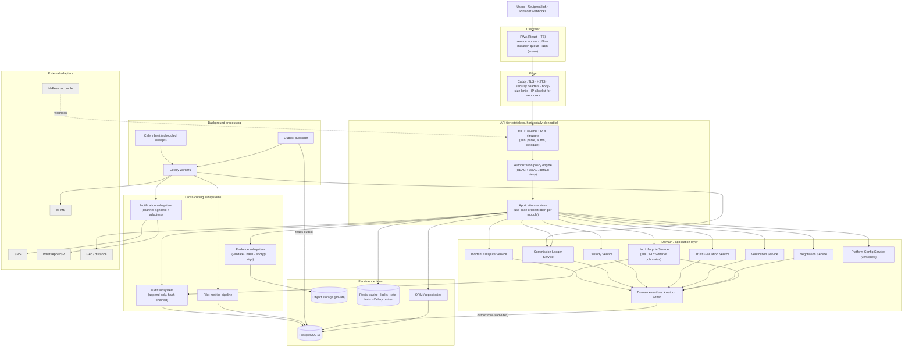
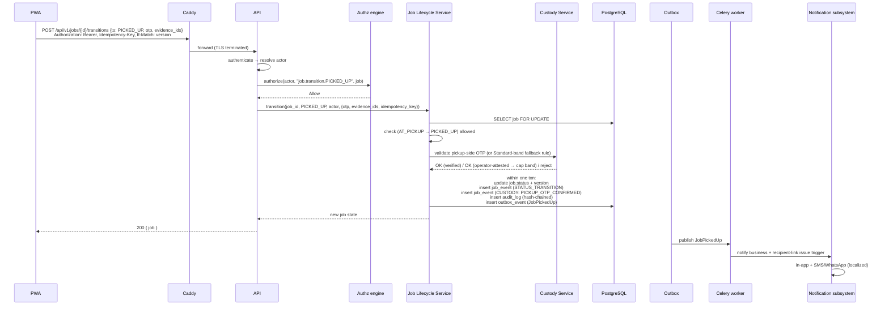

# System Architecture

How Fikisha is structured internally. Actors and external systems are in
[system-context.md](system-context.md); modules are detailed in
[domain-architecture.md](domain-architecture.md).

---

## 1. Architectural style

**Modular monolith** (Phase 1 brief §7, §34 P15).

- **One deployable API application** and **one worker application** (same
  codebase, different entrypoints), one PostgreSQL database.
- Internally divided into **bounded modules** (Django apps). Modules do not
  import each other's models directly; they call each other's **public service
  API** or react to **domain events**.
- Designed so a module could later be **extracted into a service** without
  rewriting business logic: cross-module calls already go through a narrow
  facade, and async fan-out already goes through a **transactional outbox**.
- **No microservices, no message broker, no service mesh** for the pilot.

Why not services now: pilot scale is small (NFR-PERF-1); a monolith is cheaper to
build, deploy, and reason about; distributed transactions across the job
lifecycle / ledger would be a large tax for no benefit.

---

## 2. Layered view



---

## 3. Component responsibilities

### 3.1 Frontend boundary — the PWA

- Renders all user and admin surfaces; **enforces nothing** — it reflects
  server-authoritative state and hides controls the user can't use for UX only.
- Owns: routing, i18n (en/sw), the **service worker** (app-shell precache +
  runtime caching), the **offline mutation queue** for a small whitelist of
  deferrable actions, camera capture + client-side image compression, form
  validation mirroring server error codes.
- Talks to exactly one thing: the **API** over HTTPS/JSON with a Bearer access
  token (+ httpOnly refresh cookie). Map tiles are the only other outbound call.
- Detail: [pwa-architecture.md](pwa-architecture.md), [localization.md](localization.md).

### 3.2 API boundary

- **Thin HTTP layer**: authenticate the request, resolve the actor, parse and
  shape input, call an application service, serialise the result, map domain
  errors to `problem+json` with stable `code`s.
- **No business rules in views.** A view never writes `job.status`, never
  computes commission, never decides authorization inline — it delegates.
- Conventions (versioning, pagination, idempotency, errors, concurrency via
  `If-Match`) in [api-architecture.md](api-architecture.md).
- Hosts inbound **webhook endpoints** (SMS/WhatsApp delivery receipts, optional
  M-Pesa C2B) — signature-verified, idempotent, fast-ack + enqueue.

### 3.3 Authorization policy engine

- A single `authorize(actor, action, resource) -> Allow | Deny(reason)`.
- **RBAC** (role) **+ ABAC** (verification state, trust level, suspension state,
  resource ownership, group membership, job participation, value band).
- Admin permissions come from the **role→permission map in `PlatformConfig`**, so
  the 2-role → 4-role change is configuration (D-ADM-1, FR-ADM-8).
- Every state-changing endpoint calls it; **default deny**. Object-level checks
  (IDOR/BOLA defence) are mandatory, not optional.
- Detail: [authentication-authorization.md](authentication-authorization.md).

### 3.4 Domain / application layer

Use-case orchestration lives in **application services** per module; the
invariant-critical logic lives in a small set of **domain services**:

| Service | Sole responsibility | Notes |
|---------|--------------------|-------|
| **Job Lifecycle Service** | The **only** code path that mutates `job.status`. Loads the job `FOR UPDATE`, checks the allowed-transition table + guards, applies side effects in one transaction, writes the status event + audit + custody entry, enqueues outbox events, bumps `version`. | [job-state-machine.md](job-state-machine.md) |
| **Negotiation Service** | Append offers/counters/accepts/rejects (immutable); detect mutual acceptance; call the Lifecycle Service to CONFIRM; close sibling threads; freeze the agreed price. | [negotiation-architecture.md](negotiation-architecture.md) |
| **Verification Service** | CRUD verification records per (subject, domain); apply reviewer decisions; compute **derived eligibility** (`operator_active`, `vehicle_eligible`, `driver_eligible_for_band`). | [verification-architecture.md](verification-architecture.md) |
| **Trust Evaluation Service** | Recompute trust criteria on completion / incident / rating / nightly; emit `AUTO_PROPOSED` changes; apply admin-confirmed / regression changes (append-only). Never a free-text number. | [trust-architecture.md](trust-architecture.md) |
| **Custody Service** | Record arrival / OTP confirmation / transit / destination events; validate the mandatory pickup-side OTP and the Standard-band fallback rule; attach evidence + location; enforce append-only. | [chain-of-custody.md](chain-of-custody.md) |
| **Commission Ledger Service** | On COMPLETED, compute and record an immutable `CommissionRecord` pinned to the config version; weekly statement runs; settlement reconciliation; adjustments/reversals as new signed rows. | [commission-ledger.md](commission-ledger.md) |
| **Incident / Dispute Service** | Open incidents; collect evidence + statements (append-only); run amicable-first; record admin resolutions; route the job via the Lifecycle Service. | brief §29 E2E; job-state-machine.md §5 |
| **Platform Config Service** | Read the current config; apply a versioned change (append-only `PlatformConfigVersion`); resolve "config in force at time T" for historical calculations. | [admin-architecture.md](admin-architecture.md) |
| **Domain event bus + outbox writer** | In the same DB transaction as a state change, write `outbox_event` rows; an in-process synchronous bus is used only for effects that must be atomic with the change. | [events-and-background-jobs.md](events-and-background-jobs.md) |

### 3.5 Persistence layer

- **PostgreSQL 16** — the system of record. Schema in
  [database-design.md](database-design.md).
- **Object storage** — evidence media only; never client-reachable.
- **Redis** — Celery broker, cache (config, enums, zone list, geocode results),
  distributed locks (where a DB row lock isn't the right tool), rate-limit token
  buckets, OTP attempt counters.
- Repositories/ORM are used inside services; **views never touch the ORM
  directly for writes**.

### 3.6 Background processing

- **Outbox publisher** — reads unpublished `outbox_event` rows (poll every few
  seconds, or Postgres `LISTEN/NOTIFY`), dispatches to registered handlers which
  enqueue their own Celery tasks, marks rows published. At-least-once; handlers
  are idempotent.
- **Celery workers** — send notifications, process images, run statement + eTIMS
  submission, generate CSV exports, run trust re-evaluation, geocode in the
  background where sync isn't required.
- **Celery beat** — scheduled sweeps: verification expiry, offer expiry,
  delivery-acceptance auto-complete, post-completion window close, recipient-link
  expiry, retention deletion, stale-assignment alerts, weekly statement run,
  nightly metrics rollup. Full schedule in
  [events-and-background-jobs.md](events-and-background-jobs.md).

### 3.7 Notification subsystem

- `NotificationService.send(recipient, template_key, params, importance, locale)`
  — channel-agnostic. Resolves a localized template, picks channels
  (OTP → SMS first; job events → in-app + SMS/WhatsApp per importance +
  preference; recipient link → SMS + WhatsApp), writes a `notification_message`
  row per channel, hands off to Celery, updates status from delivery-receipt
  webhooks, **falls back WhatsApp → SMS** on failure, records cost per message.
- Detail: [notification-architecture.md](notification-architecture.md).

### 3.8 Audit subsystem

- `AuditLog.record(actor, action, entity, before, after, source_meta)` — one
  **immutable, append-only** entry for every state-changing action by any actor
  including automated timers and the founder.
- Append-only enforced at the **application layer** (no update/delete ORM paths)
  and the **database layer** (the app DB role has no `UPDATE`/`DELETE` on audit
  tables). Rows are **hash-chained** (`prev_hash`, `row_hash`) for tamper
  evidence; a nightly job verifies the chain and can export to write-once
  storage.
- Detail: [security-architecture.md](security-architecture.md) §"Audit integrity".

### 3.9 Configuration subsystem

- `PlatformConfig` is a **singleton, versioned** structure (JSONB snapshot per
  version) covering: commission model + params, high-value threshold, value
  bands, trust-level criteria + ceilings, vehicle types, cargo categories, zones,
  cancellation policy, timeout values, retention windows, notification channels,
  role→permission map, feature flags.
- Every job / commission / trust decision records **which config version** was in
  force so history is deterministic and a later change never rewrites the past.
- Changes are admin-only, require re-auth, and append a
  `PlatformConfigVersion(version, changed_by, changed_at, rationale, snapshot)`.

### 3.10 Evidence subsystem

- Handles verification documents, custody/POD photos, incident/dispute evidence.
- Upload is **API-mediated** for the MVP (server-side type sniffing, size caps,
  image re-encode + EXIF strip, thumbnailing, SHA-256 hashing, optional ClamAV
  for non-images), then stored in the **private** bucket (SSE + envelope
  encryption for HIGH-PII).
- Download is always via an authorizing API endpoint that logs PII-document
  access and returns a short-lived signed URL or streams bytes. Bucket URLs are
  never exposed.
- Detail: [evidence-storage.md](evidence-storage.md).

### 3.11 Pilot metrics pipeline

- Domain events also feed an append-only `analytics_event` table; a nightly
  rollup produces `metric_daily` aggregates the admin dashboard and CSV export
  read from — **no spreadsheets** (pilot-strategy §5, FR-DASH-2).
- Detail: [observability.md](observability.md) §"Pilot metrics".

---

## 4. Request lifecycle (write path example: operator marks PICKED_UP)



Key points: one DB transaction for the state change and all its audit/custody
side effects; notifications are **after commit**, via the outbox, so a
notification failure never rolls back a custody fact.

---

## 5. Dependencies between layers (allowed direction only)

```
PWA ──> API ──> Authz engine ──> Application services ──> Domain services ──> Persistence
                                        │
                                        └──> Outbox (same txn) ──> Publisher ──> Workers ──> Notification / Metrics / eTIMS adapters
```

- **Nothing** calls "up" a layer. Workers do not call the API's HTTP layer; they
  call the same application/domain services in-process.
- Domain services depend on Persistence and the Config Service; they do **not**
  depend on the Notification subsystem directly — they emit events.
- The Audit subsystem is called by application/domain services synchronously
  (audit must be atomic with the change); it depends only on Persistence.
- External adapters are called **only from workers** (notifications, eTIMS) or
  from application services with a timeout + fallback (geocoding). No external
  call is on the critical path of a state transition.

---

## 6. Failure isolation

| If this fails | Effect | Design response |
|---------------|--------|-----------------|
| SMS or WhatsApp provider | Notifications delayed; **core job actions still work** (NFR-AVAIL-4) | Queued + retried; WhatsApp→SMS fallback; in-app notification always written |
| Geocoding provider | New job creation can still proceed with a manual/approximate distance | Sync call has a short timeout + cache; ops can override distance; matching degrades to zone-only |
| Object storage | Evidence uploads fail; **custody OTP steps still succeed** (OTP is not media) | Upload retried from the client offline queue for deferrable captures; Elevated+ pickup still gated on OTP, not photo |
| Redis | Celery stalls; cache misses hit the DB; rate limiting degrades | Beat/worker resume on recovery; the outbox is durable in PostgreSQL so nothing is lost; rate limiting fails **closed** for auth/OTP |
| eTIMS | Weekly invoice submission fails | Statement still generated; invoice queued for retry; manual eTIMS reference entry as fallback |
| A single worker crashes | Some async tasks delayed | Tasks are idempotent + retried; the outbox guarantees at-least-once |
| The single VPS | Full outage until restore | Daily backups + fast redeploy; documented restore runbook; accepted for the pilot (see [technical-risks.md](technical-risks.md)) |
