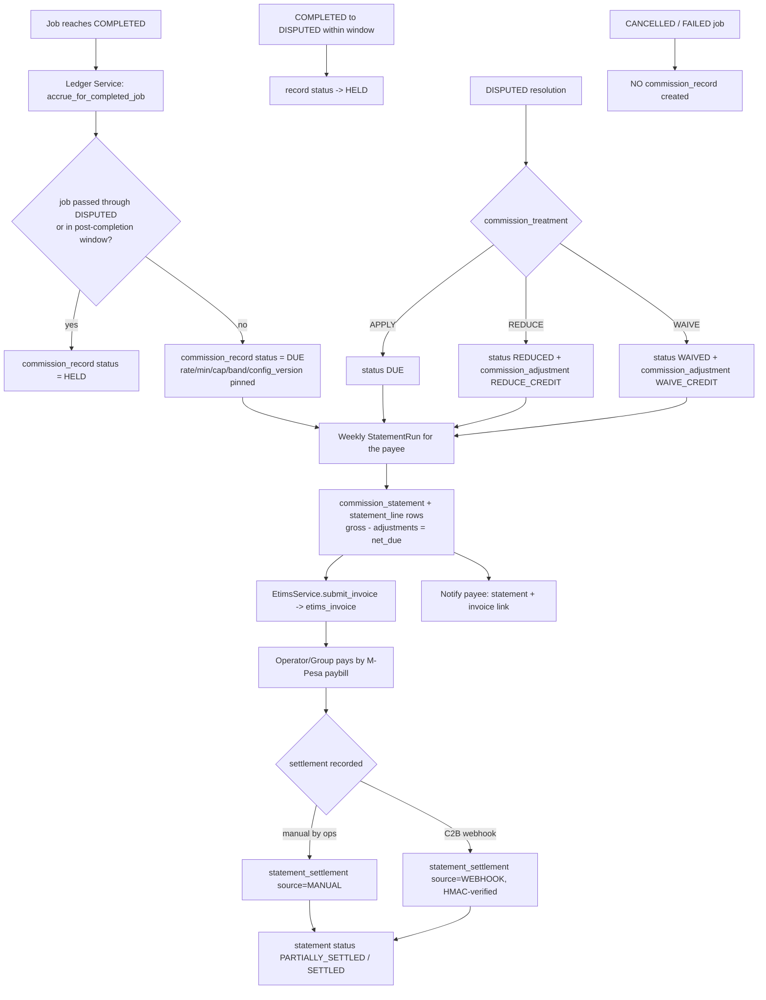
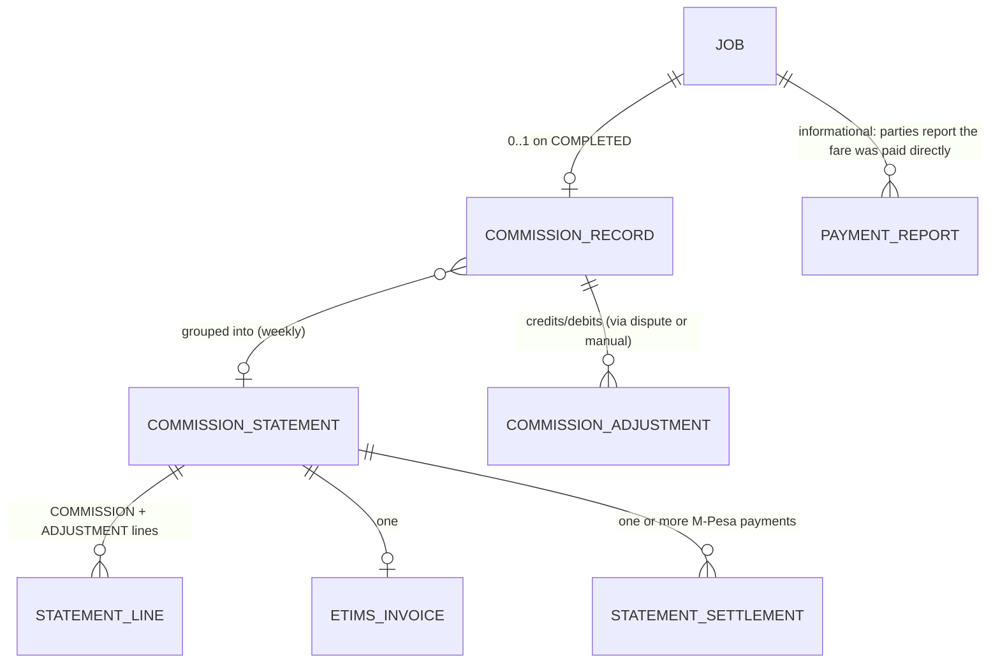

# Commission & Financial Ledger

Implements Phase 0 `D-BIZ-1..7`, `FR-M-1..6`, and the Phase 1 brief §3 (the
commission clarification) and §21 (proper ledger, not `job.commission = 500`).

**MVP commission rule (Phase 1 brief §3):**
**10% of the completed agreed transport price, minimum KES 40, capped at KES
5,000 per completed job.** No taper. No introductory ramp. **Configurable** so
the founder can change it later without rewriting the transaction system.

**The platform does NOT:** hold the transport fare · escrow customer funds ·
process the operator's fare. **The platform DOES:** record the agreed price ·
calculate its commission · record the operator/group's liability · generate
statements · support the M-Pesa paybill collection workflow · produce
eTIMS-related records.

---

## 1. Ledger principles (brief §21)

1. **Immutable per-job records.** A `commission_record` is written **once**, on
   `COMPLETED`, and is never updated.
2. **Config-version pinned.** Each record stores the `config_version_id` and the
   **resolved** `commission_model`, `rate_applied`, `min_fee_kes`, `cap_kes`,
   `band`, so recomputation is deterministic and a later config change **never
   rewrites the past** (brief §21).
3. **Corrections are new rows.** A waiver, reduction, reversal, or manual
   adjustment is a `commission_adjustment` row (admin-signed, reasoned, audited)
   that **nets against a statement** — the original record is untouched.
4. **Money is integer KES minor units.** `rate=0.10, min=4000, cap=500000`
   (minor units) in the pilot config.
5. **No fund holding.** There is no balance, no wallet, no escrow table. The only
   money movement the platform participates in is the operator/group paying the
   platform its own commission by paybill.
6. **Append-only.** `commission_record`, `commission_adjustment`,
   `commission_statement`, `statement_line`, `statement_settlement` all have DB
   roles with `INSERT, SELECT` only.

---

## 2. The calculator (configurable, one strategy implemented)

```
CommissionCalculator.compute(agreed_price_kes, band, config) -> ResolvedCommission

config.commission = {
    "model": "FLAT_WITH_MIN_CAP",     # the ONLY model implemented for the MVP
    "rate": 0.10,
    "min_fee_kes": 4000,              # KES 40
    "cap_kes": 500000,               # KES 5,000
    # reserved, NOT implemented (brief §3): "BANDED_TAPER" {bands:[...]},
    #                                       "RAMPED" {phases:[...]}
}

FLAT_WITH_MIN_CAP:
    raw   = round_half_up(agreed_price_kes * rate)      # round to the shilling
    amt   = min(cap_kes, max(min_fee_kes, raw))
    return ResolvedCommission(model, rate, min_fee_kes, cap_kes, band, amount=amt)
```

- **Rounding**: percentage first, `ROUND_HALF_UP` to the nearest shilling (KES
  has no circulating sub-unit), then apply floor/cap. Deterministic; unit-tested
  at the boundaries (§8).
- **The registry seam**: `CommissionCalculator` dispatches on `config.model`.
  Only `FLAT_WITH_MIN_CAP` is registered. `BANDED_TAPER` and `RAMPED` are
  **named in the config schema but not implemented** (brief §3) — adding one
  later is a new calculator class + a config change, **no change to the
  transaction system** (the state machine calls `compute(...)` and stores the
  result whatever the model).
- Worked examples (pilot config): agreed KES 300 → raw 30 → **KES 40** (floor);
  agreed KES 4,000 → **KES 400**; agreed KES 80,000 → **KES 5,000** (cap); agreed
  KES 60,000 → **KES 5,000** (cap); agreed KES 45,000 → raw 4,500 → **KES 4,500**.

---

## 3. Lifecycle



### 3.1 Accrual (on `COMPLETED`, inside the transition transaction)

`LedgerService.accrue_for_completed_job(job)` is called by the Job Lifecycle
Service as a side effect of `DELIVERED → COMPLETED` (see
[job-state-machine.md](job-state-machine.md) §3.3):

- `payee_kind / payee_id`: **operator** for a solo job; **group** for a group job
  (FR-O-8, D-OPR-GRP-1).
- `gross_agreed_price_kes` = `agreement.agreed_price_kes`.
- `ResolvedCommission = CommissionCalculator.compute(gross, job.value_band,
  config_at(job.config_version_id))` — note: the **config version in force at
  the job's confirmation** is used, not "now", so a mid-pilot rate change does
  not retroactively re-price completed jobs.
- `status = HELD` if the job has an unresolved dispute history or is inside the
  post-completion window that could still flip it; else `DUE`.
- One `commission_record` per job (`U(job_id)`).

### 3.2 Dispute treatment (D-BIZ-7, FR-M-3)

- `COMPLETED → DISPUTED` (within the window) → `record.status = HELD`.
- The `Resolution` carries `commission_treatment ∈ {APPLY, REDUCE, WAIVE}`:
  - `APPLY` → `status = DUE` (or stays if already invoiced).
  - `REDUCE` → `status = REDUCED`; a `commission_adjustment(kind=REDUCE_CREDIT,
    amount = original − reduced)` is created.
  - `WAIVE` → `status = WAIVED`; `commission_adjustment(kind=WAIVE_CREDIT,
    amount = original)`.
- The platform can also **record** an agreed compensation between the parties
  (`resolution.agreed_compensation_kes`) — **recorded, not processed** (FR-D-10):
  the platform moves no money between business and operator.

### 3.3 Weekly statement run (FR-M-4)

- Beat job, Monday, for the prior **Mon–Sun** period (config).
- Per payee (operator or group) with any `DUE`/`REDUCED`/`WAIVED` records or
  unstatemented adjustments in the period:
  - create `commission_statement(period_start, period_end)`;
  - one `statement_line(kind=COMMISSION, commission_record_id, job_id, amount)`
    per record;
  - one `statement_line(kind=ADJUSTMENT, adjustment_id, amount)` per adjustment;
  - `gross_commission_kes = Σ COMMISSION lines`; `adjustments_kes = Σ ADJUSTMENT`;
    `net_due_kes = gross − adjustments`;
  - move each included `commission_record.status` `DUE → INVOICED`.
- Generate the **eTIMS-compliant invoice** via `EtimsService.submit_invoice`
  (§5).
- Notify the payee (`StatementGenerated`) with a signed link to the invoice.

### 3.4 Settlement

- The payee pays `net_due_kes` to the **merchant M-Pesa paybill** (the platform's
  own account; **not** an escrow; **not** the fare).
- **Pilot default: manual recording.** Ops enters `payment_ref` + `amount` →
  `statement_settlement(source=MANUAL, recorded_by_admin_id)`; step-up not
  required (it's a recording action, fully audited).
- **Optional C2B webhook**: `POST /webhooks/mpesa/c2b`, HMAC-verified + IP
  allowlisted, idempotent by the M-Pesa transaction id → `statement_settlement
  (source=WEBHOOK)`.
- `net_settled = Σ statement_settlement.amount`; statement status →
  `PARTIALLY_SETTLED` / `SETTLED`; included records → `SETTLED`.
- Unsettled statements past a config age raise an `AdminTask` (collection
  follow-up) and feed the pilot's **invoiced-vs-settled** metric (pilot-strategy
  §4.7).

### 3.5 Adjustments & reversals (brief §21)

`commission_adjustment` kinds: `WAIVE_CREDIT`, `REDUCE_CREDIT`, `MANUAL_CREDIT`,
`MANUAL_DEBIT`, `REVERSAL`. Every one is admin-signed (`created_by_admin_id`),
carries a `reason`, links a `dispute_id` where applicable, is **step-up
protected**, and is audited. An adjustment against an **already-settled**
statement is carried to the **next** statement as a line (never edits a closed
statement).

---

## 4. Data model

See [database-design.md](database-design.md) §4.11. Relationships:



`payment_report` is **informational only** — a pilot data point on how the fare
was paid between the parties (D-BIZ-6, mvp-scope §1.10). It never affects
commission or a statement.

---

## 5. eTIMS (REQUIRES VALIDATION — legal-scope §3.2)

- `EtimsService` is an **adapter interface**: `submit_invoice(statement) ->
  {external_ref, status}`. Implementations: an accredited middleware API, or a
  KRA OSCU/VSCU integration — **integration mode is REQUIRES VALIDATION** (tax
  advisor + KRA) and is an **OPEN** decision.
- **Fallback that lets the pilot start**: `EtimsService` can generate an
  **eTIMS-compliant-format** invoice document (the fields a KRA electronic tax
  invoice needs) and set `etims_invoice.status = MANUAL_REFERENCE`; an admin
  enters the actual eTIMS reference obtained by keying the invoice into the KRA
  portal, and it is stored. No statement is blocked on eTIMS integration landing.
- VAT: whether the commission is a VATable supply and when the platform must
  register (KES 5M threshold) is **REQUIRES VALIDATION**; the invoice template
  has a VAT line that config turns on/off.

---

## 6. Configurability without touching the transaction system (brief §3, §21)

| Change the founder might make later | How | Touches the state machine? |
|-------------------------------------|-----|----------------------------|
| Different flat rate / min / cap | `platform_config.commission` values + a new `platform_config_version` | **No** |
| Switch to a banded taper or an intro ramp | implement the `BANDED_TAPER` / `RAMPED` calculator class (reserved in the registry) + set `config.model` | **No** — the transition still calls `compute(...)` and stores `ResolvedCommission` |
| Commission on a different event | not in scope; would be a design change | — |
| Business-pays or split | `party_liable` is a column; the earnings/statement UI reads it; collection target changes | State machine unaffected; UI + statement changes |
| Weekly → fortnightly statements | `config.statement_period` | **No** (beat cadence) |
| Point-of-completion M-Pesa collection (future) | a new settlement path on `COMPLETED` reusing `statement_settlement` — **REQUIRES VALIDATION** (PSP/e-money, legal-scope §3.6) | additive |

Historical `commission_record` rows keep their own pinned parameters — **a config
change is never retroactive** (brief §21).

---

## 7. Integrity & audit (brief §21, security-architecture §3.5)

- `commission_record` / `commission_statement` / `statement_line` /
  `statement_settlement` / `commission_adjustment` are **append-only** (DB role).
- Every accrual, hold, resolution treatment, statement generation, adjustment,
  and settlement writes a hash-chained `audit_log_entry`.
- A **nightly reconciliation** asserts, per open statement:
  `net_due_kes == Σ(COMMISSION lines) − Σ(ADJUSTMENT lines)` and
  `settled ≤ net_due`; any mismatch is a `CRITICAL` alert.
- The eTIMS invoice document is stored as an `evidence_object` (immutable,
  hashed) and linked from `etims_invoice`.
- There is **no held balance** to misappropriate; the attack surface is limited
  to *records*, which are immutable + reconciled + audited.

---

## 8. Tests (see [testing-strategy.md](testing-strategy.md))

- Calculator boundary tests: below-floor, at-floor, mid-range, at-cap, above-cap,
  rounding half-up, zero/negative rejected.
- Config-version pinning: change the rate after a job confirms → the completed
  job's record uses the **old** rate.
- Dispute treatments: `APPLY` / `REDUCE` / `WAIVE` produce the right
  `status` + `commission_adjustment`.
- `CANCELLED` / `FAILED` → **no** `commission_record`.
- Group job → `payee_kind = GROUP`.
- Statement run: correct grouping, line composition, `net_due` arithmetic,
  `record.status` transitions, idempotent re-run for the same period.
- Settlement: partial + full; webhook idempotency by M-Pesa txn id; forged
  webhook rejected.
- Append-only: attempted `UPDATE`/`DELETE` on any ledger table raises.
