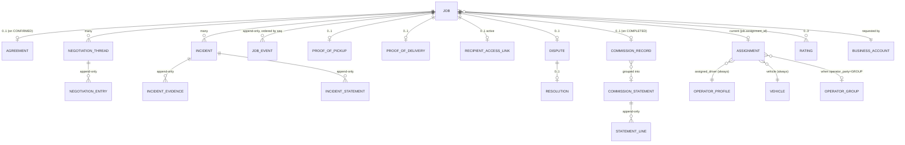

# Database Design

Technical relational design derived from the **conceptual** Phase 0 domain model
(`docs/phase-0/domain-model.md`). This is a design, **not** a set of migrations —
no SQL migrations are produced in Phase 1.

**Engine:** PostgreSQL 16. **Money:** every monetary column is `BIGINT`, integer
**KES minor units** (cents); never `FLOAT`/`REAL`/`DOUBLE` (NFR-INT-3). **Time:**
`TIMESTAMPTZ`, stored UTC; any client-reported time is a **separate** column
named `*_reported_at` (NFR-AUD-4).

---

## 1. Conventions

| Aspect | Decision | Rationale |
|--------|----------|-----------|
| **Primary keys** | `id UUID` default `uuidv7()` (time-ordered UUID via extension or app-generated). | Non-guessable public identifiers (IDOR/BOLA defence, [security-architecture.md](security-architecture.md)); time-ordered keeps B-tree locality good for inserts. |
| **Foreign keys** | Always declared, `ON DELETE RESTRICT` by default; `ON DELETE SET NULL` only for optional denormalised references. | Referential integrity (NFR-INT-5); historical rows must survive parent soft-delete. |
| **Timestamps** | `created_at TIMESTAMPTZ NOT NULL DEFAULT now()`, `updated_at` where the row is mutable. Append-only tables have **only** `created_at`. | |
| **Soft delete** | `deactivated_at TIMESTAMPTZ NULL` on entities referenced by historical records (locations, vehicles, bases, service areas, templates). **No** soft delete on append-only tables; **no** soft delete on `job` (it terminates via status). | FR-B-3; keep history joinable. |
| **Enums** | PostgreSQL native `ENUM` for **closed, code-controlled** sets (job status, verification state, event category). **Lookup tables** for **config-extensible** sets (vehicle types, cargo categories, zones) so admins add values without a migration (NFR-MNT-1, operator-model §2.1). | |
| **Optimistic locking** | `version INTEGER NOT NULL DEFAULT 0` on `job` (and any row a client edits concurrently); bumped on every write; `If-Match` maps to it. | FR-J-5, NFR-INT-1. |
| **Append-only enforcement** | Application: services expose no update/delete path. Database: a dedicated `app_rw` role has `SELECT, INSERT` only (no `UPDATE`/`DELETE`) on: `audit_log_entry`, `job_event`, `negotiation_entry`, `evidence_access_log`, `platform_config_version`, `commission_record`, `commission_adjustment`, `commission_statement`, `statement_line`, `trust_level_change`, `group_standing_change`, `verification_decision`, `statement_settlement`, `incident_statement`, `analytics_event`. Migrations run as a separate `app_ddl` role. | NFR-AUD-3. |
| **Content hashing** | Every evidence reference row stores the `sha256` of the object it points at. Audit rows store `prev_hash`/`row_hash` (chain). | NFR-INT-4, NFR-AUD-3. |
| **Naming** | `snake_case`; singular table names; join tables `a_b`; boolean columns `is_*` / `has_*`; money columns `*_kes` (minor units). | |
| **Indexes** | Every FK used in a filter/join is indexed. Partial indexes for hot filtered subsets (active jobs, open incidents). Composite indexes ordered by selectivity. Each non-obvious index has a rationale below. | |

---

## 2. Tenancy & data isolation

Fikisha is **not multi-tenant in the SaaS sense** — it is one platform instance.
"Isolation" means **row-level authorization**, not schema/database separation:

- Every business's data is scoped by `business_id`; the API's authorization
  engine adds an implicit `WHERE business_id = :actor_business` for business
  actors (and analogous scoping for operators/groups). This is applied in the
  **service/repository layer**, verified by the authorization engine, and covered
  by IDOR tests.
- **PostgreSQL Row-Level Security (RLS)** is **RECOMMENDED as a second layer**
  for the highest-risk tables (`job`, `negotiation_thread`, `negotiation_entry`,
  `evidence_object`, `verification_record`): a session `SET LOCAL app.actor_id`
  + RLS policies that re-express the ownership rule, so a query that forgets the
  `WHERE` still returns nothing. This is defence-in-depth; the application scope
  is the primary control. (OPEN: adopt RLS in Phase 2 iteration 1 or defer to
  hardening — tracked in [phase-1-decisions.md](phase-1-decisions.md).)
- **Admin** actors bypass row scoping by role but every read of HIGH-PII is
  logged (`evidence_access_log`), and every write is audited.

---

## 3. Sensitive-data handling

| Class | Examples | At rest | Access | Retention (proposed — REQUIRES VALIDATION, legal-scope §7) |
|-------|----------|---------|--------|-----------|
| **HIGH-PII field** | national ID / passport number, operator/group `payout_number` | **Field-level envelope encryption** (AES-GCM, data key wrapped by a KMS master key); stored as `bytea` + `key_ref`; a searchable **blind index** (HMAC) only where lookup is required | Verifier permission only; every decrypt logged | ID/passport number: 12 months after offboarding or document expiry; payout number: life of account + statutory tail |
| **HIGH-PII object** | ID/licence document images, good-conduct certificate scans | Private bucket, **SSE** + application envelope encryption; `pii_class = HIGH` | API-mediated only; `evidence_access_log` row per fetch | 12 months after offboarding or document expiry |
| **MEDIUM-PII** | phone numbers, names, addresses, geo points on custody rows | Bucket SSE / DB at rest (disk encryption); no field encryption | Role + ownership scope | With the job record (7y); **raw geo points coarsened to zone level after 12 months** |
| **LOW** | job status, prices, ratings scores, event types | DB at rest | Role + ownership scope | Job record 7y; audit 7y |
| **Recipient (non-user) data** | recipient name, phone, link metadata, incident text | DB at rest | Link-scoped + admin | With the job record; **the link itself expires** at COMPLETED + dispute window |

Disk-level encryption (managed Postgres / encrypted volumes) is assumed for all
tiers; field/object encryption is the **additional** control for HIGH-PII so a
region choice or a disk-image leak is not a full exposure.

---

## 4. Table catalogue

Grouped by module. `PK` = primary key, `FK` = foreign key, `U` = unique
constraint, `IX` = index, `CK` = check constraint. Field lists are the
load-bearing columns, not every column.

### 4.1 Identity & Access

**`user`**
`id PK · phone TEXT U NOT NULL · phone_blind_index BYTEA U · email TEXT NULL ·
display_name TEXT · locale TEXT NOT NULL DEFAULT 'sw' · status ENUM(user_status)
NOT NULL DEFAULT 'ACTIVE' · last_login_at · created_at`
- `U(phone)` — phone is the identity (FR-A-1/2). Store plaintext for the pilot
  (needed for SMS) **plus** a blind index if a decision is later made to encrypt.
- `IX(status) WHERE status <> 'ACTIVE'` — small, for admin filters.
- `user_status`: `ACTIVE | SUSPENDED | OFFBOARDED`.

**`credential`** (optional PIN/password) `id PK · user_id FK U · kind ENUM · hash
TEXT · created_at · updated_at`.

**`otp_challenge`** `id PK · phone TEXT · phone_blind_index BYTEA IX · purpose
ENUM(otp_purpose) · code_hash TEXT · attempts SMALLINT DEFAULT 0 · max_attempts
SMALLINT · expires_at · consumed_at NULL · created_at · request_ip INET`
- `otp_purpose`: `LOGIN | PICKUP_HANDOVER | RECIPIENT_VERIFY | STEP_UP`.
- `IX(phone_blind_index, purpose, created_at DESC)` — rate-limit lookups and
  "latest challenge" retrieval.
- Codes stored **hashed** (NFR-SEC-7); TTL 5 min; `attempts` lockout.

**`session`** `id PK · user_id FK · device_label TEXT · created_at · last_seen_at
· expires_at · revoked_at NULL · is_admin_session BOOL`.
**`refresh_token`** `id PK · session_id FK · token_hash TEXT U · rotated_from_id
FK NULL · used_at NULL · expires_at · created_at`
- Rotation with **reuse detection**: if a `refresh_token` whose `used_at IS NOT
  NULL` is presented, revoke the whole `session` chain (see
  [authentication-authorization.md](authentication-authorization.md)).

**`admin_profile`** `id PK · user_id FK U · active BOOL · created_at`.
**`role_assignment`** `id PK · user_id FK · role ENUM(admin_role) · assigned_by
FK · assigned_at · revoked_at NULL`
- `admin_role`: `PLATFORM_ADMIN | OPERATIONS_OFFICER | VERIFIER | OPERATIONS |
  DISPUTE_OFFICER`. Pilot uses the first two; the rest are enabled by config.
- Permissions themselves are **not** a table — they come from
  `platform_config.role_permissions` (FR-ADM-8). `role_assignment` only maps
  user → role.
**`totp_device`** `id PK · user_id FK U · secret_encrypted BYTEA · confirmed_at
NULL · backup_codes_hash TEXT[] · created_at`.

### 4.2 Business

**`business_account`** `id PK · owner_user_id FK · trading_name TEXT ·
category_id FK(business_category) · registration_ids JSONB NULL ·
verification_status ENUM(subject_verification_status) DEFAULT 'UNVERIFIED' ·
standing ENUM(standing) DEFAULT 'GOOD' · created_at · updated_at`.
- `subject_verification_status`: `UNVERIFIED | VERIFIED` (business is a light
  check — trust-and-safety §2.2).
- `standing`: `GOOD | RESTRICTED`.

**`business_membership`** `id PK · business_id FK · user_id FK · role ENUM · U(business_id,user_id)`
- Present for FR-A-6; pilot creates one `OWNER` row per business.

**`business_location`** `id PK · business_id FK · label TEXT · type
ENUM(location_type) · address_text TEXT · geo GEOGRAPHY(POINT,4326) NULL ·
zone_id FK(zone) NULL · contact_name TEXT · contact_phone TEXT · hours JSONB ·
access_notes TEXT · deactivated_at NULL · created_at`
- `CK` — a partial unique index enforces **exactly one `MAIN`** per active
  business: `U(business_id) WHERE type='MAIN' AND deactivated_at IS NULL`.
- `IX(business_id) WHERE deactivated_at IS NULL`.
- `geo` uses PostGIS `GEOGRAPHY` for distance queries; PostGIS is a
  RECOMMENDED extension (see §6).

### 4.3 Operators / Groups / Vehicles / Bases

**`operator_profile`** `id PK · user_id FK U · full_name TEXT · photo_evidence_id
FK NULL · phones TEXT[] · payout_number_encrypted BYTEA · payout_number_key_ref
TEXT · status ENUM(operator_status) DEFAULT 'PENDING' · created_at · updated_at`
- `operator_status`: `PENDING | ACTIVE | RESTRICTED | SUSPENDED | OFFBOARDED`.

**`operator_group`** `id PK · name TEXT · type ENUM(group_type) ·
primary_contact_user_id FK · payout_number_encrypted BYTEA · payout_number_key_ref
TEXT · standing ENUM(group_standing) DEFAULT 'GOOD' · assignment_mode
ENUM(assignment_mode) DEFAULT 'MANAGER_ASSIGNS' · verification_status
ENUM(subject_verification_status) DEFAULT 'UNVERIFIED' · created_at`
- `group_type`: `YARD_OWNER | FLEET | SACCO | PARTNERSHIP`.
- `group_standing`: `GOOD | RESTRICTED | SUSPENDED`.

**`group_membership`** `id PK · group_id FK · operator_profile_id FK · role
ENUM(group_member_role) · status ENUM(membership_status) DEFAULT 'ACTIVE' ·
since · U(group_id, operator_profile_id)`
- `group_member_role`: `OWNER | MANAGER | DRIVER`.
- **Partial unique** `U(operator_profile_id) WHERE status='ACTIVE'` — an operator
  is an active member of **at most one** group (MVP simplification; relax later).
- `IX(group_id, role, status)` — "assignable drivers for this group".

**`group_standing_change`** *(append-only)* `id PK · group_id FK · from_standing ·
to_standing · trigger ENUM · reason TEXT · actor_admin_id FK NULL · created_at ·
evidence_refs UUID[]`.

**`operating_base`** `id PK · name TEXT · type ENUM(base_type) · geo
GEOGRAPHY(POINT,4326) · zone_id FK(zone) NULL · landmark TEXT · photo_evidence_id
FK NULL · created_at`
- `base_type`: `STAGE | BASE | YARD | WAITING_AREA`.
- `IX` GiST on `geo` — proximity ranking in discovery.

**`base_membership`** `id PK · base_id FK · owner_kind ENUM(owner_kind) ·
owner_id UUID · role TEXT NULL · since · U(base_id, owner_kind, owner_id)`
- `owner_kind`: `OPERATOR | GROUP`. Polymorphic owner; integrity enforced in the
  service layer + a `CK` that `owner_id` resolves (a trigger or app check —
  simplest: two nullable FK columns `operator_id`/`group_id` with a `CK` that
  exactly one is set; **RECOMMENDED: two nullable FKs over a raw polymorphic
  column** for real referential integrity). Applies to every polymorphic
  "owner"/"subject"/"party" below.

**`service_area`** `id PK · operator_id FK · zone_id FK(zone) NULL ·
max_distance_km_from_base NUMERIC NULL · corridor_origin_zone_id FK NULL ·
corridor_destination_zone_id FK NULL · active BOOL · created_at`.

**`vehicle`** `id PK · owner_operator_id FK NULL · owner_group_id FK NULL ·
CK(exactly one owner) · type_id FK(vehicle_type) · sub_descriptor TEXT ·
plate TEXT · plate_normalised TEXT IX · payload_kg INTEGER NOT NULL ·
volume_m3 NUMERIC NULL · dims_lwh_cm INTEGER[3] NULL · feature_tags TEXT[] ·
tare_kg INTEGER NULL · ownership ENUM(vehicle_ownership) · association_evidence_id
FK NULL · verification_status ENUM(subject_verification_status) DEFAULT 'UNVERIFIED'
· state ENUM(vehicle_state) DEFAULT 'INACTIVE' · deactivated_at NULL · created_at`
- `vehicle_ownership`: `OWNED | AUTHORISED_DRIVER`.
- `vehicle_state`: `ACTIVE | INACTIVE | UNDER_REPAIR`.
- `IX(type_id, payload_kg) WHERE verification_status='VERIFIED' AND state='ACTIVE'`
  — discovery pre-filter (match required type + capacity quickly).
- `U(plate_normalised) WHERE deactivated_at IS NULL` — one active vehicle per
  plate.

**`vehicle_document`** `id PK · vehicle_id FK · kind ENUM(vehicle_doc_kind) ·
evidence_id FK · issued_at NULL · expires_at NULL · created_at`.

**`heavy_class_compliance`** `id PK · vehicle_id FK U · ntsa_operator_licence_evidence_id
FK NULL + expiry · speed_limiter_evidence_id FK NULL · telematics_evidence_id FK
NULL · inspection_evidence_id FK NULL + expiry · insurance_evidence_id FK NULL +
expiry · created_at · updated_at`
- One row per heavy-class vehicle; its own `VerificationRecord` (domain
  `HEAVY_CLASS_COMPLIANCE`) references it.

### 4.4 Verification

**`verification_requirement`** *(config-driven; a projection of
`platform_config.verification_requirements`)* `subject_type ENUM · domain
ENUM(verification_domain) · mandatory BOOL · min_trust_level_for TEXT NULL`
- e.g. `(OPERATOR, GOOD_CONDUCT, mandatory=true, min_trust_level_for='L2')`.

**`verification_record`** `id PK · subject_type ENUM(verification_subject_type) ·
subject_id UUID (two nullable typed FKs + CK) · domain ENUM(verification_domain) ·
state ENUM(verification_state) DEFAULT 'NOT_SUBMITTED' · current_evidence_ids
UUID[] · issuing_authority TEXT NULL · verification_method ENUM NULL ·
verified_by_admin_id FK NULL · verified_at NULL · expires_at NULL ·
last_decision_id FK NULL · created_at · updated_at ·
U(subject_type, subject_id, domain)`
- `verification_domain`: `IDENTITY | LICENCE | GOOD_CONDUCT | VEHICLE |
  HEAVY_CLASS_COMPLIANCE | ASSOCIATION | BASE | DOCUMENT | HISTORY`.
- `verification_state`: `NOT_SUBMITTED | SUBMITTED | IN_REVIEW | INFO_REQUESTED |
  VERIFIED | REJECTED | EXPIRED`.
- `IX(state) WHERE state IN ('SUBMITTED','IN_REVIEW','INFO_REQUESTED')` — the
  verification queue.
- `IX(expires_at) WHERE state='VERIFIED' AND expires_at IS NOT NULL` — the
  expiry sweep and "expiring soon" flags (FR-V-5/7).

**`verification_decision`** *(append-only)* `id PK · verification_record_id FK ·
action ENUM(verification_action) · reviewer_admin_id FK · reason TEXT NULL ·
set_expires_at NULL · evidence_ids UUID[] · created_at`
- `verification_action`: `SUBMIT | START_REVIEW | REQUEST_INFO | APPROVE |
  REJECT | EXPIRE (system) | RENEW`.

### 4.5 Trust & Reputation

**`trust_level_state`** `id PK · operator_id FK U · level ENUM(trust_level) ·
value_ceiling_kes BIGINT · since · last_evaluated_at · config_version_id FK`
- `trust_level`: `L0 | L1 | L2 | L3 | RESTRICTED` (Phase 0 "Pending/Verified/
  Established/Trusted" → `L0..L3`).

**`trust_level_change`** *(append-only)* `id PK · operator_id FK · from_level ·
to_level · trigger ENUM(trust_change_trigger) · status
ENUM(trust_change_status) DEFAULT 'APPLIED' · reason TEXT · proposed_by
ENUM(SYSTEM|ADMIN) · confirmed_by_admin_id FK NULL · criteria_snapshot JSONB ·
evidence_job_ids UUID[] · evidence_incident_ids UUID[] · config_version_id FK ·
created_at`
- `trust_change_trigger`: `AUTO_PROPOSED | ADMIN_CONFIRMED | ADMIN_REGRESSION |
  INCIDENT | RATING_DROP | RESTRICTED_IMPOSED | REMEDIATION_EXIT`.
- `trust_change_status`: `PROPOSED | APPLIED | REJECTED`.
- `criteria_snapshot` records the computed metrics (completed jobs, days active,
  avg rating, at-fault counts) at evaluation time — so a proposal is auditable
  and reproducible (brief §14).
- `IX(status) WHERE status='PROPOSED'` — the admin confirmation queue.

**`rating`** `id PK · job_id FK · rater_role ENUM(rater_role) · rater_user_id FK
NULL · ratee_kind ENUM(rating_subject) · ratee_id UUID · score SMALLINT CK(1..5)
· dimensions JSONB NULL · comment TEXT NULL · created_at ·
U(job_id, rater_role, ratee_kind, ratee_id)`
- `rater_role`: `BUSINESS | OPERATOR | RECIPIENT`.
- `ratee_kind`: `OPERATOR | GROUP | BUSINESS`.
- `CK` — a trigger/app check that `job.status = 'COMPLETED'` at insert (FR-R-2).
- A group job inserts **two** rows from the business (`OPERATOR` + `GROUP`).

**`reputation_summary`** *(materialised, recomputed on events)* `subject_kind
ENUM · subject_id UUID · avg_rating NUMERIC · rating_count INT · completed_jobs
INT · at_fault_serious_incidents INT · at_fault_incidents_last_20 INT ·
days_active INT · elevated_clean_jobs INT · last_recomputed_at ·
U(subject_kind, subject_id)`.

### 4.6 Jobs

**`job`** *(aggregate root — the only row a client mutates concurrently)*
`id PK · business_id FK · created_by_user_id FK · status ENUM(job_status) NOT NULL
DEFAULT 'DRAFT' · version INT NOT NULL DEFAULT 0 ·
pickup_location_id FK(job_location) · destination_location_id FK(job_location) ·
recipient_name TEXT · recipient_phone TEXT · cargo_id FK(cargo_details) ·
vehicle_requirement_id FK · pickup_datetime TIMESTAMPTZ NULL ·
delivery_requirements TEXT · delivery_flags TEXT[] ·
proposed_price_kes BIGINT · declared_value_kes BIGINT NOT NULL ·
value_band ENUM(value_band) · is_high_value BOOL GENERATED ·
required_trust_level ENUM(trust_level) ·
latent_risk_cargo BOOL · agreement_id FK NULL · assignment_id FK NULL ·
distance_km NUMERIC NULL · config_version_id FK ·
created_at · published_at NULL · confirmed_at NULL · assigned_at NULL ·
picked_up_at NULL · delivered_at NULL · completed_at NULL · terminal_at NULL ·
terminal_reason_id FK NULL`
- `job_status` ENUM: `DRAFT | REQUESTED | NEGOTIATING | CONFIRMED | ASSIGNED |
  AT_PICKUP | PICKED_UP | IN_TRANSIT | AT_DESTINATION | DELIVERED | COMPLETED |
  CANCELLED | FAILED | DISPUTED` (exactly Phase 0, D-JOB-3).
- `value_band` ENUM: `STANDARD | ELEVATED | HIGH | VERY_HIGH` — computed from
  `declared_value_kes` vs `platform_config.value_bands` at publish (recomputed if
  the config in force changes before CONFIRMED; frozen at CONFIRMED).
- `is_high_value` GENERATED from `value_band IN ('HIGH','VERY_HIGH')`.
- `config_version_id` — pins the value bands / trust criteria / thresholds used
  for this job (brief §21 principle applied platform-wide).
- **Partial indexes** (the discovery + monitor hot paths):
  - `IX(status, value_band, created_at DESC) WHERE status IN ('REQUESTED','NEGOTIATING')`
    — operator discovery list.
  - `IX(business_id, status, created_at DESC)` — business "my jobs".
  - `IX(assignment_id) WHERE status IN ('ASSIGNED','AT_PICKUP','PICKED_UP','IN_TRANSIT','AT_DESTINATION')`
    — operator active jobs + stale-assignment sweep.
  - `IX(status) WHERE status='DISPUTED'` — dispute console.
  - `IX(delivered_at) WHERE status='DELIVERED'` — delivery-acceptance auto-complete sweep.
  - `IX(completed_at) WHERE status='COMPLETED'` — post-completion window sweep.
- **No** `deactivated_at` — a job terminates via `status`.
- **CK** — `value_band` and `required_trust_level` non-null once `status <>
  'DRAFT'`.

**`job_location`** `id PK · type ENUM(PICKUP|DESTINATION) · source_kind
ENUM(BUSINESS_LOCATION|AD_HOC) · source_location_id FK NULL · address_text TEXT ·
geo GEOGRAPHY(POINT,4326) NULL · zone_id FK NULL · contact_name TEXT ·
contact_phone TEXT · notes TEXT · created_at`
- Immutable snapshot: copied from `business_location` at job creation so a later
  edit to the location does not rewrite history.

**`cargo_details`** `id PK · description TEXT · category_id FK(cargo_category) ·
est_weight_kg INTEGER · dims_lwh_cm INTEGER[3] NULL · declared_value_kes BIGINT ·
handling_flags TEXT[] · created_at`.

**`vehicle_requirement`** `id PK · required_type_ids UUID[] · min_payload_kg
INTEGER · min_volume_m3 NUMERIC NULL · required_features TEXT[] · notes TEXT`.

**`agreement`** `id PK · job_id FK U · operator_party ENUM(operator_party) ·
operator_id FK NULL · group_id FK NULL · CK(one set) ·
agreed_price_kes BIGINT NOT NULL · currency CHAR(3) DEFAULT 'KES' ·
accepting_entry_ids UUID[2] · terms_note TEXT · version INT DEFAULT 1 ·
agreed_at`
- `U(job_id)` — one agreement per job (domain-model invariant 1).
- **No `UPDATE` allowed** (append-only table role); a renegotiation would be a
  new `agreement` row with `version = prior + 1` (not needed in MVP —
  D-A-NEG-3).

**`assignment`** `id PK · job_id FK U · operator_party ENUM · operator_id FK NULL
· group_id FK NULL · assigned_driver_profile_id FK NOT NULL · vehicle_id FK NOT
NULL · assigned_by ENUM(SELF|GROUP_MANAGER|ADMIN) · assigned_by_user_id FK ·
reassigned_from_assignment_id FK NULL · admin_override_reason TEXT NULL ·
config_version_id FK · assigned_at`
- `U(job_id)` where `reassigned_from_assignment_id IS NULL` won't work for
  reassignment history; instead: **one row per assignment attempt**, and `job.
  assignment_id` points at the current one. `IX(job_id, assigned_at DESC)`.
- **CK** — `assigned_driver_profile_id` always non-null (brief §12).

**`cancellation_record`** `id PK · job_id FK · cancelled_by_role ENUM ·
cancelled_by_user_id FK NULL · at_status ENUM(job_status) · reason_code
ENUM(cancellation_reason) · reason_text TEXT · penalty_class
ENUM(NONE|LATE_CANCELLATION|WASTED_TRIP) · created_at`
- `penalty_class` computed from `at_status` per D-DIS-3 (before ASSIGNED →
  `NONE`; ASSIGNED→AT_PICKUP → `LATE_CANCELLATION`; after AT_PICKUP →
  `WASTED_TRIP`).
- Feeds the "3 in rolling 30 days" flag (a query, not a stored counter).

**`failure_record`** `id PK · job_id FK · at_status ENUM · reason_text TEXT ·
recorded_by_admin_id FK NULL · created_at`.

### 4.7 The unified `job_event` table (Phase 1 consolidation — see [phase-1-decisions.md](phase-1-decisions.md) ADR-009)

Phase 0 named three near-identical append-only concepts: `ChainOfCustodyEntry`,
`JobStatusEvent`, and (implicitly) a job timeline. Phase 1 consolidates them into
**one physical table** with typed rows and **views** for the distinct consumers.
This is a permitted technical refinement of a *conceptual* model, not a change to
a founder decision. `NegotiationEntry` and `AuditLogEntry` stay separate (richer
shape / platform-wide scope).

**`job_event`** *(append-only; strictly ordered per job)*
`id PK · job_id FK · seq BIGINT NOT NULL · category ENUM(job_event_category) ·
type ENUM(job_event_type) · is_custody BOOL NOT NULL DEFAULT false ·
actor_user_id FK NULL · actor_role ENUM(actor_role) · server_time TIMESTAMPTZ
NOT NULL DEFAULT now() · reported_time TIMESTAMPTZ NULL ·
from_status ENUM(job_status) NULL · to_status ENUM(job_status) NULL ·
geo GEOGRAPHY(POINT,4326) NULL · geo_accuracy_m NUMERIC NULL ·
geo_state ENUM(CAPTURED|NOT_CAPTURED|COARSENED) NOT NULL DEFAULT 'NOT_CAPTURED' ·
confirmation_method ENUM(OTP|SIGNATURE|PHOTO|IN_APP|NONE) NULL ·
evidence_ids UUID[] · content_hashes TEXT[] ·
source_meta JSONB · note TEXT NULL · corrects_event_id FK NULL ·
config_version_id FK · created_at`
- `U(job_id, seq)` — a per-job monotonic sequence assigned inside the
  transaction that writes the row (via `SELECT max(seq) ... FOR UPDATE` on the
  job, which is already row-locked by the Lifecycle Service).
- `job_event_category`: `STATUS_TRANSITION | CUSTODY | SYSTEM | ADMIN_ACTION`.
- `job_event_type` (superset covering brief §15 and Phase 0's `step` list):
  `JOB_CREATED · JOB_PUBLISHED · OFFER_REF · PRICE_AGREED · OPERATOR_ASSIGNED ·
  DRIVER_CONFIRMED · VEHICLE_CONFIRMED · ARRIVED_AT_PICKUP · PICKUP_OTP_ISSUED ·
  PICKUP_OTP_CONFIRMED · PICKUP_OPERATOR_ATTESTED · GOODS_RECEIVED ·
  IN_TRANSIT · ARRIVED_AT_DESTINATION · RECIPIENT_OTP_ISSUED · RECIPIENT_VERIFIED ·
  DELIVERY_CONFIRMED · COMPLETED · CANCELLED · FAILED · DISPUTED · DISPUTE_RESOLVED
  · RESUMED · ADMIN_FORCED_TRANSITION · ADMIN_REASSIGNED · NOTE`.
- **Views** (no data duplication):
  - `job_status_event` = `SELECT ... FROM job_event WHERE category='STATUS_TRANSITION'`
    — the transition audit (Phase 0 `JobStatusEvent`).
  - `chain_of_custody` = `SELECT ... FROM job_event WHERE is_custody = true ORDER BY seq`
    — the evidentiary custody trail (Phase 0 `ChainOfCustodyEntry`; assignment →
    completion). This view is what the business, assigned operator, and admins
    read (FR-J-10, trust-and-safety §4).
  - `job_timeline` = the whole table for a job, for the UI.
- Which types set `is_custody = true`: `OPERATOR_ASSIGNED, DRIVER_CONFIRMED,
  VEHICLE_CONFIRMED, ARRIVED_AT_PICKUP, PICKUP_OTP_CONFIRMED,
  PICKUP_OPERATOR_ATTESTED, GOODS_RECEIVED, IN_TRANSIT, ARRIVED_AT_DESTINATION,
  RECIPIENT_VERIFIED, DELIVERY_CONFIRMED, COMPLETED` (+ corrective `NOTE`s that
  reference a custody row).
- `geo_state = COARSENED` is set by the retention job that replaces raw
  lat/lng with a zone centroid after 12 months (legal-scope §7).

**`proof_of_pickup`** / **`proof_of_delivery`** `id PK · job_id FK U · kind ENUM ·
party_name TEXT · methods TEXT[] · otp_verified BOOL · signature_evidence_id FK
NULL · photo_evidence_ids UUID[] · captured_by ENUM(OPERATOR|BUSINESS_CONTACT|
RECIPIENT|ADMIN) · captured_at · condition_note TEXT ·
attestation ENUM(VERIFIED|OPERATOR_ATTESTED_UNVERIFIED)`
- `attestation = OPERATOR_ATTESTED_UNVERIFIED` is only insertable when
  `job.value_band = 'STANDARD'` (CK via trigger/app) and it caps the job's band
  (D-CUS-2).

**`pickup_otp_challenge`** — same shape as `otp_challenge`, `purpose =
PICKUP_HANDOVER`, `job_id FK`, `sent_to_phone` = the pickup contact's phone.

### 4.8 Negotiation

**`negotiation_thread`** `id PK · job_id FK · operator_party ENUM · operator_id
FK NULL · group_id FK NULL · CK(one set) · status
ENUM(thread_status) DEFAULT 'ACTIVE' · opened_at · closed_at NULL ·
U(job_id, operator_id, group_id)`
- `thread_status`: `ACTIVE | SUPERSEDED | CLOSED`.
- `IX(job_id, status)` — list a job's live threads for the business.

**`negotiation_entry`** *(append-only)* `id PK · thread_id FK · job_id FK
(denormalised for query) · actor_user_id FK · actor_role ENUM(BUSINESS|OPERATOR|
ADMIN) · type ENUM(negotiation_entry_type) · amount_kes BIGINT NULL ·
currency CHAR(3) DEFAULT 'KES' · note TEXT · in_response_to_id FK NULL ·
status ENUM(entry_status) DEFAULT 'ACTIVE' · expires_at NULL · created_at`
- `negotiation_entry_type`: `PROPOSE | COUNTER | ACCEPT | REJECT`.
- `entry_status`: `ACTIVE | SUPERSEDED | EXPIRED`.
- `CK` — `amount_kes` required for `PROPOSE`/`COUNTER`; for `ACCEPT` the accepted
  amount is copied in.
- `IX(thread_id, created_at)` — render a thread; `IX(status, expires_at) WHERE
  status='ACTIVE' AND expires_at IS NOT NULL` — offer-expiry sweep.

### 4.9 Recipients

**`recipient_access_link`** `id PK · job_id FK · token_hash TEXT U NOT NULL ·
token_lookup BYTEA IX (HMAC of the token, for O(1) lookup without storing plaintext) ·
allowed_actions TEXT[] · channel_sent ENUM(SMS|WHATSAPP)[] · sent_to_phone TEXT ·
sent_at · expires_at · used_at NULL · revoked_at NULL · revoke_reason TEXT NULL ·
created_at`
- **Partial unique** `U(job_id) WHERE revoked_at IS NULL AND expires_at > now()`
  — one active link per job.
- Token: ≥ 32 bytes CSPRNG in the URL; `token_hash` (argon2/sha256) for
  verification; `token_lookup` (HMAC with a server key) as the indexable lookup
  so a full-table scan isn't needed and a DB leak yields neither working tokens
  nor a rainbow-table shortcut.
- `IX(expires_at) WHERE revoked_at IS NULL` — expiry sweep.

**`recipient_otp_challenge`** — `otp_challenge` shape, `purpose = RECIPIENT_VERIFY`,
`link_id FK`.

### 4.10 Incidents & Disputes

**`incident`** `id PK · job_id FK · type ENUM(incident_type) · other_label TEXT
NULL · severity ENUM(incident_severity) · reported_by_kind ENUM(USER|
RECIPIENT_LINK|ADMIN) · reported_by_user_id FK NULL · reported_by_link_id FK NULL
· reported_at · description TEXT · status ENUM(incident_status) DEFAULT 'OPEN' ·
owner_admin_id FK NULL · linked_custody_event_ids UUID[] · sla_ack_due_at ·
sla_action_due_at · sla_resolution_due_at · created_at`
- `incident_type`: `DAMAGE | LOSS | MISSING_GOODS | WRONG_RECIPIENT |
  WRONG_PICKUP | MISCONDUCT | BREAKDOWN | ACCIDENT | DELAY | CANCELLATION | OTHER`.
- `incident_severity`: `LOW | MEDIUM | HIGH | CRITICAL` (default per type from
  config; admin-adjustable).
- `incident_status`: `OPEN | UNDER_REVIEW | AMICABLE_PENDING | RESOLVED |
  ESCALATED`.
- `IX(status) WHERE status <> 'RESOLVED'` + `IX(sla_action_due_at) WHERE status
  IN ('OPEN','UNDER_REVIEW','AMICABLE_PENDING')` — the incident queue + SLA
  timers.

**`incident_evidence`** `id PK · incident_id FK · evidence_id FK · uploaded_by_kind
ENUM · uploaded_by_user_id FK NULL · caption TEXT · created_at` *(append-only)*.

**`incident_statement`** *(append-only)* `id PK · incident_id FK · party_kind
ENUM(BUSINESS|OPERATOR|GROUP|RECIPIENT|ADMIN) · party_user_id FK NULL · text TEXT
· submitted_at`.

**`dispute`** `id PK · job_id FK U · incident_ids UUID[] · opened_by_admin_id FK
NULL · opened_at · status ENUM(dispute_status) · officer_admin_id FK NULL ·
pre_dispute_status ENUM(job_status) NOT NULL` *(so an admin RESUME can restore it —
job-lifecycle §2.3)*.

**`resolution`** *(one per dispute; append-only)* `id PK · dispute_id FK U ·
outcome_code ENUM(resolution_outcome) · rationale TEXT ·
commission_treatment ENUM(APPLY|REDUCE|WAIVE) · reduced_amount_kes BIGINT NULL ·
agreed_compensation_kes BIGINT NULL (recorded, not processed) ·
actions TEXT[] (RATING_IMPACT | TRUST_CHANGE | SUSPENSION | NONE) ·
routed_job_status ENUM(COMPLETED|FAILED|CANCELLED|RESUME_PRIOR) ·
resolved_by_admin_id FK · resolved_at`.

**`escalation`** *(append-only)* `id PK · incident_id FK · dispute_id FK NULL ·
reason TEXT · escalated_to TEXT · advised_external_options BOOL · created_at`.

### 4.11 Commission & Statements — see [commission-ledger.md](commission-ledger.md) for the full model

**`commission_record`** *(append-only, immutable)* `id PK · job_id FK U ·
payee_kind ENUM(OPERATOR|GROUP) · payee_id UUID · party_liable ENUM DEFAULT
'OPERATOR' · gross_agreed_price_kes BIGINT · commission_model
ENUM(commission_model) · rate_applied NUMERIC · min_fee_kes BIGINT ·
cap_kes BIGINT · band ENUM(value_band) · amount_kes BIGINT NOT NULL ·
status ENUM(commission_status) DEFAULT 'DUE' · statement_id FK NULL ·
config_version_id FK · computed_at`
- `commission_model`: `FLAT_WITH_MIN_CAP` (the only one implemented — pilot
  default `rate=0.10, min=4000, cap=500000` minor units), `BANDED_TAPER`,
  `RAMPED` (schema-reserved, **not implemented** — brief §3).
- `commission_status`: `DUE | HELD | WAIVED | REDUCED | INVOICED | SETTLED`.
- `U(job_id)` — one record per job.

**`commission_adjustment`** *(append-only)* `id PK · commission_record_id FK NULL
· statement_id FK NULL · kind ENUM(WAIVE_CREDIT|REDUCE_CREDIT|MANUAL_DEBIT|
MANUAL_CREDIT|REVERSAL) · amount_kes BIGINT · reason TEXT · created_by_admin_id
FK · dispute_id FK NULL · created_at`.

**`commission_statement`** *(append-only header; lines append-only)* `id PK ·
payee_kind ENUM · payee_id UUID · period_start DATE · period_end DATE ·
gross_commission_kes BIGINT · adjustments_kes BIGINT · net_due_kes BIGINT ·
status ENUM(statement_status) DEFAULT 'GENERATED' · etims_invoice_id FK NULL ·
generated_at · U(payee_kind, payee_id, period_start)`
- `statement_status`: `GENERATED | INVOICED | PARTIALLY_SETTLED | SETTLED |
  DISPUTED`.

**`statement_line`** *(append-only)* `id PK · statement_id FK · kind
ENUM(COMMISSION|ADJUSTMENT) · commission_record_id FK NULL · adjustment_id FK
NULL · job_id FK NULL · amount_kes BIGINT · created_at`.

**`statement_settlement`** *(append-only)* `id PK · statement_id FK · amount_kes
BIGINT · method ENUM(MPESA_PAYBILL|BANK|OTHER) · payment_ref TEXT ·
recorded_by_admin_id FK NULL (null = webhook) · source ENUM(MANUAL|WEBHOOK) ·
created_at`.

**`payment_report`** `id PK · job_id FK · reported_by_role ENUM · method
ENUM(CASH|MOBILE_MONEY|BANK|OTHER) · counterparty_confirmed BOOL · reported_at`
- **Informational only** — the platform never holds the fare (D-BIZ-6).

**`etims_invoice`** `id PK · statement_id FK U · external_ref TEXT NULL · status
ENUM(PENDING|SUBMITTED|ACCEPTED|FAILED|MANUAL_REFERENCE) · payload JSONB ·
submitted_at NULL · created_at`.

### 4.12 Notifications

**`notification_template`** `id PK · key TEXT · locale TEXT · channel
ENUM(IN_APP|SMS|WHATSAPP) · subject TEXT NULL · body TEXT · whatsapp_template_name
TEXT NULL · active BOOL · U(key, locale, channel)`.

**`notification_message`** `id PK · recipient_user_id FK NULL · recipient_phone
TEXT NULL · channel ENUM · template_key TEXT · dedupe_key TEXT · params JSONB ·
locale TEXT · importance ENUM(LOW|NORMAL|HIGH|CRITICAL) · status
ENUM(notification_status) DEFAULT 'QUEUED' · provider ENUM NULL ·
provider_ref TEXT NULL · segments SMALLINT NULL · cost_estimate_kes BIGINT NULL ·
job_id FK NULL · retries SMALLINT DEFAULT 0 · fell_back_from_id FK NULL ·
created_at · sent_at NULL · finalised_at NULL ·
U(coalesce(recipient_user_id::text, recipient_phone), template_key, dedupe_key)`
- `notification_status`: `QUEUED | SENT | DELIVERED | FAILED | FELL_BACK_TO_SMS`.
- `IX(status, created_at) WHERE status IN ('QUEUED','SENT')` — retry/fallback sweep.
- `IX(job_id)` — per-job cost accounting for pilot economics (FR-DASH-4).

**`in_app_notification`** `id PK · user_id FK · type TEXT · title_key TEXT ·
params JSONB · job_id FK NULL · read_at NULL · created_at ·
IX(user_id, read_at NULLS FIRST, created_at DESC)`.

**`user_notification_preference`** `id PK · user_id FK U · channel_prefs JSONB ·
quiet_hours JSONB NULL`.

**`delivery_receipt`** `id PK · notification_message_id FK · provider_status TEXT
· received_at` *(append-only)*.

### 4.13 Evidence

**`evidence_object`** `id PK · storage_key TEXT U · content_type TEXT · size_bytes
BIGINT · sha256 TEXT NOT NULL · pii_class ENUM(LOW|MEDIUM|HIGH) · purpose
ENUM(evidence_purpose) · retention_class ENUM(retention_class) ·
linked_entity_type ENUM · linked_entity_id UUID NULL · envelope_key_ref TEXT NULL
· scan_status ENUM(NOT_REQUIRED|PENDING|CLEAN|INFECTED) DEFAULT 'NOT_REQUIRED' ·
legal_hold BOOL DEFAULT false · uploaded_by_user_id FK NULL ·
uploaded_by_kind ENUM · expires_at TIMESTAMPTZ NULL · created_at`
- `evidence_purpose`: `VERIFICATION_DOC | CUSTODY_PHOTO | PROOF_OF_PICKUP |
  PROOF_OF_DELIVERY | SIGNATURE | INCIDENT | DISPUTE | PROFILE_PHOTO |
  BASE_PHOTO`.
- `IX(expires_at) WHERE legal_hold = false AND expires_at IS NOT NULL` — retention sweep.
- `IX(scan_status) WHERE scan_status='PENDING'`.

**`evidence_access_log`** *(append-only)* `id PK · evidence_object_id FK ·
accessed_by_user_id FK · accessed_by_role ENUM · reason TEXT NULL ·
job_id FK NULL · incident_id FK NULL · created_at`
- Written for **every** fetch of a `pii_class = HIGH` object (NFR-SEC-4).

### 4.14 Audit

**`audit_log_entry`** *(append-only, hash-chained)* `id PK · seq BIGINT U NOT
NULL · actor_user_id FK NULL · actor_role ENUM(actor_role) · action TEXT ·
entity_type TEXT · entity_id UUID NULL · before JSONB NULL · after JSONB NULL ·
server_time TIMESTAMPTZ NOT NULL DEFAULT now() · source_ip INET NULL ·
source_device TEXT NULL · source_channel ENUM(API|ADMIN_UI|WEBHOOK|SCHEDULER|CLI)
· prev_hash TEXT · row_hash TEXT NOT NULL · created_at`
- `seq` is a global monotonic sequence (a dedicated Postgres sequence).
- `row_hash = sha256(seq || prev_hash || canonical_json(actor, action, entity,
  before, after, server_time, source_*))`; `prev_hash` = the previous row's
  `row_hash`.
- Partitioned by month (`PARTITION BY RANGE (server_time)`) for retention +
  query performance over a 7-year window.
- `IX(entity_type, entity_id, server_time)`; `IX(actor_user_id, server_time)`.
- `before`/`after` JSONB have **HIGH-PII fields redacted** (only a reference /
  masked value) — the audit records *that* a decrypt happened, not the plaintext.

### 4.15 Platform Configuration

**`platform_config`** *(single row)* `id PK CHECK (id = 1) · current_version_id
FK · data JSONB NOT NULL · updated_at`
- `data` schema (JSONB) covers: `commission {model, rate, min_fee_kes, cap_kes}`,
  `high_value_threshold_kes`, `value_bands[]`, `trust_levels[] {level,
  value_ceiling_kes, criteria{completed_jobs, days_active, min_avg_rating,
  max_at_fault_last_20, elevated_clean_jobs, serious_incident_rule}}`,
  `restricted_rule`, `vehicle_types[]`, `heavy_class_tare_kg`,
  `cargo_categories[]`, `latent_risk_categories[]`, `zones[]`,
  `cancellation_policy {rolling_window_days, flag_threshold, courtesy_fee_enabled,
  courtesy_fee_kes}`, `timeouts {request_expiry, offer_expiry,
  delivery_acceptance {standard_h, high_h}, post_completion_window {default_h,
  high_and_latent_days}, stale_assignment_alert}`, `retention_windows{...}`,
  `notification_channels{...}`, `role_permissions {role: [permission...]}`,
  `verification_requirements[]`, `feature_flags{...}`, `sla_targets{...}`.

**`platform_config_version`** *(append-only)* `id PK · version INTEGER U ·
changed_by_admin_id FK · changed_at · rationale TEXT NOT NULL · snapshot JSONB
NOT NULL`.

**Config lookup tables** (admin-extensible, not migrations): `zone`,
`vehicle_type`, `cargo_category`, `business_category` — each `id PK · code TEXT U
· name_en TEXT · name_sw TEXT · active BOOL · sort_order INT · created_at`.
`zone` additionally `geo_boundary GEOGRAPHY(POLYGON,4326) NULL` (null until the
founder supplies the Kitengela breakdown — D-PIL-5).

### 4.16 Administration & Reporting

**`admin_intervention`** *(append-only)* `id PK · job_id FK NULL · account_ref
TEXT NULL · action ENUM(REASSIGN|CANCEL|FORCE_TRANSITION|CONTACT_PARTIES|
SUSPEND|RESTRICT|OFFBOARD|APPROVE_HIGH_VALUE) · admin_id FK · reason TEXT NOT
NULL · before JSONB · after JSONB · created_at`.

**`high_value_approval`** `id PK · job_id FK U · requested_at · decided_by_admin_id
FK NULL · decision ENUM(PENDING|APPROVED|REJECTED) · conditions TEXT[] ·
decided_at NULL`.

**`analytics_event`** *(append-only, minimal-PII)* `id PK · occurred_at · kind
TEXT · job_id FK NULL · dims JSONB (zone, band, vehicle_type, actor_role — no
names/phones) · numeric_value NUMERIC NULL · created_at` — partitioned by month.

**`metric_daily`** `id PK · metric_date DATE · metric_key TEXT · dimensions JSONB
· value NUMERIC · U(metric_date, metric_key, dimensions)`.

**`export_job`** `id PK · requested_by_admin_id FK · scope JSONB · status
ENUM(QUEUED|RUNNING|READY|FAILED) · evidence_object_id FK NULL (the generated
file) · created_at · completed_at NULL`.

---

## 5. Key relationships & integrity summary

Integrity highlights (also in [domain-architecture.md](domain-architecture.md) §4):

- One `AGREEMENT` per `JOB` (`U(job_id)`); immutable.
- `job.assignment_id` points at the current `ASSIGNMENT`; prior attempts remain
  as rows (`reassigned_from_assignment_id` chain).
- `ASSIGNMENT.assigned_driver_profile_id` is `NOT NULL` for every assignment,
  solo or group (brief §12).
- Append-only tables: enforced by table-level role privileges **and** the absence
  of update/delete service paths, **and** covered by tests
  ([testing-strategy.md](testing-strategy.md)).
- `job.status` transitions: enforced only by `JobLifecycleService`; a DB trigger
  additionally rejects a `status` change whose `(OLD.status, NEW.status)` pair is
  not in an allowed-transitions helper table — **defence in depth**, so a stray
  raw `UPDATE` cannot corrupt a job.

---

## 6. PostgreSQL extensions (RECOMMENDED)

| Extension | Use |
|-----------|-----|
| `pgcrypto` / app-side | HMAC blind indexes, hashing helpers |
| `uuid-ossp` / `pg_uuidv7` (or app-generated UUIDv7) | time-ordered UUID PKs |
| **PostGIS** | `GEOGRAPHY` columns + GiST indexes for base/pickup proximity ranking in discovery, zone containment, distance metrics. Alternative if PostGIS is unavailable on the chosen host: store `lat`/`lng` `NUMERIC` + a bounding-box pre-filter + haversine in SQL/Python — workable at pilot scale, less clean. (OPEN — host-dependent.) |
| `pg_partman` (optional) | manage monthly partitions of `audit_log_entry` and `analytics_event` |
| `pg_stat_statements` | query observability in staging/prod |

---

## 7. What is deliberately NOT in the schema (MVP)

- No `wallet` / `balance` / `escrow` / fare-holding tables (D-BIZ-6, legal-scope §3.6).
- No continuous GPS track table — only event-based `job_event.geo` (brief §16).
- No `recommended_price` / price-band history tables (D-NEG-4).
- No auto-assign / bidding / auction tables (D-A-DISC-1).
- No `recipient_account` table — the recipient is a link, not a user (D-RCP-1).
- No group payroll / shift / roster tables (D-OPR-GRP-1 out-of-scope list).
- No insurance policy / cover tables (legal-scope §3.7 — REQUIRES VALIDATION).
