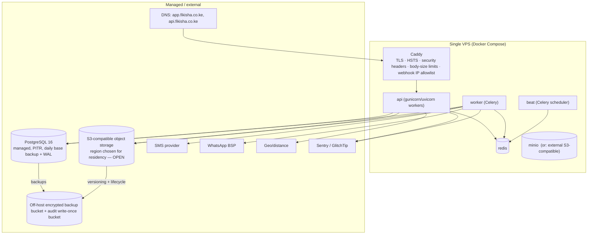

# Deployment Architecture

Implements Phase 1 brief §30. **Affordable for a bootstrapped local pilot. No
enterprise infrastructure.** (brief §30, §34 P15, NFR-PERF-1.)

---

## 1. Environments

| Environment | Purpose | Shape |
|-------------|---------|-------|
| **Development** | Local dev | `docker compose up`: api, worker, beat, postgres, redis, minio, mailhog, provider **sandboxes / fakes**. Seed data loaded. |
| **Staging** | Pre-prod verification, pilot dry-runs, E2E target | One small VPS, `docker compose`. Real provider **sandbox** credentials (SMS/WhatsApp test numbers, M-Pesa sandbox, a test eTIMS mode). Seeded with the Kitengela pilot seed dataset. Basic auth on the whole site so it isn't publicly crawlable. |
| **Production** | The pilot | One VPS (2–4 vCPU / 8 GB to start), `docker compose`. Managed Postgres if an acceptable-region tier fits the budget; else self-managed Postgres on the same host with disciplined backups. |

Dev and staging are functionally identical to prod (same images, same compose
topology) so "works on staging" means something.

---

## 2. Production topology (pilot)



- **PostgreSQL**: strongly RECOMMENDED to be **managed** (automated backups,
  point-in-time recovery, minor-version patching) even for the pilot. If cost /
  region forces self-managed on the VPS: nightly `pg_dump` **plus** continuous
  **WAL archiving** to the off-host bucket, and a **tested restore runbook**
  (NFR-AVAIL-2). This is an **OPEN** decision tied to §"Data residency".
- **Object storage**: a managed S3-compatible bucket in the chosen region is
  preferred over MinIO-on-the-VPS (MinIO ties storage durability to the single
  host). MinIO is acceptable for the earliest weeks if paired with off-host
  replication.
- **Redis**: single instance on the VPS is fine at pilot scale (broker + cache +
  locks + rate-limit counters). The **outbox lives in PostgreSQL**, so a Redis
  restart loses no events.
- **Caddy** for automatic TLS (Let's Encrypt), HSTS, security headers, request
  size limits, and a webhook IP allowlist. nginx + certbot is an equivalent
  alternative.

---

## 3. Containers & configuration

- **One image** for the backend; three services from it: `api` (HTTP), `worker`
  (Celery), `beat` (Celery scheduler). Same code, different entrypoint.
- **One image** for the built PWA static assets, served by Caddy (or baked into a
  small nginx container).
- **12-factor config**: everything via environment (`.env` files with restricted
  permissions, or Docker secrets). `.env.example` is the only such file in the
  repo. Secrets (DB URL, provider keys, signing keys, KMS key ids / the
  envelope-encryption master key) are injected at runtime, never built into the
  image, never in VCS (NFR-SEC-5). Separate secrets per environment.
- **Non-root** container user; read-only root filesystem where possible;
  minimal base image (`python:3.12-slim`); dropped Linux capabilities.

---

## 4. CI/CD (GitHub Actions)

```
push / PR:
  lint → type-check → unit+integration+API+security suites (pg+redis services)
       → OpenAPI generate + schemathesis → dep scan → image scan (Trivy)
       → SAST (Semgrep/Bandit) → secret scan (gitleaks)
merge to main:
  build & push api + web images (tagged with the commit SHA)
  deploy to STAGING: ssh → docker compose pull → run migrations (see §5)
                     → docker compose up -d → wait for /readyz
  run E2E (Playwright) against staging
  MANUAL APPROVAL gate
  deploy to PRODUCTION: same steps; keep the previous image tag for rollback
```

Deploy mechanism: SSH + `docker compose` for the pilot (simple, transparent). A
tiny tool like **Kamal** or **Dokku** is a fine upgrade if the founder wants
zero-downtime deploys; not required for the pilot (a short maintenance window is
acceptable — NFR-AVAIL-1).

---

## 5. Database migrations

- Django migrations, run as a **separate `app_ddl` DB role** (the runtime
  `app_rw` role cannot run DDL, and lacks `UPDATE`/`DELETE` on append-only
  tables — see [database-design.md](database-design.md) §1).
- **Additive migrations** (new nullable column, new table, new index
  `CONCURRENTLY`) run automatically on deploy with no downtime.
- **Non-additive / destructive migrations** (drop/rename/backfill,
  not-null on an existing column) follow the **expand → migrate → contract**
  pattern across two deploys, or run in a short announced maintenance window.
  CI runs every migration against a realistic seed DB to catch these.
- The `allowed_job_transition` helper table (state-machine DB backstop) is
  seeded/updated by a data migration generated from the same source as
  `ALLOWED_TRANSITIONS`.
- Migrations are **forward-only**; a bad migration is fixed with a new forward
  migration + an image rollback if needed.

---

## 6. Backups & recovery (NFR-AVAIL-2/3)

| Asset | Backup | Restore target |
|-------|--------|----------------|
| PostgreSQL | Managed: automated daily base + PITR (retain ≥ 7 days). Self-managed: nightly `pg_dump` + continuous WAL archiving to the off-host encrypted bucket. | **RPO ≤ 24 h**, **RTO ≤ 8 h** (Phase 0 D-A-SCALE-1 working assumption — founder to confirm) |
| Object storage | Bucket **versioning** on + a lifecycle rule; cross-bucket/region replication for durability | recover a deleted/overwritten object from a version |
| Audit log | Daily range export to a **write-once (object-lock) bucket** (tamper-evident off-box copy) | forensic |
| Config / secrets | Config is in the DB (`platform_config_version` history). Secrets: documented, stored in the secrets manager, with a sealed offline copy held by the founder | rebuild from secrets manager |
| Redis | **Not** backed up (broker/cache/counters only; the outbox is in Postgres) | rebuilds on restart; in-flight Celery tasks are re-derivable from the outbox / idempotent |

- **Restore runbook** (documented + rehearsed before pilot go-live): provision a
  fresh host → `docker compose up` → restore Postgres from the latest
  base + WAL / managed snapshot → point object storage config → run
  `/readyz` → smoke test (login OTP, create a draft job, mark a custody step) →
  cut DNS.
- A **restore drill** is a Phase 2 pre-go-live checklist item.

---

## 7. Data residency & region (OPEN, REQUIRES VALIDATION)

Phase 0 legal-scope §3.4 prefers Kenya-region (or a safeguarded region) hosting
and a Kenyan SMS aggregator to minimise cross-border personal-data transfers.

- **RECOMMENDED**: choose the DB + object-storage region for **data residency**
  first, cost second, subject to the **DPIA** (legal-scope §3.4). Options range
  from a Kenyan IaaS provider, to a nearby region of a global provider.
- **If no acceptable-region *managed* Postgres exists in budget**: self-managed
  Postgres in a Kenyan-region VPS + disciplined backups (§6). Trade-off:
  operational burden vs residency.
- **App-level envelope encryption** for HIGH-PII (IDs, licences, payout numbers)
  means the region choice is **not the only** control — a leak of storage in any
  region does not expose those plaintext.
- The **processor register** and DPAs (legal-scope §4 item 4) must list the
  hosting provider, the object-storage provider, the SMS provider, the WhatsApp
  BSP/Meta (US), the geo provider, and the error-tracking provider, with the data
  each receives — **REQUIRES VALIDATION**.

---

## 8. Domains, TLS, headers

- `app.fikisha.co.ke` — the PWA (and `/r/*` recipient links). `api.fikisha.co.ke`
  — the API (or `/api` on the same host; **RECOMMENDED same host** so the PWA is
  same-origin and CORS is off).
- TLS 1.2+ only; HSTS with a long max-age + `includeSubDomains`; automatic renew.
- Security headers at the edge: `Content-Security-Policy` (strict — see
  [security-architecture.md](security-architecture.md) §1.5),
  `X-Content-Type-Options: nosniff`, `Referrer-Policy: no-referrer` on `/r/*` and
  `strict-origin-when-cross-origin` elsewhere, `Permissions-Policy` (geolocation
  self, camera self, everything else off), `Cross-Origin-Opener-Policy`.

---

## 9. Cost sketch (pilot, indicative — not a commitment)

| Item | Rough monthly |
|------|---------------|
| 1 VPS (2–4 vCPU / 8 GB) | low tens of USD |
| Managed PostgreSQL (small tier, PITR) | low tens of USD (or $0 if self-managed) |
| Object storage + egress (pilot volume of photos) | single-digit to low tens of USD |
| SMS (OTP + notifications, per-message) | usage-based; the dominant variable cost — tracked per job (pilot-strategy §4.7) |
| WhatsApp BSP (per-conversation) | usage-based |
| Geo/distance | usage-based, cache-heavy → small |
| Error tracking (GlitchTip self-host or a free tier) | ~$0 |
| Domain + TLS | domain only (TLS free) |

Total fixed infrastructure for the pilot is intended to be **small** — the
variable messaging cost is the number the pilot must watch.

---

## 10. Explicitly NOT in the pilot deployment

- Kubernetes, service mesh, autoscaling groups, multi-AZ/multi-region, a
  load-balancer fleet, a CDN for private media, a data warehouse, blue/green with
  traffic shifting. All are future-scale concerns (brief §30, §36); the
  architecture (stateless API, outbox, `SKIP LOCKED`, config-driven behaviour)
  does not preclude adding them later.
