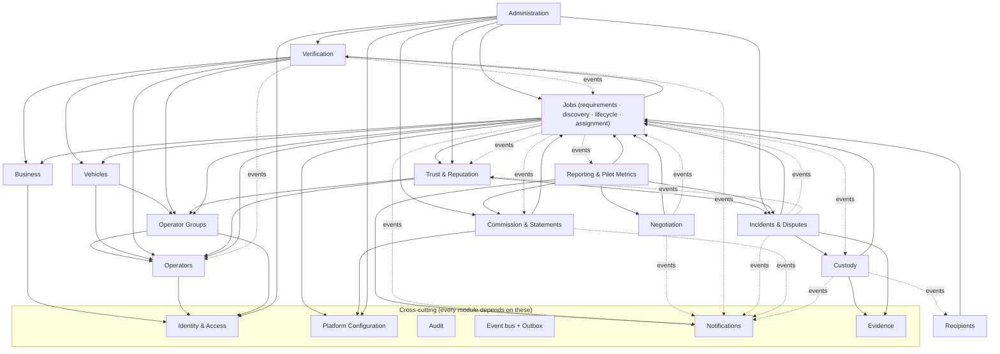
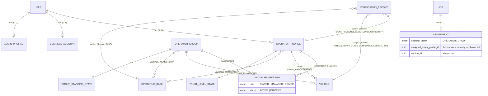

# Domain Architecture

Bounded modules of the modular monolith. Each is a Django app. Modules interact
**only** through a module's public service API (`<module>/services.py`) or through
**domain events** — never by importing another module's models.

Consolidations from the Phase 1 brief's illustrative list (brief §8), made to
avoid modules that "sound good" but earn nothing:

- **Zones** → part of **Platform Configuration** (`config.zones` — a small list;
  deferred content, D-PIL-5).
- **Job Requirements**, **Assignment** → part of **Jobs** (they share the job's
  transaction boundary and lifecycle).
- **Business Locations** → part of **Business**.
- **Ratings** → part of **Trust & Reputation** (ratings only exist to feed
  reputation and trust; FR-R-4).
- **Recipients** stays its own module: the no-account link has a distinct
  security model and lifecycle (D-RCP-1).

---

## 1. Module map

Dependency rules:

1. Arrows point **from** the dependant **to** the dependency. There are **no
   cycles** among domain modules. The only feedback paths are **events**
   (dashed), which are decoupled.
2. **Trust & Reputation → Incidents & Disputes** is a real synchronous read
   dependency (trust evaluation needs incident outcomes); **Incidents →
   Trust** is event-only (a resolved incident emits an event that triggers
   re-evaluation). No cycle: one direction is a call, the other is an event.
3. Cross-cutting modules (Identity & Access, Configuration, Audit, Event bus,
   Notifications, Evidence) may be depended on by anyone and depend on nothing
   domain-specific.

---

## 2. Operator / Group / Vehicle / Base relationship

**The rule the whole trust model hangs on (Phase 1 brief §12, §14; D-OPR-GRP-1):**
a confirmed job — solo or group — always resolves to **one specific person
(`assigned_driver_profile_id`)** and **one specific vehicle**. Value-band gating
(High-value etc.) is evaluated against **that person's** `TrustLevelState`, never
the group's. The group's `GroupStandingState` is an independent
restrict/suspend lever, not a value gate.

---

## 3. Modules

For each: **responsibility · owned entities · key invariants · dependencies ·
public interface (selected) · events emitted · events consumed.**
Entity field detail is in [database-design.md](database-design.md).

### 3.1 Identity & Access

- **Responsibility.** Users, phone+OTP authentication, sessions/tokens, admin
  TOTP MFA, the role assignment, and the **authorization policy engine**.
- **Owned entities.** `User`, `Credential` (PIN/password optional), `OtpChallenge`,
  `Session` / `RefreshToken`, `AdminProfile`, `TotpDevice`, `RoleAssignment`,
  `PermissionGrant` (derived from the config role→permission map).
- **Invariants.** A `User` is uniquely identified by `phone`. An admin `Session`
  is invalid without a verified `TotpDevice`. A `RefreshToken` is single-use
  (rotation with reuse detection). Role changes are admin-only and audited; no
  self-grant.
- **Dependencies.** Platform Configuration (role→permission map), Audit,
  Notifications (OTP).
- **Public interface.** `AuthService.request_otp(phone, purpose)`,
  `verify_otp(...)`, `issue_session(user, device)`, `rotate_refresh(token)`,
  `revoke(session)`; `AuthzService.authorize(actor, action, resource)`,
  `permissions_for(actor)`.
- **Emits.** `UserRegistered`, `UserSuspended`, `AdminActionPerformed`.
- **Consumes.** `PlatformConfigChanged` (reload the permission map).

### 3.2 Business

- **Responsibility.** Business accounts, (optional) members, and business
  locations.
- **Owned entities.** `BusinessAccount`, `BusinessMembership` (OWNER / DISPATCHER
  / VIEWER — single-user for the pilot, table present for later, FR-A-6),
  `BusinessLocation`.
- **Invariants.** Exactly one `MAIN` `BusinessLocation` per business. A business
  needs `verification_status = VERIFIED` **and** ≥ 1 active location before it
  can publish a job (FR-B-4). Locations referenced by historical jobs are
  soft-deleted, never hard-deleted (FR-B-3).
- **Dependencies.** Identity & Access, Verification, Configuration (zones).
- **Public interface.** `BusinessService.create_account(...)`,
  `add_location(...)`, `set_main_location(...)`, `deactivate_location(...)`,
  `standing(business)`.
- **Emits.** `BusinessRegistered`, `BusinessVerified`, `BusinessStandingChanged`.
- **Consumes.** `VerificationDecided` (business subject), `IncidentResolved`
  (bad-faith / non-payment → standing).

### 3.3 Operators

- **Responsibility.** Individual operator profiles, operating bases, service
  areas, availability.
- **Owned entities.** `OperatorProfile`, `OperatingBase`, `BaseMembership`,
  `ServiceArea`, `AvailabilityState`.
- **Invariants.** An operator can `discover`/`accept` a job only when
  `OperatorProfile.status = ACTIVE`, identity + licence + good-conduct
  verification are `VERIFIED` and not `EXPIRED`, and not suspended/restricted.
  `AvailabilityState = BUSY` is set by the Jobs module on ASSIGNED/AT_PICKUP and
  cleared on COMPLETED/CANCELLED/FAILED; it is **advisory** for discovery, not a
  hard block (operator-model §5).
- **Dependencies.** Identity & Access, Verification, Trust & Reputation
  (read reputation summary), Configuration (zones).
- **Public interface.** `OperatorService.create_profile(...)`, `add_base(...)`,
  `set_service_areas(...)`, `set_availability(...)`, `eligibility(operator)`.
- **Emits.** `OperatorRegistered`, `OperatorAvailabilityChanged`,
  `OperatorStatusChanged`.
- **Consumes.** `VerificationDecided`, `VerificationExpired`, `TrustLevelChanged`,
  `AdminActionPerformed` (suspend/restrict/offboard).

### 3.4 Operator Groups

- **Responsibility.** The minimal group construct (D-OPR-GRP-1): group profile,
  membership, group standing. Group-owned vehicles are stored in **Vehicles**
  with `owner_kind = GROUP`.
- **Owned entities.** `OperatorGroup`, `GroupMembership`, `GroupStandingState`,
  `GroupStandingChange` (append-only).
- **Invariants.** Every `GroupMembership(role = DRIVER, status = ACTIVE)`
  references an `OperatorProfile` that is itself fully verified (identity +
  licence + good-conduct) — **the group is not a verification shortcut**. A
  group with `standing = SUSPENDED` cannot be assigned any job. `assignment_mode`
  ∈ {`MANAGER_ASSIGNS`, `DRIVER_ACCEPTS`}.
- **Dependencies.** Identity & Access, Operators, Verification.
- **Public interface.** `GroupService.create_group(...)`, `add_member(...)`,
  `set_assignment_mode(...)`, `standing(group)`,
  `assignable_drivers(group)`.
- **Emits.** `GroupRegistered`, `GroupStandingChanged`, `GroupMemberChanged`.
- **Consumes.** `VerificationDecided` (member/vehicle), `IncidentResolved`
  (group at fault → standing), `AdminActionPerformed`.

### 3.5 Vehicles

- **Responsibility.** The vehicle registry (owned by an operator or a group) and
  its verification state, including heavy-class compliance.
- **Owned entities.** `Vehicle`, `VehicleDocument` (ref + kind + expiry),
  `HeavyClassCompliance` (NTSA operator licence, speed limiter, telematics,
  inspection, insurance — refs + expiry).
- **Invariants.** `owner_kind ∈ {OPERATOR, GROUP}` with `owner_id` matching. A
  vehicle is **eligible for discovery/assignment** only when its `VEHICLE`
  verification is `VERIFIED` and not `EXPIRED`, and — for heavy classes (tare
  > configured threshold) — its `HEAVY_CLASS_COMPLIANCE` verification is also
  `VERIFIED` and current (FR-T-6, operator-model §2.2). Expiry of insurance or
  inspection makes the vehicle immediately ineligible (FR-V-5).
- **Dependencies.** Operators, Operator Groups, Verification, Configuration
  (vehicle types, heavy-class tare threshold).
- **Public interface.** `VehicleService.register(...)`, `add_document(...)`,
  `eligibility(vehicle)`, `matches_requirement(vehicle, requirement)`.
- **Emits.** `VehicleRegistered`, `VehicleEligibilityChanged`.
- **Consumes.** `VerificationDecided`, `VerificationExpired`.

### 3.6 Verification

- **Responsibility.** Per-domain verification records, their (per-domain)
  lifecycles, reviewer decisions, expiry, and the **derived-eligibility**
  computation other modules read.
- **Owned entities.** `VerificationRecord` (per `subject` + `domain`),
  `VerificationDecision` (append-only reviewer actions),
  `VerificationRequirement` (per subject-type, from config: which domains are
  mandatory).
- **Invariants.** State machine `NOT_SUBMITTED → SUBMITTED → IN_REVIEW →
  {VERIFIED | REJECTED | INFO_REQUESTED}`; `VERIFIED → EXPIRED` on `expires_at`.
  Decisions are append-only and audited; the current `state` is a derived
  projection of the latest decision + expiry (FR-V-2, trust-and-safety §2.1).
  Raw document images are HIGH-PII (see [evidence-storage.md](evidence-storage.md)).
- **Dependencies.** Evidence, Configuration, Audit; subject modules for
  identity of the subject only.
- **Public interface.** `VerificationService.submit(subject, domain, evidence)`,
  `decide(record, decision, reviewer, reason, expires_at)`,
  `request_more_info(record, note)`,
  `eligibility(subject) -> {domain: state}`,
  `subject_meets(subject, [domains])`.
- **Emits.** `VerificationSubmitted`, `VerificationDecided`,
  `VerificationExpired`, `VerificationExpiringSoon`.
- **Consumes.** `PlatformConfigChanged` (requirement changes), beat tick
  (expiry sweep).

### 3.7 Trust & Reputation

- **Responsibility.** Operator trust levels (VERIFIED ≠ TRUSTED), the
  evidence-based, admin-confirmed progression, value-band gating input, and
  ratings/reputation summaries.
- **Owned entities.** `TrustLevelState`, `TrustLevelChange` (append-only, every
  change has a `trigger` + `reason` + evidence links), `Rating`,
  `ReputationSummary` (materialised: avg rating, completed jobs, at-fault
  incident counts, days active).
- **Invariants.** Trust level is **never** a free-text admin number: an admin can
  only **confirm/reject an `AUTO_PROPOSED` change** or **impose Restricted with a
  recorded reason** (FR-T-3/4, brief §14). Every level change references the
  facts that justify it. A `Rating` exists only for a job in `COMPLETED`
  (FR-R-2). A group job produces a rating against **both** the assigned driver
  and the group (FR-O-8).
- **Dependencies.** Operators, Operator Groups, Jobs (completed-job facts),
  Incidents & Disputes (at-fault outcomes), Configuration (level criteria +
  ceilings).
- **Public interface.** `TrustService.evaluate(operator)`,
  `propose_change(...)`, `confirm_change(change, admin)`,
  `impose_restricted(operator, admin, reason)`,
  `value_ceiling(operator)`,
  `driver_eligible_for_band(operator, band) -> bool`,
  `RatingService.submit(job, rater, score, dims, comment)`.
- **Emits.** `TrustLevelChangeProposed`, `TrustLevelChanged`, `RatingSubmitted`,
  `ReputationRecomputed`.
- **Consumes.** `JobCompleted`, `IncidentResolved`, `RatingSubmitted`,
  beat tick (nightly re-evaluation).

### 3.8 Jobs

- **Responsibility.** The **Job aggregate** (the central business object),
  cargo + requirements, discovery, the **Job Lifecycle Service** (the single
  authoritative writer of `job.status` — see
  [job-state-machine.md](job-state-machine.md)), and assignment.
- **Owned entities.** `Job`, `JobLocation` (pickup + destination),
  `CargoDetails`, `VehicleRequirement`, `Agreement` (created on CONFIRMED,
  frozen), `Assignment` (created on ASSIGNED, names driver + vehicle),
  `JobStatusEvent` (a view over `job_event` where `category = STATUS_TRANSITION`),
  `CancellationRecord` / `FailureRecord`.
- **Key invariants.**
  1. `job.status` changes **only** through `JobLifecycleService.transition(...)`;
     any other write path is a bug (FR-J-3, NFR-INT-2).
  2. A `(from, to)` pair not in the allowed-transition table is rejected with
     **no side effects** (FR-J-3).
  3. Concurrent transitions are serialised by `SELECT job FOR UPDATE` +
     `version` check; the job cannot branch (FR-J-5, NFR-INT-1).
  4. `Agreement` exists ⇔ the job has passed through CONFIRMED; the agreed price
     is **immutable** after creation (D-NEG-3, brief §34 P5/P6).
  5. `Assignment.assigned_driver_profile_id` is always set (solo = the operator;
     group = a member DRIVER) and its `TrustLevelState.value_ceiling` ≥ the job's
     value, unless a recorded admin override exists (domain-model invariant 5).
  6. Requester `User` ≠ assigned driver `User` ≠ a group the requester controls
     (domain-model invariant 8, FR-A-7).
- **Discovery** (`JobDiscoveryService`) applies the hard filters of FR-J-6 /
  operator-model §6 (vehicle type + capacity match, service-area/base proximity,
  trust-level meets the job's required level, not suspended, identity+licence
  current) and orders by ranking signals (base proximity, reputation,
  responsiveness, availability) that never hard-filter beyond FR-J-6.
- **Dependencies.** Business, Operators, Operator Groups, Vehicles, Verification,
  Trust & Reputation, Configuration; Evidence + Custody for custody transitions.
- **Public interface.** `JobService.create_draft(...)`, `publish(job)`,
  `JobLifecycleService.transition(job_id, to, actor, context)`,
  `AssignmentService.assign(job, operator_party, driver, vehicle, by)`,
  `reassign(job, ..., reason)`,
  `JobDiscoveryService.discoverable_for(operator, filters, cursor)`.
- **Emits.** `JobRequested`, `JobConfirmed`, `JobAssigned`, `JobPickedUp`,
  `JobInTransit`, `JobAtDestination`, `JobDelivered`, `JobCompleted`,
  `JobCancelled`, `JobFailed`, `JobDisputed`, `JobStatusChanged` (generic).
- **Consumes.** `AgreementReached` (from Negotiation → triggers CONFIRMED),
  `IncidentOpened` (→ may DISPUTE), `DisputeResolved` (→ routes terminal),
  `VerificationExpired` / `TrustLevelChanged` (recompute discovery eligibility),
  beat ticks (request expiry, delivery-acceptance auto-complete,
  post-completion-window close, stale-assignment alert).

### 3.9 Negotiation

- **Responsibility.** Offer / counter / accept / decline / expiry; immutable
  history; detecting mutual acceptance and freezing the agreed price.
- **Owned entities.** `NegotiationThread` (one per job × operator/group),
  `NegotiationEntry` (append-only: PROPOSE / COUNTER / ACCEPT / REJECT, amount in
  KES minor units, note, `in_response_to`, server timestamp, status ACTIVE /
  SUPERSEDED / EXPIRED).
- **Invariants.** Entries are **never updated or deleted** (FR-N-2); a correction
  is a new entry. A job reaches CONFIRMED via **exactly one** thread; on
  confirmation the winning thread → `CLOSED`, all sibling threads →
  `SUPERSEDED` (FR-N-4). Two racing ACCEPTs: the job row lock + status recheck
  means the first wins and the second gets `409 job_no_longer_available`
  (FR-N-6). Read access to a thread is scoped to its operator/group, the job's
  business, and admins — see [negotiation-architecture.md](negotiation-architecture.md)
  for why this "sealed thread" is a concrete requirement and how it is *not*
  heavyweight.
- **Dependencies.** Jobs (calls `JobLifecycleService` to CONFIRM),
  Configuration (offer-expiry default, sanity thresholds).
- **Public interface.** `NegotiationService.open_thread(job, operator_party)`,
  `place_entry(thread, actor, type, amount, note)`, `accept(entry, actor)`,
  `expire_stale_offers()`.
- **Emits.** `OfferPlaced`, `OfferAccepted`, `AgreementReached`, `ThreadClosed`.
- **Consumes.** `JobCancelled` / `JobFailed` (close open threads), beat tick
  (offer expiry).

### 3.10 Custody

- **Responsibility.** The append-only custody trail from assignment to
  completion, the mandatory pickup-side OTP, proof of pickup/delivery, and
  event-based location evidence.
- **Owned entities.** custody rows of `job_event` (`custody = true`),
  `ProofOfPickup`, `ProofOfDelivery`, `PickupOtpChallenge`,
  `LocationEvidence` (embedded on custody rows).
- **Invariants.** Custody rows are **append-only and immutable** (FR-C-6);
  corrections are a new `NOTE` row referencing the original. `AT_PICKUP →
  PICKED_UP` requires a **verified pickup-side OTP** (D-CUS-2); the
  **operator-attested photo fallback is allowed only on a Standard-band job** and
  **caps that job at the Standard band** unless the business later confirms;
  **no fallback at Elevated and above** (FR-C-3). Delivery requires recipient
  verification (name + one or more of OTP / signature / photo, FR-C-5). Server
  timestamps are authoritative; client times are stored separately as "reported"
  (NFR-AUD-4).
- **Dependencies.** Jobs (custody transitions go through `JobLifecycleService`),
  Evidence, Notifications (OTP), Recipients (issue the delivery link).
- **Public interface.** `CustodyService.mark_arrival(job, actor, geo)`,
  `issue_pickup_otp(job)`, `confirm_pickup(job, otp | fallback_photo, actor)`,
  `mark_in_transit(...)`, `mark_at_destination(...)`,
  `record_proof_of_delivery(...)`, `timeline(job)`.
- **Emits.** `ArrivedAtPickup`, `CustodyConfirmed`, `InTransit`,
  `ArrivedAtDestination`, `ProofOfDeliveryRecorded`.
- **Consumes.** `JobAssigned` (prepare custody context), `JobDisputed` (freeze).

### 3.11 Recipients

- **Responsibility.** The no-account, per-job recipient link (D-RCP-1): issuing,
  scoping, verifying, expiring, revoking.
- **Owned entities.** `RecipientAccessLink` (job_id, **token hash**,
  `allowed_actions`, `channel_sent`, `sent_to_phone`, `expires_at`, `used_at`,
  `revoked`), `RecipientOtpChallenge`.
- **Invariants.** One active link per job. The token is a ≥ 128-bit CSPRNG value
  stored **hashed**; the plaintext is only in the URL. The link grants **nothing
  beyond `allowed_actions`** and is inert after `expires_at` (= COMPLETED +
  post-completion dispute window) or `revoked` (domain-model invariant 12).
  Confirm-receipt requires an OTP to `sent_to_phone`. Every access is audited as
  `actor_role = RECIPIENT`. See [recipient-access.md](recipient-access.md) for
  the threat model.
- **Dependencies.** Jobs (read the delivery-facing subset), Custody (record the
  recipient's proof-of-delivery), Incidents & Disputes (create an incident),
  Notifications (deliver the link + OTP).
- **Public interface.** `RecipientLinkService.issue(job, phone, channels)`,
  `resolve(token) -> scoped view | 404`, `verify_otp(token, code)`,
  `revoke(job, reason)`.
- **Emits.** `RecipientLinkIssued`, `RecipientConfirmedReceipt`,
  `RecipientRaisedIncident`.
- **Consumes.** `JobAtDestination` / `JobDelivered` (issue/refresh link),
  `JobCompleted` (schedule expiry), beat tick (link expiry sweep).

### 3.12 Incidents & Disputes

- **Responsibility.** Incident capture (all Phase 0 types), evidence + statements
  (append-only), the amicable-first workflow, administrative review, resolution,
  and escalation.
- **Owned entities.** `Incident`, `Evidence` (link rows; media in the Evidence
  module), `Statement` (append-only), `Dispute`, `Resolution`, `Escalation`.
- **Invariants.** Evidence and statements are **append-only** (FR-D-4). An
  incident that blocks progression moves the job to `DISPUTED` via
  `JobLifecycleService` (FR-D-3). A `Resolution` routes the job to
  `COMPLETED / FAILED / CANCELLED` or (admin-only) resumes the recorded
  pre-dispute state (FR-D-7 — the resume path is **OPEN** in Phase 0
  job-lifecycle §2.3; the state machine supports it, gated to Platform Admin).
  The platform records financial adjustments but **processes no forced
  refund/payout** (FR-D-10); it may `WAIVE`/`REDUCE` its **own commission** only.
- **Dependencies.** Jobs, Custody (auto-attach relevant custody rows), Evidence,
  Trust & Reputation (apply at-fault outcomes), Commission & Statements (commission
  treatment), Notifications, Audit.
- **Public interface.** `IncidentService.open(job, type, severity, reporter,
  description, evidence)`, `add_statement(...)`, `add_evidence(...)`,
  `propose_amicable_outcome(...)`, `record_resolution(...)`, `escalate(...)`.
- **Emits.** `IncidentOpened`, `IncidentUpdated`, `AmicableOutcomeProposed`,
  `DisputeOpened`, `DisputeResolved`, `IncidentEscalated`, `IncidentResolved`.
- **Consumes.** `RecipientRaisedIncident`, `JobDisputed`, beat tick (SLA timers).

### 3.13 Commission & Statements

- **Responsibility.** The commission **ledger** — immutable per-job records,
  weekly statements, settlement reconciliation, adjustments/reversals, eTIMS
  invoice generation. **No fund holding, no escrow, no fare processing**
  (D-BIZ-6). Detail: [commission-ledger.md](commission-ledger.md).
- **Owned entities.** `CommissionRecord` (immutable; pinned to a config version),
  `CommissionAdjustment` (append-only, admin-signed), `CommissionStatement`,
  `StatementLine`, `SettlementRecord`, `PaymentReport` (party-reported fare
  payment — informational only), `EtimsInvoice` (ref + status).
- **Invariants.** A `CommissionRecord` is created **on COMPLETED**, computed
  from `PlatformConfig` version in force, storing the resolved
  `rate_applied / min_fee_applied / cap_applied / band / config_version` so it is
  never recomputed differently later (brief §21). Commission on a `DISPUTED` job
  is `HELD` until resolution decides `APPLY / REDUCE / WAIVE` (D-BIZ-7).
  `CANCELLED / FAILED` jobs create **no** record (FR-M-5). Money is integer KES
  minor units (NFR-INT-3). For a group job the **payee is the group** (FR-O-8).
  A `CommissionRecord` is **never mutated** — corrections are
  `CommissionAdjustment` rows that net against a statement.
- **Dependencies.** Jobs (`JobCompleted`), Configuration (rate model + version),
  Notifications (send statements), eTIMS adapter, M-Pesa reconcile adapter.
- **Public interface.** `LedgerService.accrue_for_completed_job(job)`,
  `hold(job)`, `apply_resolution(job, treatment, amount)`,
  `StatementService.run_weekly(period)`,
  `reconcile_settlement(statement, payment_ref)`,
  `add_adjustment(statement_or_record, admin, kind, amount, reason)`.
- **Emits.** `CommissionAccrued`, `CommissionHeld`, `CommissionResolved`,
  `StatementGenerated`, `StatementSettled`, `EtimsInvoiceSubmitted`.
- **Consumes.** `JobCompleted`, `JobDisputed`, `DisputeResolved`,
  `PlatformConfigChanged` (future rate change — never retroactive), beat tick
  (weekly statement run).

### 3.14 Notifications

- **Responsibility.** Channel-agnostic delivery over in-app + SMS + WhatsApp,
  OTP SMS-primary, WhatsApp→SMS fallback, localized templates, delivery status,
  retries, cost accounting. Detail:
  [notification-architecture.md](notification-architecture.md).
- **Owned entities.** `NotificationTemplate` (key × locale × channel),
  `NotificationMessage` (per channel: status, provider ref, cost, retries),
  `InAppNotification`, `UserNotificationPreference`, `DeliveryReceipt`.
- **Invariants.** OTP sends prefer SMS (FR-NOTIF-4). Idempotent per
  `(recipient, template_key, dedupe_key)`. A WhatsApp `FAILED` (or no receipt in
  N minutes) enqueues an SMS with the same rendered content (D-NOTIF-1).
- **Dependencies.** Configuration (channel config, quiet hours), SMS + WhatsApp
  adapters, Audit (for OTP issuance meta, not the code).
- **Public interface.** `NotificationService.send(recipient, template_key,
  params, importance, locale)`, `send_otp(phone, purpose)`,
  `mark_receipt(provider_ref, status)`.
- **Emits.** `NotificationSent`, `NotificationFailed`,
  `NotificationFellBackToSms`.
- **Consumes.** virtually every domain event (fan-out); `PlatformConfigChanged`.

### 3.15 Evidence

- **Responsibility.** Store, validate, hash, encrypt, and serve all media, and
  enforce authorized, logged access. Detail:
  [evidence-storage.md](evidence-storage.md).
- **Owned entities.** `EvidenceObject` (storage_key, content_type, size, sha256,
  `pii_class`, `purpose`, `retention_class`, `linked_entity`, `uploaded_by`),
  `EvidenceAccessLog` (append-only; who fetched which HIGH-PII object when).
- **Invariants.** Clients never receive a bucket URL (NFR-SEC-8). Every fetch is
  authorized against the linked job/incident/verification and, for HIGH-PII,
  logged (NFR-SEC-4). Objects carry a SHA-256 recorded on the referencing
  domain row so tampering is detectable (NFR-INT-4). Retention sweep deletes past
  the window unless a legal hold is set (NFR-PRIV-2).
- **Dependencies.** Object storage adapter, KMS / secrets (envelope keys),
  optional ClamAV adapter, Configuration (retention classes).
- **Public interface.** `EvidenceService.begin_upload(purpose, linked_entity,
  actor)`, `finalize_upload(...)`, `authorized_url(object, actor, ttl)`,
  `stream(object, actor)`, `purge_expired()`.
- **Emits.** `EvidenceStored`, `EvidenceAccessed` (HIGH-PII), `EvidencePurged`.
- **Consumes.** beat tick (retention + scan sweeps).

### 3.16 Audit

- **Responsibility.** The immutable, append-only, hash-chained record of every
  state-changing action by every actor (including automated timers and the
  founder). Detail: [security-architecture.md](security-architecture.md)
  §"Audit integrity".
- **Owned entities.** `AuditLogEntry` (actor, role, action, entity_type,
  entity_id, before, after, server_time, source_meta, `prev_hash`, `row_hash`).
- **Invariants.** No application code path updates or deletes an entry; the app
  DB role lacks `UPDATE`/`DELETE` on the table (NFR-AUD-3). Written **synchronously
  and in the same transaction** as the change it records (so it cannot be lost or
  diverge). Hash chain verified nightly.
- **Public interface.** `AuditLog.record(...)`, `for_entity(type, id)`,
  `for_actor(user)`, `verify_chain(range)`, `export(range, requester)`.
- **Consumes.** nothing (leaf module).

### 3.17 Platform Configuration

- **Responsibility.** The single versioned `PlatformConfig` and its change
  history; resolving "config in force at time T".
- **Owned entities.** `PlatformConfig` (current, JSONB), `PlatformConfigVersion`
  (append-only: version, changed_by, changed_at, rationale, full snapshot).
- **Invariants.** Changes are admin-only, require re-auth, and always append a
  version with a rationale (FR-ADM-7). No consumer caches config beyond a short
  TTL / a `PlatformConfigChanged` invalidation. Historical decisions store the
  version id they used.
- **Public interface.** `ConfigService.current()`, `get(path)`,
  `apply_change(patch, admin, rationale)`, `version_at(timestamp)`,
  `role_permissions()`.
- **Emits.** `PlatformConfigChanged`.
- **Consumes.** nothing (leaf module).

### 3.18 Administration

- **Responsibility.** Orchestration of the internal admin surface: the
  verification queue, job monitor + interventions, dispute console, high-value
  approval queue, account suspension/offboarding, config management UI, and the
  audit-log viewer. It **composes** other modules' services; it owns little data.
  Detail: [admin-architecture.md](admin-architecture.md).
- **Owned entities.** `AdminTask` / queue projections (materialised views over
  Verification, Incidents, Trust proposals, High-value jobs),
  `AdminIntervention` (reassign / cancel / force-transition — a thin wrapper that
  always records actor + reason + before/after via Audit),
  `HighValueApproval`.
- **Invariants.** **Every** admin action — including the Platform Admin's /
  founder's — writes an `AuditLogEntry` (FR-ADM-9, brief §34 P11). A forced job
  transition is only to a state reachable per the allowed-transition table
  (job-lifecycle §4). Sensitive actions (config change, suspension, dispute
  resolution, PII-document view) require re-auth.
- **Dependencies.** Verification, Trust & Reputation, Jobs, Incidents & Disputes,
  Commission & Statements, Platform Configuration, Identity & Access, Audit.
- **Public interface.** `AdminService.verification_queue(filters)`,
  `active_jobs(filters)`, `intervene(job, action, admin, reason)`,
  `approve_high_value(job, admin)`, `resolve_dispute(...)`,
  `suspend_account(...)`, `apply_config_change(...)`.
- **Emits.** `AdminActionPerformed` (generic), `HighValueApproved`,
  `AccountSuspended`.
- **Consumes.** queue-feeding events from the modules above.

### 3.19 Reporting & Pilot Metrics

- **Responsibility.** The pilot learning agenda (pilot-strategy §4): capture
  structured operational data from domain events, roll it up nightly, feed the
  operational dashboard and the access-controlled CSV export — **no
  spreadsheets** (FR-DASH-2/3).
- **Owned entities.** `AnalyticsEvent` (append-only, minimal-PII projection of
  domain events), `MetricDaily` (aggregates per day × dimension),
  `ExportJob` (async CSV generation + signed download).
- **Invariants.** Analytics use the **minimum necessary personal data**
  (NFR-PRIV-1); exports are access-controlled and logged (FR-DASH-3). Every
  pilot metric in pilot-strategy §4 maps to a source event (mapping table in
  [observability.md](observability.md)).
- **Dependencies.** every domain module (as event consumer), Configuration
  (dimensions like zones/bands), Evidence (export delivery).
- **Public interface.** `MetricsService.record(event)`, `rollup(date)`,
  `dashboard(range)`, `ExportService.request(scope, requester)`.
- **Emits.** `ExportReady`.
- **Consumes.** all domain events; beat tick (nightly rollup).

---

## 4. Cross-module invariants (enforced across boundaries)

| Invariant | Owning enforcement point |
|-----------|--------------------------|
| `job.status` mutated only via `JobLifecycleService.transition` | Jobs — code review + a single writer; other modules call it, never write the column |
| Every state change → one `AuditLogEntry` in the same txn | Jobs / Custody / Negotiation / Trust / Admin call `AuditLog.record` inside the transaction; a test asserts coverage |
| Every domain event that triggers async work → one `outbox_event` in the same txn | Event bus writer; publisher is at-least-once; handlers idempotent |
| Verification `VERIFIED` + not `EXPIRED` for identity/licence/good-conduct before an operator can accept a job | Jobs discovery + the CONFIRMED/ASSIGNED guards call `VerificationService.subject_meets` |
| Value-band gating uses the **assigned driver's** trust ceiling (never the group's) | Jobs `AssignmentService` + the ASSIGNED guard call `TrustService.driver_eligible_for_band` |
| Negotiation entries, custody rows, statements/statement-lines, audit rows, config versions, trust changes: append-only | Each module's service layer has no update/delete path; DB role restricted for audit + config-version + statement tables |
| Money is integer KES minor units everywhere | A shared `Money` value type; DB columns `BIGINT`; a lint/test guard against float money |
| Config version pinned on every job/commission/trust decision | The deciding service records `config_version_id` on the row |
