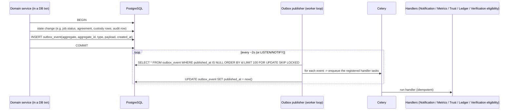

# Events & Background Jobs

Implements Phase 1 brief §27. Decides what is **synchronous** vs **asynchronous**,
how domain events are published (**transactional outbox**), and the **scheduled
job** catalogue.

Principle (brief §27): *do not create an event-driven architecture for fashion.*
The system is a **modular monolith**. "Events" here are an **in-process pub/sub
plus a transactional outbox for async fan-out** — not a message broker.

---

## 1. Synchronous vs asynchronous

### Synchronous — inside the request, inside the DB transaction

| Operation | Why sync |
|-----------|----------|
| Login OTP verification → session issue | The user is waiting; security-critical |
| **Every job status transition** + its side-effect rows (Agreement, Assignment, CommissionRecord accrual, ProofOfPickup/Delivery, status event, custody event) | Atomicity + the `FOR UPDATE` lock; a partial transition is unacceptable ([job-state-machine.md](job-state-machine.md)) |
| Negotiation `place_entry` / `accept` (accept also runs the CONFIRM transition) | Immutability + the confirm race must be serialised |
| Verification decision (approve/reject/info) | Reviewer is waiting; changes eligibility that a subsequent action may depend on |
| Trust-level **confirm** (apply an admin-confirmed change) | Small; the admin is waiting; must be consistent before the next assignment |
| Platform-config change (append a version) | The admin is waiting; consumers reload after |
| **Audit-log write** for any of the above | Must be atomic with the change it records (NFR-AUD-1) |
| **Outbox-row write** for any domain event the change raises | Must be atomic with the change (exactly-once *capture*) |
| Evidence metadata write (after the file is validated) | The uploader is waiting for the `evidence_id` |
| Pickup / recipient **OTP verification** | Security-critical; the user is at the doorstep |

### Asynchronous — Celery tasks, triggered by the outbox or the beat scheduler

| Operation | Why async |
|-----------|-----------|
| Send SMS / WhatsApp / write in-app notification | External I/O; must not block or roll back a state change (NFR-AVAIL-4) |
| WhatsApp→SMS fallback watcher | Time-delayed |
| Image processing (re-encode, EXIF strip, thumbnail, hash) — *the response can wait for a quick synchronous encode for small images; large files or non-images go async* | CPU / I/O |
| ClamAV scan of non-image uploads | Slow; quarantined until done |
| Geocoding / distance lookup on job creation | External; done sync **with a short timeout + cache**, falls back to async + a manual/approx distance if the provider is slow |
| Trust re-evaluation (recompute `reputation_summary`, propose level changes) | Not user-blocking; batched |
| Weekly commission statement run + eTIMS submission | Scheduled; heavy |
| Pilot metrics: write `analytics_event`, nightly `metric_daily` rollup | Analytical |
| CSV export generation | Heavy; delivered as a signed download |
| Expiry / retention sweeps (verification, offers, links, evidence, geo coarsening) | Scheduled |
| Stale-assignment alerts, delivery-acceptance auto-complete, post-completion-window close, request/negotiation expiry | Scheduled timers |
| Audit-chain nightly verification + off-box export | Scheduled |

---

## 2. Transactional outbox

- **`outbox_event`** `id BIGSERIAL PK · aggregate_type · aggregate_id ·
  type · payload JSONB · created_at · published_at NULL · attempts SMALLINT`.
- Written **in the same transaction** as the state change → the event cannot be
  lost and cannot describe a change that rolled back (**exactly-once capture,
  at-least-once delivery**).
- The publisher uses `FOR UPDATE SKIP LOCKED` so multiple worker instances don't
  double-publish.
- **Handlers are idempotent**: each handler task carries a deterministic key
  `(handler, event_id)`; a second run is a no-op. Notification handlers dedupe
  via the `notification_message` unique index; metrics handlers upsert; the
  Ledger accrual already happened synchronously (the `JobCompleted` event handler
  only *notifies* — it does not re-accrue).
- **Poison events**: after `attempts >= N`, park the event in
  `outbox_event_dead` and alert; never block the queue.
- A **`published_at` lag** metric feeds observability (a growing lag = the
  publisher or workers are unhealthy).

### 2.1 In-process synchronous bus (used sparingly)

For effects that **must** be atomic with the change and are cheap and in-process
(e.g. "on `JobAssigned`, set `operator.availability = BUSY`"), a synchronous
in-transaction listener is used instead of the outbox. The rule: **synchronous
listener only if it writes to the same DB and must not be eventually
consistent**; everything else goes through the outbox.

---

## 3. Domain events (catalogue)

Producers/consumers are listed per module in
[domain-architecture.md](domain-architecture.md) §3. Consolidated list:

| Event | Payload (key fields) | Primary consumers |
|-------|----------------------|-------------------|
| `JobRequested` | job_id, zone, band, vehicle_req | Notifications (eligible operators), Metrics |
| `JobNegotiating` / `OfferPlaced` | job_id, thread_id, actor_role, amount_kes | Notifications, Metrics |
| `AgreementReached` / `JobConfirmed` | job_id, operator_party, agreed_price_kes | Notifications, Metrics, (CONFIRM already applied sync) |
| `JobAssigned` | job_id, driver_profile_id, vehicle_id | Notifications, Custody (prep), Availability=BUSY (sync), Metrics |
| `ArrivedAtPickup` | job_id, geo_state | Notifications (issue pickup OTP), Metrics |
| `JobPickedUp` | job_id, attestation | Notifications, Metrics; if `OPERATOR_ATTESTED_UNVERIFIED` → business-confirm prompt |
| `JobInTransit` / `JobAtDestination` | job_id | Recipients (issue link+OTP), Notifications, Metrics |
| `JobDelivered` | job_id, pod_method | Notifications, Metrics, start acceptance timer |
| `JobCompleted` | job_id, payee_kind, payee_id | Ledger (notify only — accrual was sync), Trust re-eval, Metrics, Notifications, open ratings window |
| `JobCancelled` / `JobFailed` | job_id, at_status, reason | Negotiation (close threads), Recipients (revoke), Availability=AVAILABLE, Metrics, cancellation-flag eval |
| `JobDisputed` / `DisputeResolved` / `JobResumed` | job_id, dispute_id, routed_status | Ledger (hold/treat), Trust (at-fault), Notifications, Metrics |
| `IncidentOpened` / `IncidentUpdated` / `IncidentEscalated` | incident_id, job_id, type, severity | Jobs (maybe DISPUTE), Notifications, Metrics |
| `VerificationSubmitted` / `VerificationDecided` / `VerificationExpired` / `VerificationExpiringSoon` | record_id, subject, domain, state | Operators/Vehicles (eligibility), Jobs (discovery), Trust (L1), Notifications |
| `TrustLevelChangeProposed` / `TrustLevelChanged` | operator_id, from, to | Admin queue, Jobs (discovery), Notifications, Metrics |
| `RatingSubmitted` | job_id, ratee_kind, score | Trust re-eval, Metrics |
| `CommissionAccrued` / `CommissionHeld` / `CommissionResolved` | job_id, amount_kes, status | Reporting, (statement run consumes on schedule) |
| `StatementGenerated` / `StatementSettled` | statement_id, payee, net_due_kes | Notifications (payee), Reporting |
| `RecipientLinkIssued` / `RecipientConfirmedReceipt` / `RecipientRaisedIncident` | job_id, link_id | Notifications, Incidents, Metrics |
| `EvidenceStored` / `EvidenceScanInfected` / `EvidencePurged` | evidence_id | requesting module, Notifications (infected), Audit |
| `PlatformConfigChanged` | version | every module with cached config, Reporting |
| `AdminActionPerformed` / `AccountSuspended` | actor, action, entity | Reporting, capability cascades |
| `NotificationSent` / `NotificationFailed` / `NotificationFellBackToSms` | message_id, channel, provider | Reporting, Observability |

---

## 4. Scheduled jobs (Celery beat)

| Job | Cadence | Action |
|-----|---------|--------|
| `expire_stale_offers` | every 5 min | `negotiation_entry` `ACTIVE` + `expires_at < now()` → `EXPIRED` (no job-state change — FR-N-7) |
| `expire_requests` | every 15 min | `REQUESTED`/`NEGOTIATING` past `request_expiry` (or pickup time) with no acceptable offer → `FAILED` |
| `auto_complete_delivered` | every 5–15 min | `DELIVERED` past the acceptance window (24h Std/Elevated, 48h High/Very-high — D-JOB-5), no open dispute → `COMPLETED` |
| `close_post_completion_window` | hourly | after the window (72h / 7d), stop allowing `COMPLETED → DISPUTED` (guard reads the timer; this job just emits a marker + settles any `HELD` records that were only held for the window) |
| `stale_assignment_alert` | every 15 min | `ASSIGNED` with no `AT_PICKUP` past `pickup_datetime + stale_assignment_alert` → `AdminTask` + notify |
| `verification_expiry_sweep` | hourly | `VERIFIED` records with `expires_at < now()` → `EXPIRED` + events; and `expires_at` within `expiry_lead_days` → `VerificationExpiringSoon` |
| `recipient_link_expiry_sweep` | hourly | links past `expires_at` (and not extended by an open dispute) → inert |
| `weekly_statement_run` | Monday 06:00 EAT | generate `commission_statement`s for the prior Mon–Sun; submit eTIMS; notify payees |
| `unsettled_statement_followup` | daily | statements past `settlement_followup_days` unsettled → `AdminTask` |
| `trust_reevaluation` | nightly | recompute `reputation_summary` for active operators/groups; propose level changes |
| `metrics_rollup` | nightly 01:00 EAT | build `metric_daily` from `analytics_event` for the prior day |
| `evidence_retention_sweep` | daily 02:00 EAT | delete `evidence_object`s past `expires_at` (not on legal hold); null the domain refs; `EvidencePurged` |
| `geo_coarsening_sweep` | weekly | `job_event.geo` older than 12 months → zone centroid, `geo_state = COARSENED` (legal-scope §7) |
| `audit_chain_verify` | nightly | walk the `audit_log_entry` hash chain; alert on a break; export the day's range to write-once storage |
| `data_retention_sweep` | daily | per validated `retention_windows` — account data, negotiation notes, comms logs (REQUIRES VALIDATION for exact periods) |
| `outbox_dead_letter_alert` | every 5 min | non-empty `outbox_event_dead` → alert |
| `scan_queue_drain` | every minute | ensure the ClamAV queue isn't stuck |

All scheduled transitions call `JobLifecycleService.transition(...)` with a
`SystemActor` (so the audit records *which timer* did it) and a deterministic
idempotency key (so a double-tick is a no-op).

---

## 5. Worker topology (pilot)

- **One Celery worker process** (a few concurrency slots) + **one beat process**,
  both in the same image as the API, different entrypoints.
- Queues: `default`, `notifications` (isolated so a notification backlog doesn't
  starve `default`), `media` (image/scan), `reports` (exports/statements). All on
  the one Redis.
- Retries: exponential backoff, capped attempts, dead-letter + alert.
- Scale lever (future): more worker processes / a second host — no code change,
  the outbox + `SKIP LOCKED` already support it.
