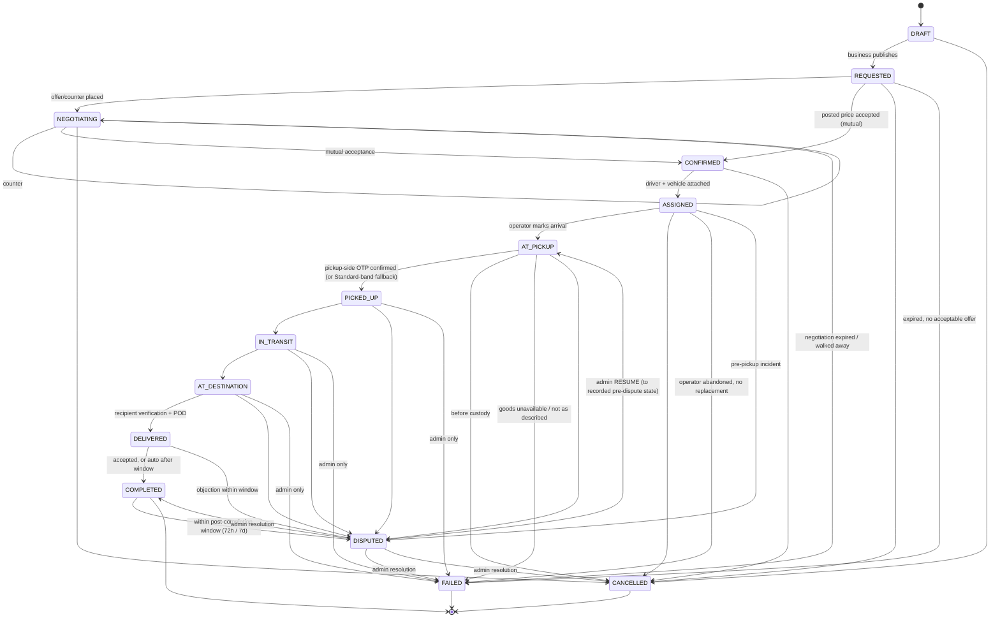

# Job State Machine

The **JOB** is the central business object. Its `status` moves **only** through
explicitly permitted transitions (D-JOB-2, FR-J-3). This document is the
authoritative technical definition: states, allowed transitions, who may
initiate each, preconditions, side effects, emitted events, concurrency,
idempotency, and transaction boundaries.

States and the allowed set are taken **verbatim** from Phase 0
`docs/phase-0/job-lifecycle.md`; this document adds the implementation contract.

---

## 1. States

`DRAFT · REQUESTED · NEGOTIATING · CONFIRMED · ASSIGNED · AT_PICKUP · PICKED_UP ·
IN_TRANSIT · AT_DESTINATION · DELIVERED · COMPLETED` (primary)
`CANCELLED · FAILED · DISPUTED` (interruption / terminal)

`COMPLETED`, `CANCELLED`, `FAILED` are terminal for the lifecycle.
`DISPUTED` is a freeze; a `Resolution` routes it onward (§5).
Goods are in operator custody in `PICKED_UP · IN_TRANSIT · AT_DESTINATION`.



(The `DISPUTED → AT_PICKUP` arrow is illustrative of the **RESUME** path: the
target is `dispute.pre_dispute_status`, whatever it was. Phase 0 marks RESUME
**OPEN**, recommended admin-only — carried forward as OPEN, gated to Platform
Admin. See §5.4.)

---

## 2. The single authoritative implementation point

```
JobLifecycleService.transition(job_id: UUID,
                               to: JobStatus,
                               actor: Actor,
                               context: TransitionContext,
                               idempotency_key: str) -> JobView
```

**This is the only function anywhere in the codebase that writes `job.status`.**
(FR-J-3, NFR-INT-2, brief §10.) Every API endpoint, every admin action, every
scheduled sweep, every event handler that advances a job calls it. A DB trigger
(§7) is the backstop.

### 2.1 Algorithm

```
BEGIN TRANSACTION  (READ COMMITTED)

1.  idem = SELECT * FROM idempotency_key WHERE key = :idempotency_key
    IF idem EXISTS:
        RETURN idem.stored_response          -- exact replay, no side effects

2.  job = SELECT * FROM job WHERE id = :job_id FOR UPDATE     -- serialises transitions
    IF NOT FOUND: raise 404

3.  IF context.if_match_version IS SET AND context.if_match_version <> job.version:
        raise 412 stale_job

4.  rule = ALLOWED_TRANSITIONS[(job.status, to)]
    IF rule IS NONE: raise 422 transition_not_allowed  (no side effects, tx rolls back)

5.  actor_ok = rule.initiators.matches(actor)            -- role / participant check
    IF NOT actor_ok: raise 403 not_authorised_to_initiate

6.  FOR guard IN rule.guards:                            -- see §4
        guard.check(job, actor, context)                -- raises 409 / 422 on failure

7.  side_effects = rule.apply(job, actor, context)       -- creates Agreement / Assignment /
                                                         -- CommissionRecord / etc. IN THIS TX

8.  job.status = to
    job.version = job.version + 1
    set the relevant *_at timestamp column

9.  INSERT job_event (category=STATUS_TRANSITION, type=<mapped>, from_status, to_status,
                      actor, server_time, config_version_id, ...)
    IF rule.is_custody: also INSERT job_event(category=CUSTODY, is_custody=true, ...)

10. INSERT audit_log_entry (hash-chained)               -- see security-architecture.md

11. FOR evt IN side_effects.domain_events:
        INSERT outbox_event (aggregate='job', aggregate_id=job.id, type=evt.type, payload=evt.payload)

12. INSERT idempotency_key (key, stored_response = JobView(job), created_at)

COMMIT

-- AFTER COMMIT (not in the transaction): nothing. The outbox publisher picks up
-- rows and fans out notifications / metrics / trust / ledger asynchronously.
```

### 2.2 Why this shape

- **One `FOR UPDATE` on the job row** is the concurrency primitive. Two
  simultaneous transitions on the same job serialise; the second sees the
  updated `status` and either no-ops (idempotent replay) or fails the
  `ALLOWED_TRANSITIONS` lookup / `If-Match` check. A job **cannot branch**
  (FR-J-5, NFR-INT-1).
- **Guards run before any write.** A forbidden `(from, to)` or a failed guard
  raises and the transaction rolls back — **no side effects** (FR-J-3).
- **Side effects, status change, status event, custody entry, audit entry, and
  outbox rows are one atomic unit.** Either the whole transition happened and is
  fully recorded, or none of it did. Audit and custody **cannot diverge** from
  the fact they record.
- **External effects (notifications, eTIMS, metrics) are outside the transaction**
  via the outbox — a downstream failure never rolls back a custody fact, and the
  outbox guarantees at-least-once delivery.

### 2.3 The allowed-transitions table (single declaration)

A single readable structure (illustrative — Python):

```python
ALLOWED_TRANSITIONS = {
    ("DRAFT", "REQUESTED"): Rule(
        initiators=[BusinessOwnerOrDispatcher, Admin],
        guards=[RequiredFieldsComplete, BusinessVerifiedWithLocation,
                CargoNotProhibited, ValueBandComputed],
        apply=publish_job,                       # sets value_band, required_trust_level
        events=["JobRequested"], is_custody=False,
        event_type="JOB_PUBLISHED",
    ),
    ("AT_PICKUP", "PICKED_UP"): Rule(
        initiators=[AssignedDriver],
        guards=[PickupSideOtpVerifiedOrStandardFallback, EvidenceScanned],
        apply=confirm_custody,                   # writes ProofOfPickup, may cap band
        events=["JobPickedUp"], is_custody=True,
        event_type="PICKUP_OTP_CONFIRMED",       # or PICKUP_OPERATOR_ATTESTED
    ),
    # ... every row of §3 ...
}
```

- The table is data, covered by parametrized tests over **every** `(from, to)`
  pair in the state's cross-product (allowed → succeeds with valid context;
  everything else → `422 transition_not_allowed`). See
  [testing-strategy.md](testing-strategy.md).
- `NFR-MNT-1`: this table, the role→permission map, the config schema, and the
  enums are the four "single authoritative definitions".

---

## 3. Transition catalogue

Columns: **Initiator** (who may call it), **Guards** (preconditions that raise on
failure), **Side effects** (rows written in the same transaction), **Events**
(outbox → async). Terminal-state reasons are always recorded
(`cancellation_record` / `failure_record`).

### 3.1 Pre-custody

| From → To | Initiator | Guards | Side effects | Events |
|-----------|-----------|--------|--------------|--------|
| `DRAFT → REQUESTED` | Business (owner/dispatcher), Admin | required fields present; business VERIFIED + ≥1 active location; cargo not prohibited | compute+freeze `value_band`, `required_trust_level`; set `published_at`; pin `config_version_id` | `JobRequested` → notify eligible operators (discovery), metrics |
| `DRAFT → CANCELLED` | Business, Admin | — | `cancellation_record(at_status=DRAFT, penalty_class=NONE)` | `JobCancelled` |
| `REQUESTED → NEGOTIATING` | Business or eligible Operator/Group (via Negotiation) | operator eligible (vehicle+capacity, area, **trust ≥ required**, not suspended, id+licence current) | none on the job itself (the `negotiation_entry` is written by the Negotiation Service, which then calls this transition) | `JobNegotiating` |
| `REQUESTED → CONFIRMED` | Business (accepts an operator PROPOSE at posted price) or Operator (accepts the business's `proposed_price`) | mutual acceptance recorded; operator eligible **now** (re-checked) | create `Agreement` (frozen price); close winning thread; `SUPERSEDE` sibling threads; set `confirmed_at` | `JobConfirmed` → notify both parties; metrics |
| `REQUESTED → CANCELLED` | Business, Admin | — | `cancellation_record(penalty_class=NONE)`; close open threads | `JobCancelled` |
| `REQUESTED → FAILED` | Scheduler, Admin | request-expiry timer elapsed (pickup time or `request_expiry`, whichever first) and no acceptable offer | `failure_record(reason='EXPIRED_NO_OFFER')`; close threads | `JobFailed` |
| `NEGOTIATING → NEGOTIATING` | Business or Operator (via Negotiation) | thread is `ACTIVE`; amount valid | *(the loop is a new `negotiation_entry`; the job stays `NEGOTIATING` — this "self-transition" is really a no-op on `job.status` but re-runs the timer)* | `OfferPlaced` |
| `NEGOTIATING → CONFIRMED` | Business or Operator (accepts the other's current offer, via Negotiation) | mutual acceptance in one thread; operator eligible now | as `REQUESTED → CONFIRMED` | `JobConfirmed` |
| `NEGOTIATING → CANCELLED` | Business, Admin | — | `cancellation_record(penalty_class=NONE)`; close threads | `JobCancelled` |
| `NEGOTIATING → FAILED` | Scheduler, Admin, either party (explicit walk-away) | negotiation-expiry timer, or explicit end with no agreement | `failure_record(reason='NEGOTIATION_ENDED')`; close threads | `JobFailed` |
| `CONFIRMED → ASSIGNED` | Operator (attaches own vehicle) / Group MANAGER (names a member DRIVER + group vehicle) / Admin | vehicle VERIFIED + type/capacity match; heavy-class compliance current if applicable; **assigned driver** id+licence+good-conduct VERIFIED & not EXPIRED; **driver trust ceiling ≥ job value** (or recorded admin override); **if high-value: `HighValueApproval.decision = APPROVED`**; requester ≠ driver | create `Assignment` (driver + vehicle always set); set `assigned_at`; operator/driver `AvailabilityState = BUSY` | `JobAssigned` → notify business + driver; metrics |
| `CONFIRMED → CANCELLED` | Business, Operator/Group, Admin | — | `cancellation_record(penalty_class=NONE)` | `JobCancelled` |

Note: `CONFIRMED → ASSIGNED` **may be the same API call** as the accept that
produced `CONFIRMED` (Phase 0) — the client sends `to=CONFIRMED` then `to=ASSIGNED`
in one request wrapped by the service, or the accept endpoint runs both
transitions in one transaction.

### 3.2 Custody

| From → To | Initiator | Guards | Side effects | Events |
|-----------|-----------|--------|--------------|--------|
| `ASSIGNED → AT_PICKUP` | Assigned driver | — (location capture *attempted*, not required) | `job_event(CUSTODY, ARRIVED_AT_PICKUP, geo?)` | `ArrivedAtPickup` → notify business/pickup contact; issue pickup OTP |
| `ASSIGNED → CANCELLED` | Business, Operator/Group, Admin | — | `cancellation_record(at_status=ASSIGNED → penalty_class=LATE_CANCELLATION)`; driver `AVAILABLE` | `JobCancelled` → cancellation-flag evaluation |
| `ASSIGNED → FAILED` | Admin | operator abandoned; no replacement found | `failure_record`; driver `AVAILABLE` | `JobFailed` |
| `ASSIGNED → DISPUTED` | Any participant, Admin | an `Incident` that blocks progression exists | freeze; `dispute.pre_dispute_status = ASSIGNED` | `JobDisputed` |
| `AT_PICKUP → PICKED_UP` | Assigned driver | **pickup-side OTP verified**; OR (`value_band = STANDARD` AND fallback photo + pickup-contact name provided → `attestation = OPERATOR_ATTESTED_UNVERIFIED`, job capped at STANDARD); **Elevated+ has no fallback** (D-CUS-2) | `ProofOfPickup`; `job_event(CUSTODY, PICKUP_OTP_CONFIRMED` or `PICKUP_OPERATOR_ATTESTED`, `GOODS_RECEIVED)`; set `picked_up_at` | `JobPickedUp` → notify business; metrics |
| `AT_PICKUP → CANCELLED` | Business, Operator/Group, Admin | **only before custody confirmed** | `cancellation_record(penalty_class=WASTED_TRIP)` | `JobCancelled` |
| `AT_PICKUP → FAILED` | Assigned driver, Admin | goods not available / not as described / pickup impossible; reason + evidence required | `failure_record` + `Incident` (optional) | `JobFailed` |
| `AT_PICKUP → DISPUTED` | Any participant, Admin | blocking `Incident` (e.g. cargo materially different) | `dispute.pre_dispute_status = AT_PICKUP` | `JobDisputed` |
| `PICKED_UP → IN_TRANSIT` | Assigned driver | — | `job_event(CUSTODY, IN_TRANSIT)` | `JobInTransit` |
| `PICKED_UP → DISPUTED` | Any participant, Admin | blocking `Incident` (e.g. damage noticed at handover) | `dispute.pre_dispute_status = PICKED_UP` | `JobDisputed` |
| `PICKED_UP → FAILED` | Admin only | abandoned immediately after custody | `failure_record` + `Incident` | `JobFailed` |
| `IN_TRANSIT → AT_DESTINATION` | Assigned driver | — (location capture attempted) | `job_event(CUSTODY, ARRIVED_AT_DESTINATION, geo?)` | `JobAtDestination` → issue/refresh recipient link + OTP |
| `IN_TRANSIT → DISPUTED` | Any participant, Admin | blocking `Incident` (accident, theft, major delay, misconduct) | `dispute.pre_dispute_status = IN_TRANSIT` | `JobDisputed` |
| `IN_TRANSIT → FAILED` | Admin only | delivery became impossible; goods status via `Incident` | `failure_record` + `Incident` | `JobFailed` |
| `AT_DESTINATION → DELIVERED` | Assigned driver (records POD) **or** Recipient (via link) | recipient verification present: name + ≥1 of {OTP to recipient phone, signature, photo}; **Elevated+ requires recipient OTP + photo POD** (D-TRU-5) | `ProofOfDelivery`; `job_event(CUSTODY, RECIPIENT_VERIFIED, DELIVERY_CONFIRMED)`; set `delivered_at`; start delivery-acceptance timer | `JobDelivered` → notify business; metrics |
| `AT_DESTINATION → DISPUTED` | Any participant, Recipient, Admin | recipient refuses / wrong recipient / damage on arrival | `dispute.pre_dispute_status = AT_DESTINATION` | `JobDisputed` |
| `AT_DESTINATION → FAILED` | Admin only | recipient unreachable/absent, no fallback; return handled as `Incident` | `failure_record` + `Incident` | `JobFailed` |

### 3.3 Completion & post-completion

| From → To | Initiator | Guards | Side effects | Events |
|-----------|-----------|--------|--------------|--------|
| `DELIVERED → COMPLETED` | Business/Recipient (explicit accept) **or** Scheduler (auto after `delivery_acceptance` window: 24h Standard/Elevated, 48h High/Very-high — D-JOB-5) | no open blocking dispute | `job_event(CUSTODY, COMPLETED)`; set `completed_at`; **create `CommissionRecord`** (pinned to `config_version_id`; `HELD` if the job passed through DISPUTED, else `DUE`); driver `AVAILABLE`; open the ratings window; start the post-completion dispute timer | `JobCompleted` → Trust re-evaluation, Ledger accrual, metrics, notify both parties (statement forthcoming) |
| `DELIVERED → DISPUTED` | Business, Recipient, Operator/Group, Admin | objection raised within the acceptance window | `dispute.pre_dispute_status = DELIVERED` | `JobDisputed` |
| `COMPLETED → DISPUTED` | Business, Recipient, Operator/Group, Admin | within the **post-completion dispute window** (72h all bands; 7 days for High/Very-high **or** `latent_risk_cargo` — D-JOB-5) | `CommissionRecord.status = HELD`; `dispute.pre_dispute_status = COMPLETED` | `JobDisputed` → hold commission |

After the post-completion window, an `Incident` can still be **recorded** (for
reputation/audit) but **cannot** move `COMPLETED → DISPUTED` (the guard fails);
the job stays `COMPLETED` and the commission stays `DUE/INVOICED/SETTLED`
(D-JOB-5).

### 3.4 Dispute resolution outcomes (§5)

| From → To | Initiator | Guards | Side effects | Events |
|-----------|-----------|--------|--------------|--------|
| `DISPUTED → COMPLETED` | Admin (Platform Admin for bands above STANDARD; D-ADM-1) | `Resolution` recorded with `routed_job_status = COMPLETED` | ensure/keep `CommissionRecord`; apply `commission_treatment` (`APPLY / REDUCE / WAIVE` → `CommissionAdjustment`); apply rating/trust/suspension actions | `DisputeResolved`, `JobCompleted` (if not previously completed) |
| `DISPUTED → FAILED` | Admin | `routed_job_status = FAILED` | `failure_record`; **no** `CommissionRecord`, or `WAIVE` an existing one | `DisputeResolved`, `JobFailed` |
| `DISPUTED → CANCELLED` | Admin | `routed_job_status = CANCELLED` | `cancellation_record(by=ADMIN)`; commission waived | `DisputeResolved`, `JobCancelled` |
| `DISPUTED → <pre_dispute_status>` (RESUME) | **Platform Admin only** | `routed_job_status = RESUME_PRIOR`; the pre-dispute state is non-terminal and the job can continue (e.g. breakdown fixed, replacement vehicle) | restore `job.status = dispute.pre_dispute_status`; `job_event(SYSTEM, RESUMED)` | `DisputeResolved`, `JobResumed` |

---

## 4. Guards (reusable precondition checks)

Each guard is a small, independently tested unit. A guard **raises** a typed
domain error (mapped to `409`/`422`) on failure; it never returns a boolean that
a caller might forget to check.

| Guard | Checks | Used by |
|-------|--------|---------|
| `RequiredFieldsComplete` | pickup, destination, cargo, vehicle requirement, declared value, proposed price all present | publish |
| `BusinessVerifiedWithLocation` | `business.verification_status = VERIFIED` and ≥ 1 active `BusinessLocation` | publish |
| `CargoNotProhibited` | `cargo.handling_flags` ∌ `HAZARDOUS`; category not in the prohibited set (legal-scope §3.10) | publish |
| `OperatorEligibleForJob` | vehicle type+capacity match; pickup within a service area / base distance; **not suspended/restricted**; identity+licence+good-conduct VERIFIED & current | negotiate, confirm |
| `DriverTrustCeilingCoversValue` | `assigned_driver.trust_level.value_ceiling_kes ≥ job.declared_value_kes` (uses the **driver's** ceiling for group jobs — brief §12/§14), OR a recorded `admin_override_reason` | assign |
| `VehicleEligible` | vehicle VERIFIED & ACTIVE; heavy-class compliance current if `tare_kg > config.heavy_class_tare_kg` | assign |
| `HighValueApproved` | if `job.is_high_value`: a `HighValueApproval` with `decision = APPROVED` exists; for `VERY_HIGH`, that approval was made by a Platform Admin (D-TRU-5) | assign |
| `RequesterIsNotProvider` | requester `User` ≠ `assigned_driver.User`; requester does not control the assigned group | assign |
| `MutualAcceptanceExists` | this thread has an `ACCEPT` from each side referencing compatible amounts; both entries `ACTIVE` (not `EXPIRED`) | confirm |
| `NoRacingConfirm` | `job.status ∈ {REQUESTED, NEGOTIATING}` at the moment of the locked read (else `409 job_no_longer_available`) | confirm |
| `PickupSideOtpVerifiedOrStandardFallback` | a `pickup_otp_challenge` for this job is `consumed` & valid; OR (`value_band = STANDARD` AND `context.fallback_photo_id` + `context.pickup_contact_name` present → mark `OPERATOR_ATTESTED_UNVERIFIED`); **rejects any fallback when `value_band ≠ STANDARD`** (D-CUS-2) | confirm custody |
| `RecipientVerificationPresent` | name + ≥ 1 of {recipient OTP consumed, signature evidence, photo evidence}; for Elevated+ requires **both** recipient OTP and a photo (D-TRU-5) | deliver |
| `EvidenceScanned` | any non-image evidence referenced in `context` has `scan_status = CLEAN` | confirm custody, deliver, incident |
| `WithinDeliveryAcceptanceWindow` / `WithinPostCompletionWindow` | timers per `config.timeouts` and `job.value_band` / `latent_risk_cargo` | auto-complete, `COMPLETED → DISPUTED` |
| `BlockingIncidentExists` | an `OPEN`/`UNDER_REVIEW` incident on this job that is flagged progression-blocking | `* → DISPUTED` |
| `ActorIsPlatformAdmin` | `actor` has `PLATFORM_ADMIN` role | RESUME, bands above STANDARD dispute resolution, forced transitions |

---

## 5. Dispute handling detail

### 5.1 Entering DISPUTED

Any of the `* → DISPUTED` rows in §3 fire when the Incident/Dispute Service
opens an `Incident` marked progression-blocking (FR-D-3). The Lifecycle Service
records `dispute.pre_dispute_status = job.status` **before** setting
`status = DISPUTED`, so a later RESUME is deterministic.

### 5.2 Freeze semantics

While `DISPUTED`: no custody transitions accepted; the delivery-acceptance and
post-completion timers are **paused** (their `*_at` anchors are preserved and the
elapsed time is subtracted on resume); the recipient link's expiry is extended to
`dispute closed + window`; any `CommissionRecord` is `HELD` (D-BIZ-7).

### 5.3 Resolution

The Incident/Dispute Service records a `Resolution` (`FR-D-6`) and then calls
`JobLifecycleService.transition(job, <routed_job_status>, admin, {resolution_id})`.
The transition applies the `commission_treatment` and `actions` in the same
transaction (§3.4). Binding resolutions above the STANDARD band require a
Platform Admin (D-ADM-1); the guard `ActorIsPlatformAdmin` enforces it.

### 5.4 RESUME (OPEN in Phase 0)

`DISPUTED → dispute.pre_dispute_status` is supported by the state machine,
**gated to Platform Admin**, only when the pre-dispute status is non-terminal and
`routed_job_status = RESUME_PRIOR`. It writes a `RESUMED` `job_event`, restores
the paused timers with elapsed-time compensation, and emits `JobResumed`. The
founder still needs to confirm this path is wanted (Phase 0 job-lifecycle §2.3 —
carried forward as OPEN in [phase-1-decisions.md](phase-1-decisions.md)).

---

## 6. Concurrency, idempotency, transaction boundaries

| Concern | Mechanism |
|---------|-----------|
| Two clients transition the same job at once | `SELECT job FOR UPDATE` serialises; the loser sees the new status → replay or `422` |
| Client retries a transition (flaky network, PWA offline queue) | `Idempotency-Key` header → `idempotency_key` table; the stored `JobView` is returned; **no** second side effect. Keys are scoped `(actor, job, key)` and expire after 24h. |
| Stale client optimistic view | `If-Match: <job.version>` → `412` if it doesn't match `job.version`; the client refetches |
| Racing negotiation ACCEPTs | job row lock + `NoRacingConfirm` guard → first wins, second `409` |
| A worker retries an event handler that advances a job | handler is idempotent (checks current status first) **and** passes its own deterministic `Idempotency-Key` |
| Transaction isolation | `READ COMMITTED` is sufficient because the `FOR UPDATE` lock plus the status recheck make the critical section serialisable for a given job. No cross-job invariant needs `SERIALIZABLE`. |
| Transaction boundary | Exactly the numbered steps in §2.1 — side effects + status + status event + custody entry + audit + outbox + idempotency row are **one commit**. External I/O (SMS, eTIMS, geocoding) is **never** inside it. |
| Long-running side effects (e.g. generating a big export on COMPLETED) | Not done inline; emitted as an event, handled by a worker |

---

## 7. Database-level backstop

Independent of the application, a `BEFORE UPDATE OF status ON job` trigger:

```
IF (OLD.status, NEW.status) NOT IN (SELECT from_status, to_status
                                    FROM allowed_job_transition)
   AND NOT current_setting('app.lifecycle_service', true) = 'on'
THEN RAISE EXCEPTION 'illegal job status transition % -> %', OLD.status, NEW.status;
```

`allowed_job_transition` is a small helper table seeded from the same source as
`ALLOWED_TRANSITIONS` (a build step generates both, or the app seeds the table on
migrate). The `app.lifecycle_service` session flag is set only inside
`JobLifecycleService.transition` after its guards pass — so a stray raw `UPDATE`
elsewhere (a script, a console, a bug) **cannot** corrupt a job's state, and the
service still works. This is defence-in-depth, not the primary control.

---

## 8. What this buys the pilot

- Every job's history is a **replayable, append-only** sequence of `job_event`
  rows with actor, server time, and (for custody) location + evidence + method.
- Pilot metrics (`REQUESTED→CONFIRMED` time, `CONFIRMED→AT_PICKUP` time, no-show
  rate, cancellation-by-state, etc. — pilot-strategy §4) are **direct queries**
  over `job_event`, not spreadsheet reconstruction (FR-DASH-2).
- A dispute investigation reads one ordered timeline plus the immutable
  `negotiation_entry` history plus the `audit_log_entry` chain — nothing has been
  edited or deleted.
