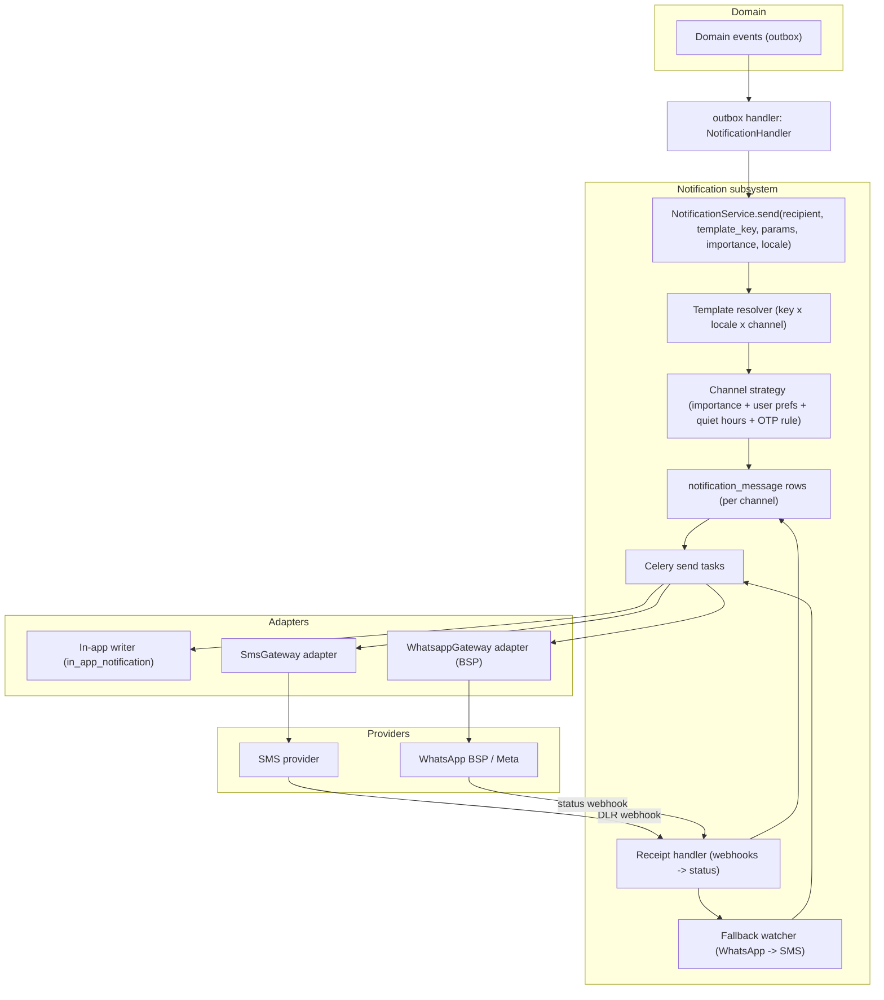

# Notification Architecture

Implements Phase 0 `D-NOTIF-1`, `FR-NOTIF-1..5`.

Channels for the MVP: **in-app + SMS + WhatsApp**. **OTP is SMS-primary.**
WhatsApp goes via an authorised **BSP** with **pre-approved templates**, and a
**WhatsApp failure falls back to SMS**. Business logic never talks to a provider
directly.

---

## 1. Layers



---

## 2. Public interface

```
NotificationService.send(
    recipient: UserRef | PhoneRef,      # a user (in-app + their channels) or a bare phone (recipient link, pickup contact)
    template_key: str,                  # e.g. "job.confirmed", "custody.pickup_otp", "statement.generated"
    params: dict,                       # data for the template (job reference, amounts, names, code, link)
    importance: LOW | NORMAL | HIGH | CRITICAL,
    locale: str | None = None,          # defaults to recipient.locale, else 'sw' for operator-facing, else 'en'
    dedupe_key: str | None = None,      # idempotency within (recipient, template_key)
)

NotificationService.send_otp(phone, purpose)          # SMS-first path
NotificationService.mark_receipt(provider_ref, status)
```

Callers are **event handlers** (the `NotificationHandler` reads the outbox and
maps each domain event to one or more `send(...)` calls) — domain services never
call `NotificationService` directly, keeping notifications off the critical path
(see [architecture.md](architecture.md) §5).

---

## 3. Channel strategy

| Message class | In-app | SMS | WhatsApp | Rule |
|---------------|:--:|:--:|:--:|------|
| **OTP** (login, pickup handover, recipient verify) | — | **primary** | optional (config) | `FR-NOTIF-4` — always attempt SMS first; WhatsApp only as an *additional* copy if `config.otp.whatsapp_enabled` |
| **Job-critical** (confirmed, assigned, arrived, delivered, incident opened, dispute resolved) | always | yes | yes (template) | `importance ∈ {HIGH, CRITICAL}` → send to in-app **and** the user's preferred external channel; WhatsApp preferred if the user has engaged on WhatsApp, else SMS |
| **Job-informational** (new offer, counter, expiring-soon verification, statement generated) | always | per preference | per preference | `importance = NORMAL` → in-app always; external per `user_notification_preference` |
| **Recipient link** | n/a (no account) | yes | yes | sent on both channels to maximise reach; the link + a short instruction |
| **Marketing** | — | — | — | **not in the MVP**; would require separate consent (legal-scope §3.9) |

**Quiet hours** (`user_notification_preference.quiet_hours`, `FR-NOTIF-5`):
`NORMAL`/`LOW` external messages are deferred to the next allowed window;
`HIGH`/`CRITICAL` and all OTPs ignore quiet hours.

---

## 4. Templates & localization

- `notification_template(key, locale, channel, subject?, body, whatsapp_template_name?)`.
- Bodies use the same **ICU MessageFormat** placeholders as the client i18n
  catalogs (see [localization.md](localization.md)) so wording is consistent
  across channels and both languages.
- **WhatsApp** requires **pre-registered templates** with the BSP; `body` holds
  the human-readable copy for reference, `whatsapp_template_name` + an ordered
  `params` list is what the adapter actually submits. A template not yet
  approved → that channel is skipped (fallback applies).
- SMS bodies are kept short (segment-aware): the resolver reports the segment
  count so the cost estimate is right; long messages are trimmed with a link.
- Locale resolution: explicit `locale` arg → `recipient.locale` → operator-facing
  default `sw` → `en`.

---

## 5. Send + delivery lifecycle

```
send(...) ->
  1. resolve template for each selected channel + locale
  2. compute dedupe_key; if a non-terminal notification_message already exists
     for (recipient_ref, template_key, dedupe_key) -> return (idempotent)
  3. INSERT notification_message rows (status QUEUED) — one per channel
  4. enqueue a Celery send task per row

send task ->
  - IN_APP: write in_app_notification -> status DELIVERED immediately
  - SMS:    SmsGateway.send(...) -> store provider_ref, segments, cost_estimate; status SENT
  - WHATSAPP: WhatsappGateway.send_template(...) -> provider_ref; status SENT
  - on adapter error / timeout: retry with backoff (max N); then status FAILED

webhook (DLR / status) -> mark_receipt(provider_ref, status):
  - DELIVERED / READ  -> status DELIVERED
  - FAILED / UNDELIVERED -> status FAILED

fallback watcher (beat, every minute):
  - for each WHATSAPP row that is FAILED, or SENT with no receipt after
    config.whatsapp.fallback_after_seconds, and whose message class allows it:
      -> INSERT a new SMS notification_message (fell_back_from_id = the WA row),
         status QUEUED; original WA row status FELL_BACK_TO_SMS
```

Idempotency: `notification_message` has a unique index on
`(coalesce(recipient_user_id, recipient_phone), template_key, dedupe_key)`; retries
and duplicate events cannot double-send.

---

## 6. Cost accounting (pilot economics — pilot-strategy §4.7, FR-DASH-4)

Every `notification_message` records `provider`, `segments`, `cost_estimate_kes`,
and (where known) `job_id`. The nightly rollup produces **cost per job** and
**cost by channel/provider** for the operational dashboard and the CSV export —
so "SMS/WhatsApp spend per job" is a query, not a spreadsheet.

---

## 7. Reliability & degradation (NFR-AVAIL-4)

- Provider down → send tasks retry with backoff; the **in-app** notification is
  always written, so a user opening the PWA still sees the event.
- Core job actions **do not depend** on a notification succeeding — the outbox
  decouples them; a stuck notification never blocks a custody step.
- WhatsApp BSP outage → the fallback watcher routes everything to SMS.
- SMS provider outage → messages stay `QUEUED` and drain on recovery; a health
  alert fires; **OTP login is impacted** — documented as an availability risk
  ([technical-risks.md](technical-risks.md)); mitigations: a second SMS provider
  behind the same adapter interface (config-selectable) is a fast follow.

---

## 8. Events

| Emits | Consumers |
|-------|-----------|
| `NotificationSent` / `NotificationFailed` | Reporting (delivery rates by provider); Observability (alerts on failure spikes) |
| `NotificationFellBackToSms` | Reporting (WhatsApp reliability metric) |

| Consumes (via `NotificationHandler` on the outbox) | Produces |
|---|---|
| `JobRequested` | notify eligible operators (a bounded fan-out — see note) |
| `JobConfirmed` / `JobAssigned` / `ArrivedAtPickup` / `JobPickedUp` / `JobDelivered` / `JobCompleted` | notify business + operator/driver (+ pickup contact / recipient where relevant) |
| `OfferPlaced` / `ThreadSuperseded` | notify counterparty / losing operator |
| `IncidentOpened` / `IncidentUpdated` / `DisputeResolved` / `IncidentEscalated` | notify parties + admin |
| `VerificationDecided` / `VerificationExpiringSoon` / `TrustLevelChangeProposed` | notify the operator (+ admin for expiry) |
| `StatementGenerated` | notify the payee (operator or group) with the invoice link |
| `RecipientLinkIssued` | send the link on SMS + WhatsApp |
| `EvidenceScanInfected` | alert admin |

> **Fan-out note:** `JobRequested` → "notify eligible operators" is bounded by
> the discovery filter (a handful in one Kitengela zone). If a future zone has
> many eligible operators, this becomes an **in-app-only** notification + a
> single digest, not N SMS. Configurable cap.
