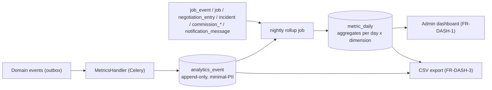

# Observability

Implements Phase 0 `NFR-OBS-1..4`, `NFR-AVAIL-5`, `pilot-strategy.md` §4–§5,
`FR-DASH-1..4`, and Phase 1 brief §28.

Two jobs: keep the system **operable** (logs, errors, metrics, health), and
generate the **pilot's learning data** with **no spreadsheets**.

---

## 1. Structured application logging (NFR-OBS-1)

- **JSON logs** via `structlog` / `django-structlog`. One line per request +
  per background task.
- Standard fields: `ts`, `level`, `event`, `request_id` (propagated to Celery
  tasks), `actor_id` (opaque UUID, **not** a name/phone), `actor_role`, `route`,
  `method`, `status`, `latency_ms`, `job_id?`, `outcome_code?`.
- **PII scrubbing**: a processor redacts phone numbers, names, ID numbers,
  tokens, OTP codes, and signed URLs before emit. The recipient-link path scrubs
  `/r/<token>` → `/r/[token]`.
- Shipped to a central store (the hosting provider's log service, or a small
  Loki, or files + logrotate for the smallest deployment). Retention per
  `retention_windows.comms_logs` (2–3 y proposed — REQUIRES VALIDATION).

---

## 2. Error tracking (NFR-OBS-2)

- **Sentry** (SaaS) or self-hosted **GlitchTip**. SDK in the API and the workers;
  `beforeSend` scrubs PII.
- Release + environment tagged; source maps for the PWA (uploaded from CI,
  access-controlled).
- Alert routes: unhandled exception rate spike, a new error signature in prod,
  Celery task failure rate, outbox dead-letter non-empty.

---

## 3. Metrics (NFR-OBS-3/4)

- **Prometheus client** in the API + workers exposing `/metrics`; scraped by a
  small Prometheus, dashboards in **Grafana** (self-hosted small, or Grafana
  Cloud free tier).
- **System metrics**: request rate / latency histograms / error rate by route
  class; DB pool usage; Redis; Celery **queue depth** + task duration + failure
  rate per queue; **outbox publish lag** (`now() − min(created_at)` of
  unpublished rows); SW/PWA basic RUM (optional, privacy-light).
- **Provider metrics**: SMS/WhatsApp send / delivered / failed / fell-back
  counts and **cost** per provider (from `notification_message`); geocoding
  call count + latency + cache hit rate; eTIMS submit success/failure.
- **Business-shaped operational metrics** (also on the admin dashboard): job
  funnel counters, incident SLA breaches, cancellation/no-show counters — these
  are **derived from the pilot pipeline** (§5), not ad-hoc counters, so the
  dashboard and the CSV export agree.

---

## 4. Health checks (NFR-AVAIL-5)

| Endpoint | Checks | Used by |
|----------|--------|---------|
| `GET /healthz` | process is up | container liveness |
| `GET /readyz` | DB `SELECT 1`, Redis `PING`, object-storage `HEAD` on a sentinel key | load-balancer / deploy gate |
| Celery beat heartbeat | a beat task writes a timestamp key every minute; an alert if it's stale | worker liveness |
| Synthetic check (external) | a scheduled external ping of `/healthz` + a login-OTP dry-run against a test number | uptime alerting to the founder/admin (NFR-AVAIL-5) |

---

## 5. Pilot metrics pipeline (the "no spreadsheets" guarantee — FR-DASH-2)

- **`analytics_event`** — one row per meaningful domain event, carrying only
  `dims` (zone, band, vehicle_type, actor_role, outcome) + a `numeric_value`
  (e.g. an interval in seconds, an amount in KES). **No names, no phones**
  (NFR-PRIV-1). Partitioned monthly.
- **`metric_daily`** — nightly rollup: `(metric_date, metric_key, dimensions,
  value)`. The dashboard and export read **this**, so they can never disagree.
- The **CSV export** (`FR-DASH-3`) is an async `export_job`, access-controlled,
  audited, minimal-PII, delivered as a signed short-TTL download.

### 5.1 Pilot-metric → source mapping (pilot-strategy §4)

| Pilot metric (pilot-strategy §4) | Source event(s) / query |
|----------------------------------|-------------------------|
| Jobs created / published per day, by class/zone | `JobRequested` (`JOB_PUBLISHED` `job_event`) |
| Declared value / agreed price distribution | `job.declared_value_kes`, `agreement.agreed_price_kes` |
| Time REQUESTED → first offer | `JobRequested` → first `OfferPlaced` |
| Time REQUESTED → CONFIRMED; counters to agreement | `JobRequested` → `JobConfirmed`; count `negotiation_entry` in the winning thread |
| Proposed-vs-agreed delta | `job.proposed_price_kes` vs `agreement.agreed_price_kes` |
| Time CONFIRMED → ASSIGNED → AT_PICKUP | `job_event` timestamps |
| No-show rate | `ASSIGNED` with no `AT_PICKUP` before `stale_assignment_alert` / cancellation at ASSIGNED |
| Cancellation rate by state; reasons | `cancellation_record.at_status`, `.reason_code` |
| FAILED rate; reasons | `failure_record` |
| On-time pickup / delivery vs agreed | `job.pickup_datetime` vs `picked_up_at`; delivery requirement vs `delivered_at` |
| Incident rate per 100 completed; by type/class/band | `incident` counts / `JobCompleted` counts |
| Amicable vs admin-review vs escalated split | `resolution.outcome_code`, `escalation` presence |
| SLA acknowledge / action / resolution vs targets | `incident.sla_*_due_at` vs actual timestamps |
| Repeat-offender operators/businesses | grouped incident/cancellation counts |
| Commission revenue per completed job; total | `commission_record.amount_kes` |
| Variable cost per job (SMS/WhatsApp, geo, storage) | `notification_message.cost_estimate_kes` by `job_id`; geo call counters; storage bytes attributable |
| Contribution per job | commission − variable cost |
| Operator earnings per job / week / class | `agreement.agreed_price_kes − commission_record.amount_kes` |
| Commission invoiced-vs-settled | `commission_statement` vs `statement_settlement` |
| Off-platform diversion signal | repeat business↔operator pairs whose job frequency drops after a first match (a query over completed jobs grouped by pair over time) |
| Active operators / day by class + base | `AvailabilityState` history + job activity |
| Jobs offered vs accepted per operator | discovery impressions (logged) vs `OfferPlaced` vs assignments |
| Coverage gaps | published jobs with **zero** eligible+available operators at publish time |
| Onboarding funnel drop-off | `UserRegistered` → `VerificationSubmitted` → `VerificationDecided(APPROVED)` → first `JobAssigned` |
| POD method chosen; custody completeness per job | `proof_of_delivery.methods`; `CustodyService.completeness` |
| Steps where users call support instead of self-serving | support contacts logged + correlated to the last screen (manual tag by ops for the pilot) |

Every metric above is **derivable from platform data without manual
bookkeeping** — the Phase 0 requirement (pilot-strategy §5, FR-DASH-2).

---

## 6. Security & audit observability (security-architecture §4)

- Auth failure rate, OTP-request bursts, recipient `/r/` 404 storms, HIGH-PII
  document access counts (`evidence_access_log`), step-up frequency, admin-action
  volume by admin — all on a **security dashboard** with alerts.
- The nightly **audit-chain verification** result is a metric + a `CRITICAL`
  alert on a break.
- Ledger nightly reconciliation mismatch → `CRITICAL` alert.

---

## 7. Alerting (NFR-AVAIL-5) — who gets paged

Pilot: alerts go to the founder + the Operations Officer (a shared channel /
SMS). Tiers:

| Tier | Examples | Response |
|------|----------|----------|
| **CRITICAL** | site down (`/readyz` failing), DB unreachable, audit-chain break, ledger reconciliation mismatch, outbox dead-letter, ClamAV-infected upload | immediate |
| **HIGH** | error-rate spike, Celery failure spike, SMS provider failing (OTP impact), backup job failed | same day |
| **NORMAL** | outbox lag rising, WhatsApp fallback rate high, unsettled-statement backlog, verification queue aging | weekly review |

---

## 8. What is deliberately lightweight for the pilot

- No distributed tracing system (a `request_id` propagated through logs + Celery
  is enough at monolith scale). OpenTelemetry can be added later without design
  change.
- No dedicated analytics warehouse — `analytics_event` + `metric_daily` in
  Postgres, plus CSV export, cover the pilot (future-roadmap: a warehouse when
  volume grows).
- No full APM SaaS — Prometheus + Grafana + Sentry/GlitchTip is proportionate and
  cheap.
