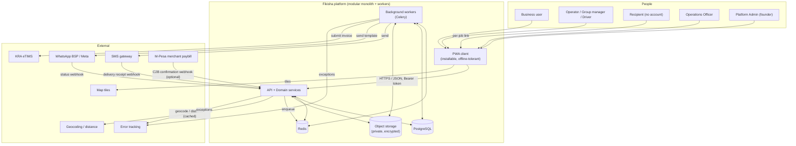
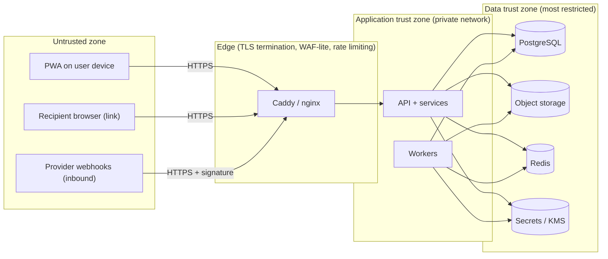

# System Context

C4 level 1: who and what interacts with Fikisha, and where the trust boundaries
are. Detail on internal structure is in [architecture.md](architecture.md).

---

## 1. Actors

| Actor | Account? | How they reach the system | Key interactions |
|-------|----------|---------------------------|------------------|
| **Business user** | Yes (phone + OTP) | PWA | Create/manage jobs, negotiate, confirm, track, rate, raise/participate in incidents, confirm pickup in-app (fallback), view delivery records |
| **Transport Operator (individual)** | Yes (phone + OTP) | PWA (mobile-first, Swahili-prominent) | Complete profile + verification, register vehicles/bases, set availability, discover jobs, negotiate, accept, execute custody steps, capture pickup/POD OTP + photos, view earnings + statements, rate, raise incidents |
| **Operator Group — primary contact / MANAGER** | Yes (phone + OTP) | PWA | Manage group profile, members, group vehicles; browse eligible jobs for the fleet; negotiate; **assign a specific member DRIVER + vehicle**; view the group's statement |
| **Operator Group — member DRIVER** | Yes (phone + OTP), individually verified | PWA | Same custody/execution surface as an individual operator, for jobs assigned to them by the manager (or accepted directly if the group allows) |
| **Recipient / Consignee** | **No account** | A **scoped, time-limited per-job link** (SMS/WhatsApp) opened in any browser | View *their* delivery's status, **confirm receipt** (name + OTP/signature/photo), **raise an incident** with photos + a statement |
| **Operations Officer** (pilot admin role) | Yes (phone + OTP **+ TOTP MFA**) | PWA admin surface + Django Admin | Work the verification queue, monitor active jobs, intervene (reassign/cancel/contact), incident intake, facilitate amicable resolution, propose trust changes |
| **Platform Admin** (the founder; pilot admin role) | Yes (phone + OTP **+ TOTP MFA**) | PWA admin surface + Django Admin | Everything the Operations Officer can do **plus** platform configuration, account suspension/offboarding, binding dispute resolution at any band, high-value job approval, manage other admins — **all actions audited, including the founder's** |

The 4-role split (Verifier / Operations / Dispute Officer / Platform Admin) is a
**configuration** of the role→permission map, not a code change (D-ADM-1).

---

## 2. External systems

| External system | Direction | Purpose | Trust / compliance notes |
|-----------------|-----------|---------|--------------------------|
| **SMS gateway** (e.g. Africa's Talking) | Out (send) + In (delivery-receipt webhook) | OTP delivery (primary), job-event notifications, recipient link | Transactional only; registered sender ID; webhook signature verified; per-message cost recorded |
| **WhatsApp BSP / Meta** | Out (send templates) + In (status webhook) | Job-event notifications, recipient link (not OTP-primary) | **Cross-border transfer to the US** — REQUIRES VALIDATION (legal-scope §3.9); pre-approved templates only; falls back to SMS on failure |
| **Geocoding + distance provider** | Out (request/response), cached | Resolve addresses to coordinates; pickup→destination distance for matching + metrics | Results cached; ops can override distance manually; provider is OPEN |
| **Map tile provider** | Out (client fetches tiles) | Map display in the PWA | Bounded caching; static-map fallback for low-end devices |
| **KRA eTIMS** (or accredited middleware) | Out (submit invoice) + In (reference/ack) | eTIMS-compliant commission invoices attached to weekly statements | **Integration mode REQUIRES VALIDATION**; adapter-isolated; manual-reference fallback |
| **M-Pesa (Safaricom Daraja) — merchant paybill** | In (optional C2B confirmation webhook) | Reconcile **the platform's own commission** payments against statements | The platform **never holds the transport fare**; manual reconciliation is the week-1 default; webhook signature verified |
| **Object storage (S3-compatible)** | Out + In | Store and retrieve evidence media (verification docs, custody/POD photos, incident/dispute evidence) | Private bucket; SSE at rest; app-level envelope encryption for HIGH-PII; access always mediated by the API |
| **Error tracking (Sentry / GlitchTip)** | Out | Exception capture | PII scrubbed before send |
| **Email (optional)** | Out | Admin notifications, statement copies (optional) | Not a primary channel; SHOULD |

There is **no** integration with banks, insurers, NTSA, ODPC, or the DCI in the
MVP. Verification is document-upload + human review. Any future automated check
(insurance status, licence validity, good-conduct lookup) is future-roadmap and
would be a new adapter.

---

## 3. Context diagram

---

## 4. Trust boundaries

Boundary rules:

1. **Everything from a client is untrusted.** All authorization, all state
   transitions, all validation happen server-side (NFR-SEC-2). The PWA only
   *hides* controls for UX; it never *enforces*.
2. **The recipient link is untrusted and unauthenticated** but tightly scoped:
   it can only touch one job's delivery-facing surface, is rate-limited, and
   confirm-receipt requires an OTP to the recipient's phone on file. See
   [recipient-access.md](recipient-access.md).
3. **Inbound webhooks are untrusted** until their signature / HMAC / shared
   secret is verified and the source IP is allowlisted where the provider
   supports it. Processing is idempotent.
4. **Object storage is never reached by a client.** Uploads and downloads go
   through the API, which authorizes the request and logs PII-document access.
5. **Secrets** (DB credentials, provider keys, signing keys, envelope-encryption
   keys) live only in the secrets store / KMS, injected as environment at
   runtime, never in source control (NFR-SEC-5).
6. **Workers share the data trust zone** with the API but take no inbound
   client traffic; they consume the queue and the outbox.

---

## 5. Data residency posture

Phase 0 (legal-scope §3.4) prefers **Kenya-region, or a safeguarded region,**
hosting and a **Kenyan SMS aggregator** to minimise cross-border personal-data
transfers. The architecture:

- Keeps the **database and object storage in one chosen region**, selected to
  favour data residency subject to the DPIA (OPEN — see
  [technical-risks.md](technical-risks.md)).
- Applies **app-level envelope encryption** to HIGH-PII fields and objects (ID
  numbers, licence images, payout numbers) so region choice is not the only
  control.
- Records every processor and the data it receives (SMS, WhatsApp/Meta, geo,
  tiles, error tracking, hosting) for the **processor register** and the DPAs
  (legal-scope §4 item 4).
- Treats the **WhatsApp/Meta transfer** and the **recipient-link processing of a
  non-user's data** as explicitly REQUIRES VALIDATION items, surfaced in the
  Privacy Notice and recipient short terms.
