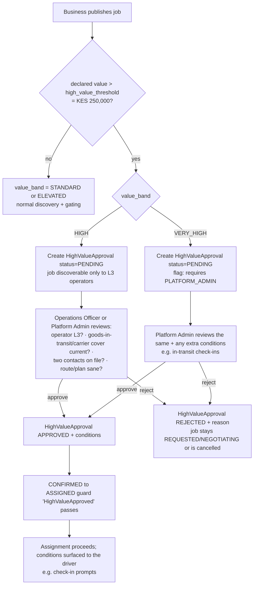

# Trust Architecture

Implements Phase 0 `trust-and-safety.md` §1, §3 and `FR-T-1..T-6`, `D-TRU-5/6/7`.

**VERIFIED ≠ TRUSTED.** Verification (identity/licence/vehicle/... — see
[verification-architecture.md](verification-architecture.md)) decides whether an
operator can be **active at all** and which vehicle they may use. Trust decides
**which value band of jobs** they may take and what extra safeguards apply.

**Trust is not an editable arbitrary admin number** (brief §14). It is a small
enum backed by an **evidence-based, admin-confirmed, append-only** change log.

---

## 1. Levels and value bands (CONFIRMED — D-TRU-5/6)

| Level | Entry criteria (pilot values — configurable) | Job value ceiling |
|-------|----------------------------------------------|-------------------|
| **L0** Pending | Registered; verification incomplete | Cannot accept jobs |
| **L1** Verified | `IDENTITY` + correct-class `LICENCE` + ≥ 1 VERIFIED vehicle + VERIFIED base. **0 completed jobs is fine.** | **Standard** — declared value ≤ KES 50,000 |
| **L2** Established | L1 **and** ≥ 8 completed jobs **and** ≥ 14 days active **and** avg rating ≥ 4.2/5 **and** no unresolved incident **and** ≤ 1 at-fault incident in last 20 **and** a VERIFIED `GOOD_CONDUCT` **and** admin confirms | **Elevated** — ≤ KES 250,000 |
| **L3** Trusted | L2 **and** ≥ 30 completed jobs **and** ≥ 60 days active **and** avg rating ≥ 4.5/5 **and** 0 unresolved/unremediated at-fault *serious* incidents (loss/damage/misconduct) **and** ≥ 3 clean Elevated-band jobs **and** admin confirms | **High** — ≤ KES 1,000,000; **Very high** (> KES 1,000,000) only with per-job Platform-Admin approval |
| **Restricted** | Admin-imposed after an at-fault serious incident, or avg rating < 3.5 over last 10 jobs. Remediation plan to exit. | Standard or zero |

Value bands (`platform_config.value_bands`, D-TRU-5):

| Band | Declared cargo value | Min trust | Mandatory safeguards |
|------|---------------------|-----------|----------------------|
| `STANDARD` | ≤ 50,000 | L1 | standard proof of pickup/delivery |
| `ELEVATED` | 50,001 – 250,000 | L2 | recipient **OTP** + **photo POD** + pickup-side **OTP** (no operator-attested fallback) |
| `HIGH` | 250,001 – 1,000,000 | L3 | **admin pre-assignment review**; operator goods-in-transit / carrier's cover re-checked current; two contacts on file |
| `VERY_HIGH` | > 1,000,000 | L3 + per-job Platform-Admin approval | case-by-case; consider requiring the business to arrange its own cover; possible in-transit check-in |

`platform_config.high_value_threshold_kes = 250,000` — the point at which admin
review is required. The band is computed from **declared cargo value** at
publish, frozen at CONFIRMED, and pinned to `job.config_version_id`.

---

## 2. Data model

From [database-design.md](database-design.md) §4.5:

- **`trust_level_state`** — one per operator: `level`, `value_ceiling_kes`,
  `since`, `last_evaluated_at`, `config_version_id`.
- **`trust_level_change`** — append-only. Every change records: `from_level`,
  `to_level`, `trigger`, `status` (`PROPOSED | APPLIED | REJECTED`), `reason`,
  `proposed_by` (`SYSTEM | ADMIN`), `confirmed_by_admin_id`, a
  **`criteria_snapshot`** (the metrics computed at evaluation time), and links to
  the **evidence jobs / incidents** that justify it, plus `config_version_id`.
- **Groups** have `group_standing_state` / `group_standing_change` — a
  `GOOD / RESTRICTED / SUSPENDED` lever, **not** a value gate.
- **`reputation_summary`** — materialised metrics feeding the criteria.

An operator's effective ceiling for a job = `trust_level_state.value_ceiling_kes`
for a **solo** operator, or the **assigned driver's** ceiling for a **group** job
(brief §12/§14). The group's standing can only *reduce* what the group can do
(SUSPENDED = no assignment); it never *raises* a driver's ceiling.

---

## 3. Evaluation & progression (FR-T-3)

```mermaid
sequenceDiagram
    participant EVT as Domain events
    participant TE as Trust Evaluation Service
    participant RS as reputation_summary
    participant TLC as trust_level_change
    participant ADM as Admin (confirmation queue)
    participant TLS as trust_level_state

    EVT->>TE: JobCompleted / IncidentResolved / RatingSubmitted (+ nightly beat)
    TE->>RS: recompute (completed jobs, days active, avg rating,<br/>at-fault counts, elevated-clean jobs)
    TE->>TE: does the operator now meet criteria for level+1?
    alt criteria met and not already proposed
        TE->>TLC: INSERT trust_level_change(status=PROPOSED, trigger=AUTO_PROPOSED,<br/>criteria_snapshot, evidence_job_ids, evidence_incident_ids)
        TE-->>ADM: appears in the confirmation queue
        ADM->>TE: confirm_change(change, admin)
        TE->>TLC: INSERT trust_level_change(status=APPLIED, trigger=ADMIN_CONFIRMED)
        TE->>TLS: level := to_level; value_ceiling := config ceiling; since := now
        TE-->>EVT: emit TrustLevelChanged
    else criteria not met
        TE->>TE: no-op
    end
```

Rules:

- **Progression is auto-*proposed* but admin-*confirmed*** for the MVP (guards
  against gaming a thin early dataset — D-TRU-6). The system never advances a
  level on its own.
- An admin's only levers are: **confirm** or **reject** a `PROPOSED` change, or
  **impose Restricted** with a recorded reason. There is **no** "set level = 3"
  action. (brief §14.)
- Every `trust_level_change` row is fully auditable: the `criteria_snapshot`
  makes the decision reproducible; the `evidence_*` arrays link the concrete
  jobs/incidents.

### 3.1 Regression (FR-T-4)

- **At-fault *serious* incident resolved against the operator** (loss / damage /
  misconduct): `IncidentResolved` triggers an **auto-applied**
  `trust_level_change(trigger=INCIDENT, status=APPLIED)` to **Restricted**
  (safety-first; configurable), with the incident linked. Exit requires an
  admin-recorded remediation and a `REMEDIATION_EXIT` change.
- **Rating drop** (avg < 3.5 over last 10): a `PROPOSED`
  `trigger=RATING_DROP` change to a lower level / Restricted → admin confirms.
- A regression is still an append-only `trust_level_change`; the prior level and
  the reason are preserved.

### 3.2 Cancellation-flag interaction (D-DIS-3)

Three late-cancellations / wasted-trips in a rolling 30 days (or last 20 jobs)
raises an `AdminTask` and **blocks L2 progression** (the Trust Evaluation Service
treats an open cancellation flag as an unmet criterion). Repeated → the admin can
impose Restricted.

---

## 4. High-value job approval flow (D-TRU-5, brief §32 diagram 10)



Enforcement points:

- **Discovery**: a `HIGH`/`VERY_HIGH` job is only listed to operators whose
  **current** trust level meets the band's minimum (L3).
- **`CONFIRMED → ASSIGNED` guard `HighValueApproved`**: requires
  `HighValueApproval.decision = APPROVED`; for `VERY_HIGH`, requires the
  approving admin held `PLATFORM_ADMIN`.
- **Guard `DriverTrustCeilingCoversValue`**: the assigned driver's
  `value_ceiling_kes` ≥ the job's declared value (the driver's own ceiling for a
  group job), unless a recorded `admin_override_reason`.
- Approval **conditions** (e.g. "in-transit check-in every 30 min") are stored on
  the `HighValueApproval` and surfaced to the driver as custody prompts (FR-C-9).

The platform **does not** invent any insurance guarantee for high-value cargo
(trust-and-safety §3.2, legal-scope §3.7 — REQUIRES VALIDATION). It records which
cover is in place and gates on it; it does not underwrite.

---

## 5. Reputation & ratings (FR-R-1..R-5)

- A `Rating` is only insertable for a job in `COMPLETED`, within
  `config.rating_window` (FR-R-2). Two-way: business↔operator; a **group job**
  produces a business→driver rating **and** a business→group rating (FR-O-8).
- `reputation_summary` (per operator, per group) is recomputed on
  `RatingSubmitted` / `JobCompleted` / `IncidentResolved` and feeds the trust
  criteria and the discovery ranking signal.
- Businesses see an operator's **reputation summary** (avg rating, completed-job
  count, incident summary) during discovery/negotiation — **never** raw identity
  data (FR-R-3, NFR-PRIV-6).
- Bad-faith reports / non-payment are recorded and can move a business's
  `standing` to `RESTRICTED` (FR-R-5, dispute-and-liability §6).

---

## 6. Anti-gaming (trust-and-safety §7, brief §14)

| Risk | Control |
|------|---------|
| Collusive fake 5★ ratings to rush an operator to L2/L3 | Admin-confirmed progression; the `criteria_snapshot` + evidence links are reviewed; the Reporting module surfaces **repeat business↔operator pairs** for the weekly review (pilot-strategy §4.7) |
| Thin early dataset makes thresholds easy to hit | Modest but non-trivial numbers (8 / 14d / 4.2★ for L2); admin confirmation is the real gate; L3 realistically reached by few operators by pilot end (which is fine — high-value jobs route through approval anyway) |
| An operator regains eligibility by re-uploading an expired doc but has an open incident | `operator_active` requires no *unresolved* incident for L2+; the incident must be resolved first |
| Group used to shortcut a low-trust driver onto a high-value job | Gating is on the **assigned driver's** ceiling, never the group's; the guard is unconditional |

---

## 7. Events

| Emits | Consumers |
|-------|-----------|
| `TrustLevelChangeProposed` | Admin confirmation queue; Notifications (operator "you may qualify for the next level") |
| `TrustLevelChanged` | Jobs (recompute discovery eligibility); Notifications; Reporting |
| `RatingSubmitted` | Trust Evaluation (recompute); Reporting |
| `ReputationRecomputed` | Discovery ranking cache invalidation |

| Consumes | For |
|----------|-----|
| `JobCompleted` | recompute `reputation_summary`; evaluate progression |
| `IncidentResolved` | apply at-fault regression; recompute counts |
| `VerificationDecided` / `VerificationExpired` (identity/licence/good-conduct) | L1 eligibility; drop below L1 if a core doc expires |
| `PlatformConfigChanged` | reload level criteria + ceilings (applies going forward; historical `trust_level_change` rows keep their own `config_version_id`) |
| beat tick (nightly) | re-evaluate all active operators |
