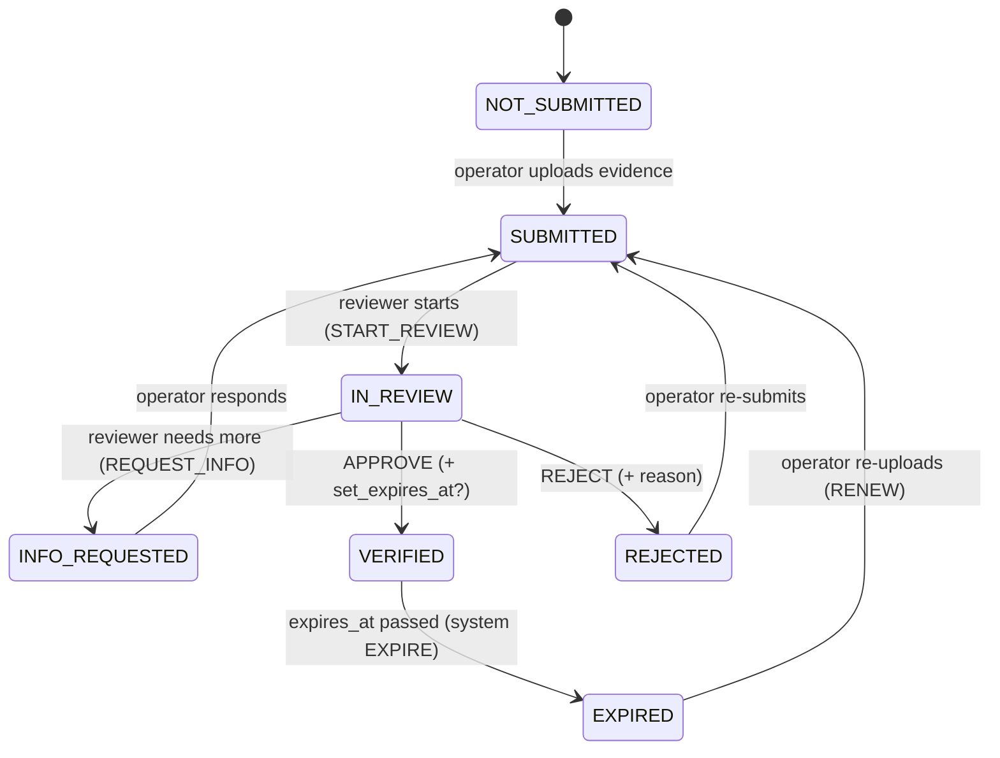

# Verification Architecture

Implements Phase 0 `trust-and-safety.md` §2 and `FR-V-1..V-8`, `FR-T-6`.

**Verification is per-domain, not a boolean.** There is no `is_verified` flag.
Eligibility is *derived* from a set of `VerificationRecord`s, each with its own
state, evidence, and (where relevant) expiry.

---

## 1. Verification domains

| Domain | Subject | Establishes | Evidence (MVP) | Expiry model |
|--------|---------|-------------|----------------|--------------|
| `IDENTITY` | OperatorProfile | Real, identifiable person | National ID / passport image + selfie; name + DOB | On document expiry |
| `LICENCE` | OperatorProfile | May legally drive the relevant class(es) | Driving-licence image; class(es); endorsements | On licence expiry |
| `GOOD_CONDUCT` | OperatorProfile | DCI Certificate of Good Conduct (D-TRU-7) | Certificate scan; issue date | Periodic re-check cadence (config; certificates are point-in-time — see §3) |
| `HISTORY` | OperatorProfile | Platform track record | *Derived* from completed jobs / incidents / ratings — **feeds TRUST, not a document** | Continuous (recomputed) |
| `VEHICLE` | Vehicle | Vehicle exists, is registered & roadworthy | Logbook, inspection cert, insurance cert, photos of vehicle + plate | On earliest document expiry (esp. insurance) |
| `HEAVY_CLASS_COMPLIANCE` | Vehicle (`tare_kg > config.heavy_class_tare_kg`) | NTSA commercial-service-vehicle operator licence + speed limiter + telematics + inspection + insurance (FR-T-6) | Each item's evidence + expiry | On earliest item expiry |
| `ASSOCIATION` | Vehicle | This operator/group is entitled to use this vehicle | Ownership match, or owner-consent evidence for an authorised driver | Reviewed on change |
| `BASE` | OperatingBase | The stage/yard is real and the operator works there | Founder/admin local knowledge; optional photo / peer co-sign | Periodic re-check |
| `DOCUMENT` | any subject | Any extra doc a job / vehicle class needs (e.g. goods-in-transit paperwork) | Case-by-case | Case-by-case |

**Which licences, endorsements, certificates, and insurances are *legally*
required per vehicle class is REQUIRES VALIDATION** (Phase 0 trust-and-safety §2,
legal-scope §3.3). The architecture keeps the **required-domain set in
`platform_config.verification_requirements`** (a `verification_requirement`
projection) so the validated legal list is applied by configuration, not code.

---

## 2. Record lifecycle

`verification_record.state` is a **derived projection** of the latest
`verification_decision` plus expiry:

- Every arrow is an append-only `verification_decision` row (actor, reason,
  `set_expires_at`, evidence ids). The current `state` column is a cache of the
  latest decision + expiry check (FR-V-2).
- `VERIFIED → EXPIRED` is applied by the **expiry sweep** (a beat job, hourly)
  when `expires_at < now()` — it inserts a `verification_decision(action=EXPIRE,
  reviewer=system)` and emits `VerificationExpired` (FR-V-5).
- "**Expiring soon**" (`VerificationExpiringSoon`) is emitted when `expires_at`
  is within `config.verification.expiry_lead_days` — notifies the operator and
  the admin (FR-V-7).

Domains have **different** lifecycles (brief §13 — "do not assume every
verification type has the same lifecycle"):

| Lifecycle shape | Domains |
|-----------------|---------|
| Document with an explicit expiry date on the document | `IDENTITY`, `LICENCE`, `VEHICLE` (insurance/inspection), `HEAVY_CLASS_COMPLIANCE` items |
| Point-in-time certificate, re-checked on a cadence (no natural expiry printed) | `GOOD_CONDUCT` — `set_expires_at = verified_at + config.good_conduct_recheck_months` |
| Reviewed on change, not time-expiring | `ASSOCIATION` |
| Periodic operational re-check | `BASE` |
| Continuously recomputed, never "submitted" | `HISTORY` |

---

## 3. Reviewer workflow (FR-V-4, admin surface)

The **verification queue** (`admin_architecture.md` §"Verification queue") lists
records in `SUBMITTED / IN_REVIEW / INFO_REQUESTED`, filterable by subject type,
domain, and age. A reviewer (Verifier permission; pilot = Operations Officer or
Platform Admin) can:

- `START_REVIEW` — claims the record (`owner_admin_id`).
- View evidence — each HIGH-PII fetch writes an `evidence_access_log` row
  (NFR-SEC-4).
- `REQUEST_INFO` with a note → operator is notified, record → `INFO_REQUESTED`.
- `APPROVE` with an optional/expected `expires_at` → record → `VERIFIED`.
- `REJECT` with a mandatory reason → record → `REJECTED`; operator notified.

Optional automated **assist** checks (FR-V-8, MAY): image quality / blur, MRZ /
format sanity on ID and licence, duplicate-face detection across operators. These
run in a worker on `VerificationSubmitted` and annotate the queue item; they
**never** auto-approve — a human decides (this also keeps the trust decision out
of "solely automated decision-making", legal-scope §3.4).

---

## 4. Derived eligibility (what other modules read)

`VerificationService` exposes pure functions the Jobs / Operators / Vehicles /
Trust modules call; none of them re-implement the rules:

| Function | Returns | Rule |
|----------|---------|------|
| `subject_meets(subject, domains: list) -> bool` | | every named domain's record is `VERIFIED` and not `EXPIRED` |
| `operator_active(operator) -> bool` | | `IDENTITY` + `LICENCE` + `GOOD_CONDUCT` VERIFIED & current, ≥ 1 VERIFIED vehicle, ≥ 1 VERIFIED base, `operator.status = ACTIVE` |
| `vehicle_eligible(vehicle) -> bool` | | `VEHICLE` VERIFIED & current; **and** if `tare_kg > config.heavy_class_tare_kg` then `HEAVY_CLASS_COMPLIANCE` VERIFIED & current; `vehicle.state = ACTIVE`; `ASSOCIATION` VERIFIED |
| `operator_eligible_for_band(operator, band) -> bool` | | `operator_active` **and** (band = `STANDARD` OR `GOOD_CONDUCT` VERIFIED) — Certificate of Good Conduct is **mandatory before Elevated** (D-TRU-7). Trust-level ceiling is checked separately by the Trust module. |
| `eligibility(subject) -> {domain: state}` | map | for the profile UI + admin view |

These are **cached** (Redis, short TTL) and invalidated on `VerificationDecided`
/ `VerificationExpired` / `VehicleEligibilityChanged`.

---

## 5. How verification gates the job lifecycle

| Point | Check | Effect if it fails |
|-------|-------|--------------------|
| Job **discovery** (FR-J-6) | operator's `operator_active`; each candidate vehicle `vehicle_eligible`; `operator_eligible_for_band(operator, job.value_band)` | the job is not shown to that operator |
| `REQUESTED/NEGOTIATING → CONFIRMED` guard `OperatorEligibleForJob` | re-checked **at confirmation time** (a document may have expired since discovery) | `409` — operator told they are no longer eligible |
| `CONFIRMED → ASSIGNED` guards `VehicleEligible` + (via Trust) band ceiling | re-checked for the **named driver + vehicle** | `409` — cannot assign |
| Custody transitions | if identity/licence/good-conduct **EXPIRED mid-job**, an alert goes to admin; the job is **not** force-failed automatically (goods may be in transit) — admin decides | admin intervention flagged |

Expiry that occurs **while a job is active** never silently strands goods; it
raises an `AdminTask` and the operator loses *new-job* eligibility immediately.

---

## 6. Events

| Emits | Consumers |
|-------|-----------|
| `VerificationSubmitted` | assist-check worker; admin queue projection |
| `VerificationDecided` (approve/reject/info) | Operators / Groups / Vehicles (recompute eligibility); Trust (identity/licence/good-conduct affect L1); Notifications |
| `VerificationExpired` | Operators / Vehicles (immediate ineligibility for new jobs); Jobs (recompute discovery); admin alert if a job is active; Notifications |
| `VerificationExpiringSoon` | Notifications (operator + admin) |

| Consumes | For |
|----------|-----|
| `PlatformConfigChanged` | reload `verification_requirements`; re-project mandatory domains |
| beat tick (hourly) | expiry sweep + expiring-soon scan |

---

## 7. Business verification (light)

Per Phase 0 trust-and-safety §2.2: a single `business_account.verification_status
∈ {UNVERIFIED, VERIFIED}` set by an admin after a lightweight check (real
business, ≥ 1 confirmed active location). No per-domain records, no trust tiers
for businesses in the MVP (OPEN in Phase 0 — recommended single flag). The
`BusinessVerifiedWithLocation` guard on `DRAFT → REQUESTED` enforces it.

---

## 8. Privacy & retention hooks

- Document images are `pii_class = HIGH` `evidence_object`s — private bucket,
  envelope-encrypted, access-logged (see [evidence-storage.md](evidence-storage.md)).
- Retention (legal-scope §7, REQUIRES VALIDATION): the **verification outcome +
  expiry date** are kept for the account-record period, but the **document image**
  is purged **12 months after offboarding or document expiry, whichever first**.
  The retention sweep clears `current_evidence_ids` and the objects; the
  `verification_record` and its `verification_decision` history remain.
